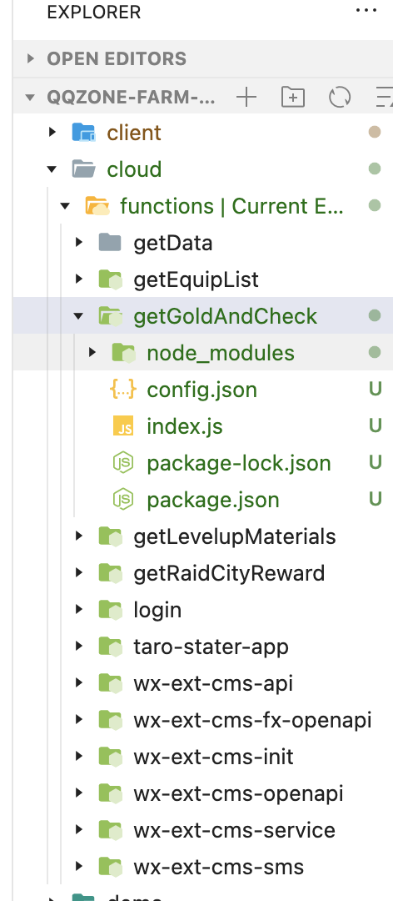
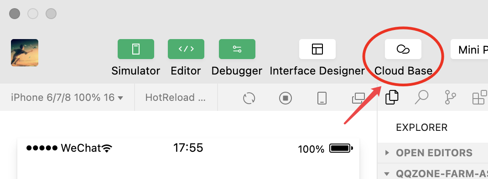
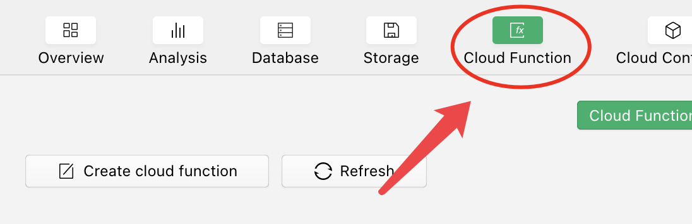
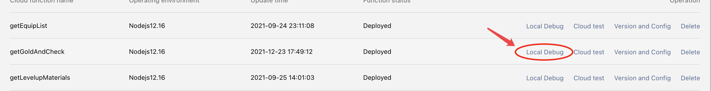
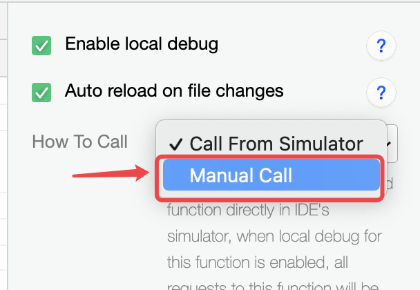
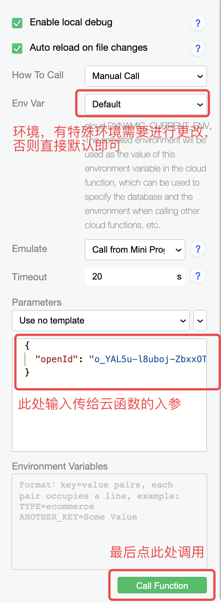
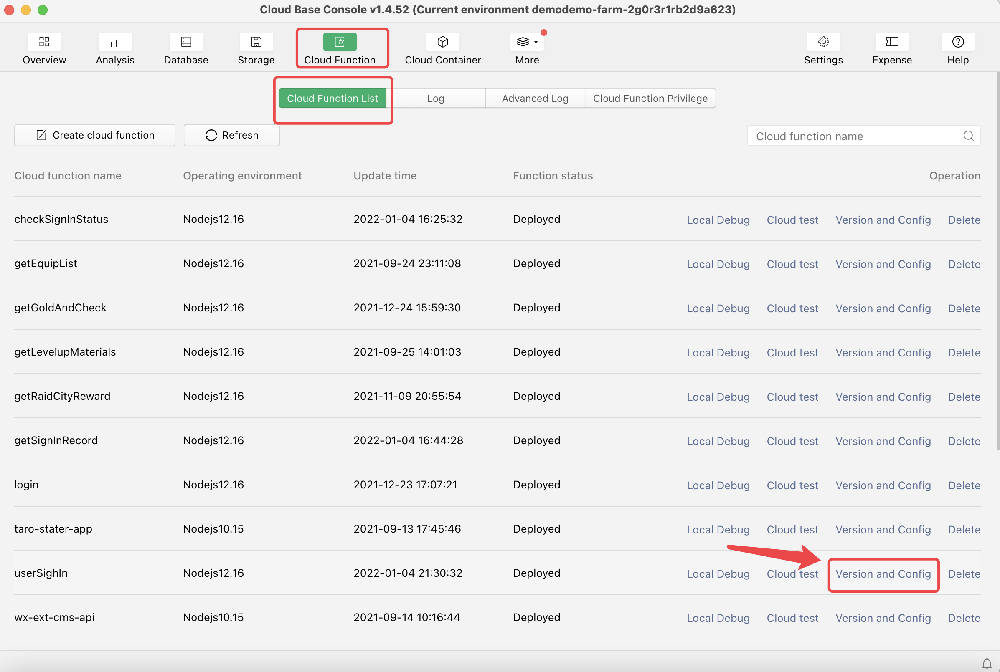
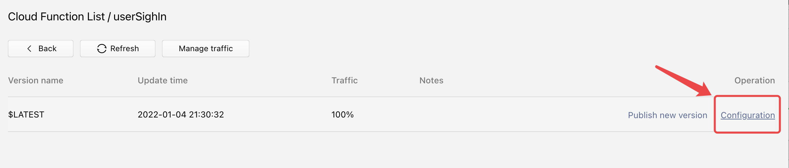
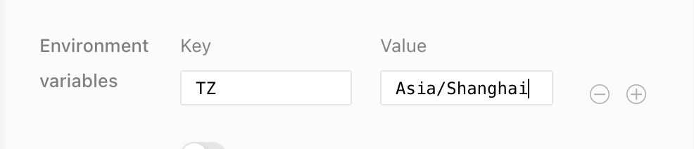

CloudDevelopment

周分享会（2021-8-20）

- 主题：小程序云开发
- ppt 地址：https://prezi.com/view/LuFhZsaxvjLS7vaeV1eR/
- 相关参考视频/文档：
  ① 快速搭建 Taro 云开发项目脚手架：https://taro-docs.jd.com/taro/docs/GETTING-STARTED
  ② 云开发学习视频：https://www.bilibili.com/video/BV1x54y1s7pk?p=60&spm_id_from=pageDriver
  ③ 云函数部署失败解决办法：https://blog.csdn.net/qq_34464926/article/details/96497906
  ④ 微信云开发文档：https://developers.weixin.qq.com/miniprogram/dev/wxcloud/basis/getting-started.html
  ⑤ Taro 云开发文档：https://taro-docs.jd.com/taro/docs/apis/cloud/cloud/

# 前置知识

###微信 openId 和微信 unionId

> https://juejin.cn/post/6844903789044973575

# 云开发

## 概述

# 云函数

## 云函数本地调试方法

前置条件：**要保证在有云函数的项目中进行本地调试，否则会报找不到云函数**



即如图所示，需为上述项目中才可

具体步骤：

1.

打开云开发面板

2.

进入云函数区块

3.

选择本地调试

4.

开发面板右侧，选择手动调用，如果选择从模拟器调用，请保持基础库等级低于 2.14.3

5.

更改上述相关参数，即可实现本地调用

## 云函数调用云数据库方式

> 云函数请求云数据库为异步，所以，需要进行异步处理
>
> https://blog.csdn.net/weixin_43430789/article/details/90601066

- **云函数调用云数据库后，直接返回 success，没有返回所 return 的内容，或者打印出来是 Undefined**

  1. 先查看云数据库集合名称是否正确
  2. 再查看云数据库权限是否设置为可读
  3. 仔细查看异步逻辑，promise 之间的处理

  详细样例可以查看农场项目里面的 getGoldAndCheck 云函数

## 云函数引入插件

## 云函数中的时区问题

注：云函数中默认的时区为 UTC+0，并不是 UTC+8 的中国时区，如果要默认 UTC+8，则需要更改云函数的环境变量，设置 TZ 为 asia/shanghai

> https://developers.weixin.qq.com/miniprogram/dev/wxcloud/guide/functions/notice.html

具体操作：

- 第一步，进入云函数版本管理

  

- 第二步，点击配置

  

- 第三步，写入配置 TZ, Asia/Shanghai，点击确认即可

  

# 云数据库

## 云数据库数据获取 get

```typescript
const db = Taro.cloud.database(); //或者 wx.cloud.database();
db.collection("demo")
  .get() // collection表示集合，传参为集合的名称
  .then((res) => {})
  .catch((err) => {});
```

# 云存储

# 项目实战

## 恋之农场项目

## 开发中遇到的问题

### 1.如何让多渠道小程序共用一套云

> 无法实现

### 2. 如何同时打开同一个微信和 qq 小程序

Taro 的项目 config 目录下进行配置

```javascript
outputRoot: `dist/${process.env.TARO_ENV}`,
```

把输入端带上当前跑的环境即可互不影响

# 云部署静态网站

云部署静态网站可以用于从普通浏览器，或者别的腾讯系 app 中跳转小程序

> 参考文档：https://zhuanlan.zhihu.com/p/336173709
