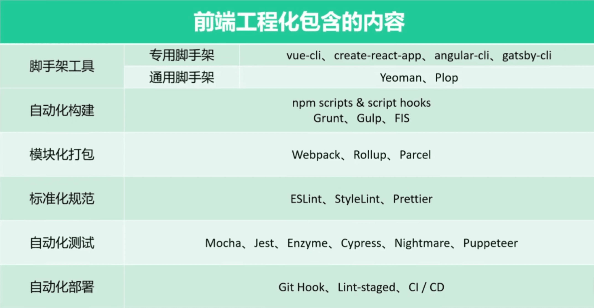

Peoject 前端工程化

# 工程化概览

> 参考文章：
>
> https://mp.weixin.qq.com/s/pVI1pmZdNIRWguoV5HKAeg 究竟该如何理解「前端工程化」？
>
> https://juejin.cn/post/6939556120956502053 前端工程化概述和**node.js**基础
>
> 参考视频：
> https://www.bilibili.com/video/BV1n44y1r7Dv?p=2&spm_id_from=pageDriver&vd_source=6adac1d9bbd16466fad0c4ec156dc9b7

**工程化概念**：

前端工程化是指围绕代码处理的一系列工具链，他们把代码当作字符串处理，并不运行代码，包括编译构建、静态分析、格式化、**CI/CD** 等等。
