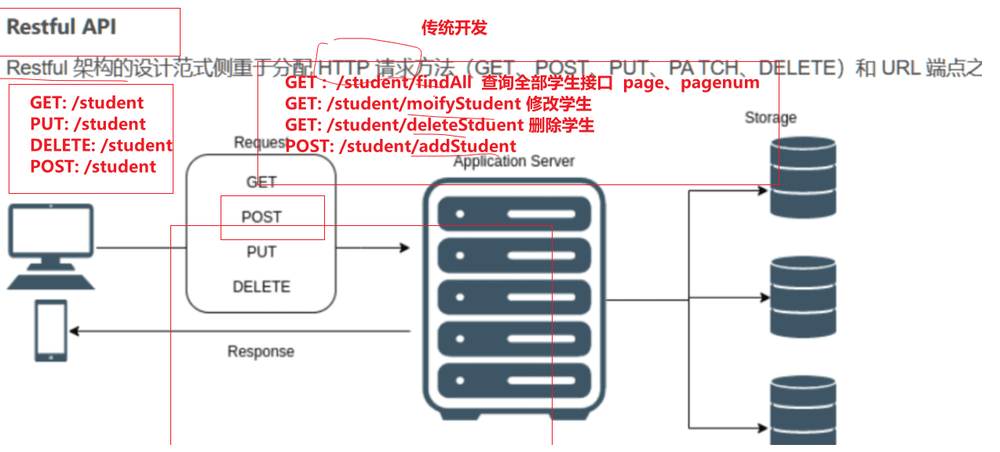

## Introduce

> 视频参考：https://www.bilibili.com/video/BV1Lg4y197u1/?spm_id_from=333.999.0.0&vd_source=6adac1d9bbd16466fad0c4ec156dc9b7
>
> 对应课件参考：https://www.yuque.com/u295415/xbahyh/wb7dz6ira0ebznvw?singleDoc#

Nest是一个用于构建高效，可扩展的Node.js服务器端应用的框架

结合了**OOP(面向对象编程)**，**FP(函数式编程)**和**FRP(函数式反应式编程)**的元素

Nest在常见的框架(Express)上进行进一步封装


## Directory

按照官网方式搭建项目，src文件夹下会生成如下基本boilerplate files:

| boilerplate files        | Introduction                                                 |
| ------------------------ | ------------------------------------------------------------ |
| `app.controller.ts`      | A basic controller with a single route. 单个路由的controller，主要用于控制路由和service层的匹配 |
| `app.controller.spec.ts` | The unit tests for the controller. controller的单元测试文件  |
| `app.module.ts`          | The root module of the application. 应用的根模块             |
| `app.service.ts`         | A basic service with a single method. 单个controller的service层，处理业务逻辑 |
| `main.ts`                | The entry file of the application which uses the core function `NestFactory` to create a Nest application instance. |


### nest-cli.json

用于对nest的各项进行配置


## Knowledge Base

### LOC和依赖注入

TODO


### Decorator

装饰器decorator是一种函数的语法糖，可理解为用于初始化函数，将一系列函数属性或者方法通过装饰器方式添加到某些特定的类/方法/属性上

以类装饰器为例，原理就是接收一个class为参数，然后在class对应的**prototype**上添加各种属性

#### 类装饰器

类装饰器的type为**classDecorator**，例如：

```typescript
const myClassDecorator: classDecorator = (target: any) => {
	console.log(target)	// target指向实例类，即Leo
  target.prototype.name = 'leo'
}
// 以下两种写法互相等价
// 1:
@myClassDecorator
class Leo {
  constructor(){}
}
// 2:
class Leo {
  constructor(){}
}
myClassDecorator(Leo)
```


#### 属性装饰器

类装饰器的type为**propertyDecorator**，例如：

```typescript
const myPropertyDecorator: propertyDecorator = (target: any, key: string | symbol) => {
	console.log(target, key)	// target指向原型对象。key指向属性的key值，即name
}

class Leo {
  @myPropertyDecorator	// 属性装饰器用于装饰属性
  public name:string
  constructor(){}
}
```


#### 方法装饰器

类装饰器的type为**methodDecorator**，例如：

```typescript
const myMethodDecorator: methodDecorator = (target: any, key: string | symbol, descriptor: PropertyDescriptor) => {
	console.log(target, key, descriptor)	// target指向原型对象。 key指向属性的key值，即getName。descriptor为方法的操作对象，{ writable, enumerable, configurable }
}

class Leo {
  public name:string
  constructor(){}
  
  @myMethodDecorator
  getName(){}
}
```


#### 参数装饰器

类装饰器的type为**parameterDecorator**，例如：

```typescript
const myParameterDecorator: parameterDecorator = (target: any, key: string | symbol, index: number) => {
	console.log(target, key, index)	// target指向原型对象。 key指向属性的key值，即getName。index为索引，参数所在位置，即1
}

class Leo {
  public name:string
  constructor(){}
  
  @myMethodDecorator
  getName(name: string, @myParameterDecorator age: number){}
}
```


### 常用装饰器

⚠️**注意，如果不添加装饰器的话，拿到的将会是undefiend**

eg: 下面这种情况下，req的值为undefined

```typescript
@Get('user-info')
findAll(req):string {
  console.log('req', req)		// undefined
}
```

Nest provides a set of useful **param decorators** that you can use together with the HTTP route handlers. Below is a list of the provided decorators and the plain Express (or Fastify) objects they represent

| Decorator                  |                                      |
| -------------------------- | ------------------------------------ |
| `@Request(), @Req()`       | `req`                                |
| `@Response(), @Res()`      | `res`                                |
| `@Next()`                  | `next`                               |
| `@Session()`               | `req.session`                        |
| `@Param(param?: string)`   | `req.params` / `req.params[param]`   |
| `@Body(param?: string)`    | `req.body` / `req.body[param]`       |
| `@Query(param?: string)`   | `req.query` / `req.query[param]`     |
| `@Headers(param?: string)` | `req.headers` / `req.headers[param]` |
| `@Ip()`                    | `req.ip`                             |
| `@HostParam()`             | `req.hosts`                          |

#### @Request

```typescript
@Get('user-info')
findAll(@Request() req):string {
  console.log('IP Address', req.ip)
  console.log('Request path', req.path)
  console.log('HTTP method', req.method)
  console.log('Request headers', req.headers)
  console.log('Query params', req.query)
}
```

#### @Response


#### @HttpCode


#### @Params

param是路径参数，而不是请求参数！

```typescript
localhost:80/user-info/3
```

#### @Query

和param不一样，query是请求参数

```typescript
localhost:80/user-info?id=3
```


## Controllers

### 定义

Controllers are responsible for handling incoming **requests** and returning **responses** to the client.


### 命名规则

在RESTful API设计中，URL路径的命名约定存在不同的实践，但最常见和广泛接受的方式是使用`kebab-case`（又称中划线、短横线）。这种风格对于URL路径而言具有良好的可读性，并且是多个单词组合时的自然选择。而`camelCase`（小驼峰式）通常更多用于编程语言中的变量和函数命名。

**为什么选择中划线（kebab-case）**：

1. **可读性**：中划线可以提高URL路径的可读性，使路径看起来更清晰。
2. **兼容性**：某些浏览器和服务器可能对大小写敏感，使用中划线避免了因大小写不一致导致的问题。
3. **约定俗成**：尽管没有强制的标准，但使用中划线作为URL路径的一部分已成为一种普遍实践。


### 快速创建CURD

在nest.js中，使用

```bash
nest g resource [name]
```

可以快速生成CRUD controller

生成过程中会询问两个问题

```bash
leo-lair-backend git:(v1.0.0) nest g resource UserInfo
What transport layer do you use? (Use arrow keys)
❯ REST API 
  GraphQL (code first) 
  GraphQL (schema first) 
  Microservice (non-HTTP) 
  WebSockets 
```

其分别含义对应为：

**REST API**

选择 REST API 表示你打算通过HTTP协议实现RESTful风格的接口。REST（Representational State Transfer）是一种设计风格，它侧重于使用标准的HTTP方法（如GET、POST、PUT、DELETE）来处理资源。在Web应用程序中非常常见。

**GraphQL (code first)**

GraphQL (code first) 方法让你可以使用TypeScript类和装饰器来定义GraphQL模式。在这种方法中，你将从代码开始定义模式，NestJS将自动根据你的代码生成GraphQL模式定义。这种方式让你可以享受TypeScript的强类型特性，同时更容易维护和重构。

**GraphQL (schema first)**

与code first方法相反，GraphQL (schema first) 方法要求你先定义GraphQL模式（通常是`.graphql`文件），然后根据这个模式来实现解析器。这种方法适合那些习惯于从模式开始并且希望完全控制GraphQL模式的开发者。

**Microservice (non-HTTP)**

Microservice (non-HTTP) 选项是为希望构建使用非HTTP协议的微服务应用程序的开发者准备的。NestJS支持多种微服务传输协议，如TCP、RabbitMQ、Kafka等。这适合构建分布式系统和微服务架构。

**WebSockets**

WebSockets 提供了全双工的通信通道，允许服务器和客户端之间进行实时、双向的通信。选择这个选项意味着你打算使用WebSockets来实现与 `UserInfo` 资源的实时交互，这在需要实时功能的应用程序中很有用，比如在线聊天应用或实时通知系统。


### 文件解释

当快速创建完毕之后，会在原本的src文件夹下创建出刚刚快速创建的文件夹src/user-info

其中，目录树结构如下：

```md
user-info
├── dto
│   ├── create-user-info.dto.ts
│   └── update-user-info.dto.ts
├── entities
│   └── user-info.entity.ts
├── user-info.controller.spec.ts
├── user-info.controller.ts
├── user-info.module.ts
├── user-info.service.spec.ts
└── user-info.service.ts
```

#### dto 目录
用于存放数据传输对象（Data Transfer Objects），它们用于封装从客户端接收到的数据。

#### entities 目录

通常包含与数据库表直接映射的模型。

#### controller

定义了与特定路由相关的处理逻辑，主要用于分发前端请求的url和后端对应需要调用的service

#### service

包含了业务逻辑，主要业务代码，调用接口之后的逻辑都写在这里

#### module

用于组织同一模块下的各种元素，如控制器controller和服务service

#### service/controller.spec

是单元测试文件，分别对应控制器和服务的测试


### Routing

#### 快速创建controller

在nest.js中，使用

```bash
nest g resource [name]
```

可以快速生成CRUD control


## Database

采用**MySQL** `读作：My-S-Q-L 或 my-sequel`进行说明

数据库模块安装

```bash
yarn add @nest/typeorm typeorm mysql2
```

安装上述三个库

@nest/typeorm: 用于建立链接

typeorm: 用于进行数据库操作

mysql2: 数据库

⚠️**注意！必须要install mysql2**，如果安装的是mysql，会出现连不上的情况

```bash
 [TypeOrmModule] Unable to connect to the database. Retrying ER_PARSE_ERROR
```


### TypeORM

TypeORM 是一个运行在 Node.js 平台上的对象关系映射（ORM）库，它使得开发者能够以面向对象的方式来操作数据库。通过使用 TypeORM，开发者可以在 TypeScript 或 JavaScript 中定义模型作为类，并且可以很方便地执行数据库操作，如插入、查询、更新和删除等，而不需要编写繁琐的 SQL 语句。TypeORM 支持多种数据库，包括 PostgreSQL、MySQL、MariaDB、SQLite、MS SQL Server、Oracle 以及 MongoDB 等。

TypeORM 的主要特点包括：

1. **类型安全**：得益于 TypeScript 的强类型系统，TypeORM 提供了类型安全的数据库操作，可以减少开发中的一些常见错误。
2. **数据模型**：开发者可以定义实体（Entity），这些实体代表了数据库中的表，并且可以通过装饰器（Decorator）来声明表的结构、关系等信息。
3. **自动数据库同步**：TypeORM 可以根据模型自动创建或更新数据库结构，使得数据库结构与代码中定义的模型保持同步。
4. **数据查询**：提供了丰富的查询 API，支持复杂的查询操作，包括联表查询、分组、排序、分页等，并且可以方便地实现条件查询和关系查询。
5. **事务处理**：支持事务操作，确保数据的一致性和完整性。
6. **迁移支持**：支持数据库迁移功能，可以帮助开发者在不同版本的数据库结构之间平滑迁移。
7. **装饰器语法**：TypeORM 使用 TypeScript 装饰器来定义模型和模型之间的关系，代码简洁明了。

通过以上特点，TypeORM 为开发者提供了一个强大而灵活的工具，以简化数据库操作并提高开发效率。尤其对于采用 TypeScript 的项目，TypeORM 提供了非常好的类型支持和开发体验。


### 数据库连接

通过TypeOrmModule，分两步进行

1. 首先，需要在main.ts的根module(app.module.ts)中创建数据库的连接

   ```typescript
   import { TypeOrmModule } from '@nestjs/typeorm';
   
   @Module({
     imports: [
       TypeOrmModule.forRoot({
         type: 'mysql', // 数据库类型
         host: 'localhost',
         database: 'nest-test',
         port: 3306,
         username: 'root',
         password: 'leolairtest123',
         entities: [__dirname + '/**/*.entity{.ts,.js}'], // 扫描本项目中.entity.ts或者.entity.js的文件
         synchronize: false, // 定义数据库表结构与实体类字段同步(这里一旦数据库少了字段就会自动加入,根据需要来使用)
       }),
       UserInfoModule,
     ],
   ```

2. 编辑entity.ts，创建实体ORM映射关系，在@Entity中写入表名

   ```typescript
   import { Entity, Column, PrimaryGeneratedColumn, CreateDateColumn, UpdateDateColumn } from 'typeorm';
   
   // 表名
   @Entity({ name: 'users' })
   export class User {
     @PrimaryGeneratedColumn()
     id: number;
   
     @Column({ length: 30, nullable: true, comment: 'user name' })
     name: string;
   
     @Column({ nullable: true, comment: 'user age' })
     age: number;
   
     @CreateDateColumn({ name: 'created_at', type: 'datetime', comment: 'created time' })
     createdAt: Date;
   
     @UpdateDateColumn({ name: 'updated_at', type: 'datetime', comment: 'updated time' })
     updatedAt: Date;
   }
   ```

3. 在业务module中，创建映射关系，以user-info resource为

   ```typescript
   ...
   import { UserInfo } from './entities/user-info.entity';
   import { TypeOrmModule } from '@nestjs/typeorm';
   
   @Module({
     imports: [TypeOrmModule.forFeature([UserInfo])],
   })
   ```

4. 在业务service中，通过constructor注册Repository，以便可以使用封装好的各种方法对数据库进行操作

   ```typescript
   ...
   import { InjectRepository } from '@nestjs/typeorm';
   import { Repository } from 'typeorm';
   import { UserInfo } from './entities/user-info.entity';
   
   @Injectable()
   export class UserInfoService {
     constructor(
       @InjectRepository(UserInfo)
       private readonly userInfoResitory: Repository<UserInfo>,
     ) {}
     
     // 调用方式
     async findAll(): Promise<UserInfo[]> {
       return await this.userInfoResitory.find();
     }
   }
   ```

   


### CURD

controller

```typescript
@Get()
  findAll() {
    return this.userInfoService.findAll();
  }

// 调用该方法，使用路径参数模式而不是查询参数模式，即：
// 正确（路径参数）：http://127.0.0.1:3000/user-info/3
// 错误（查询参数）：http://127.0.0.1:3000/user-info?id=3
@Get(':id')
findOne(@Param('id') id: string) {
  return this.userInfoService.findOne(+id);
}

@Post('add-user')
addUser(@Body() body) {
  return this.userInfoService.addUser(body);
}

@Post('update-user')
updateUser(@Body() body) {
  return this.userInfoService.updateUser(body);
}

@Post('delete-user')
deleteUser(@Body() params) {
  return this.userInfoService.deleteUser(params);
}
```

service

```typescript
async findAll(): Promise<UserInfo[]> {
    return await this.userInfoResitory.find();
  }

  async findOne(id: number): Promise<UserInfo> {
    return await this.userInfoResitory.findOne({ where: { id: id } });
  }

  async addUser(userInfo): Promise<UserInfo> {
    return await this.userInfoResitory.save(userInfo);
  }

  async updateUser(userInfo): Promise<string> {
    await this.userInfoResitory.update({ id: userInfo.id }, userInfo);
    return 'update success';
  }

  async deleteUser(params): Promise<object> {
    const res = await this.userInfoResitory.delete({ id: params.id });
    if (res.affected > 0) {
      return {
        code: 0,
        data: '',
        msg: '删除成功',
      };
    } else {
      return {
        code: 0,
        data: '',
        msg: '删除失败',
      };
    }
  }
```


### 分页查询

要实现分页查询，仅需要改造一下findAll即可

controller

```typescript
@Get()
async findAll(
  @Query('page') page?: number | string,
  @Query('pageSize') pageSize?: number | string,
) {
  if (!!page && !!pageSize) {
    const [users, total] = await this.userInfoService.findPage(
      +page,
      +pageSize,
    );
    return {
      data: users,
      total,
      page: +page,
      pageSize: +pageSize,
    };
  } else {
    return await this.userInfoService.findAll();
  }
}
```

service

```typescript
async findAll(): Promise<UserInfo[]> {
  return await this.userInfoResitory.find();
}

async findPage(
  page: number = 1,
  pageSize: number = 10,
): Promise<[UserInfo[], number]> {
	const [users, total] = await this.userInfoResitory.findAndCount({
    skip: (page - 1) * pageSize,
    take: pageSize,
  });
	return [users, total];
}
```


### 条件查询

利用传入的FindManyOptions类型的对象，可以进行条件查询

controller

```typescript
@Get('by-name')
async findByName(@Query('name') name: string) {
  return await this.userInfoService.findByName(name);
}
```

service

```typescript
async findByName(name: string) {
  const findConditions: FindManyOptions<UserInfo> = {
    where: {
      name: name,
    },
  };
  return await this.userInfoResitory.find(findConditions);
}
```


## GraphQL

> Graph-Q-L 分开读
>
> Nest js 网址 ：   https://nestjs.bootcss.com/graphql/quick-start.html
>
> graphQL官方地址： https://graphql.org/

**介绍**

GraphQL是一种用于**API的查询语言**，是由Facebook公司于2012年开发的一种新型的API架构方式。GraphQL旨在提高客户端应用程序的数据获取效率，通过定义数据的类型和结构使得API更加灵活和可扩展。与传统的API不同，GraphQL允许客户端指定需要哪些数据，从而减少了不必要的数据传输和处理，提高了API的效率和可用性。

GraphQL的核心思想是**用一个API来代替多个API**，通过GraphQL API，客户端可以获取所需的所有数据，而不需要调用多个API或者进行多次请求。GraphQL还支持实时数据查询和订阅，使得客户端可以实时获取数据更新，从而更好地支持实时应用程序。

**使用场景**

GraphQL适用于处理复杂或经常变化的数据需求，因为它可以将数据请求的控制权交给客户端，让客户端在任何时间请求任何数据。这让在每次API变更迭代或从这些API请求的数据发生变化时更容易进行更新。与REST API相比，GraphQL允许客户端精确指定所需数据的结构和字段，从而避免了获取过度或获取不足的问题。因此，GraphQL可以提高数据传输的精确性和效率，使应用程序更加灵活和可扩展。


### RESTful API

restful风格的API，通常是一个url可以干多件事儿

例如，一个/student路径，通过调用的方法不同（GET/POST/DELETE）来实现不同的功能




### 接入GraphQL

REST API 构建在请求方法（method）和端点（endpoint）之间的连接上，而 GraphQL API 被设计为只通过一个端点，即 /graphql，始终使用 POST 请求进行查询，其集中的 API 如 `localhost:3000/graphql`，所有的操作都通过这个接口来执行。

1. 首先，进行下载安装

   ```bash
   npm i @nestjs/graphql @nestjs/apollo @apollo/server graphql
   ```

2. 然后，在根module下（app.module.ts），进行配置

   ```typescript
   ...
   import { GraphQLModule } from '@nestjs/graphql';
   import { ApolloDriverConfig, ApolloDriver } from '@nestjs/apollo';
   import { join } from 'path';
   
   @Module({
     imports: [
       ...
       GraphQLModule.forRoot<ApolloDriverConfig>({
         driver: ApolloDriver,
         autoSchemaFile: join(process.cwd(), 'src/schema.gql'),
       }),
     ],
     ...
   })
   ```

3. 然后，在/src下新建一个schema.gql文件

4. 然后，通过nest g res新建一个graphQL code文件

