# Computer Science

# 1 逻辑门

> 逻辑门*logic gate*

如下图，先了解下基本的三极管电路，再实现其他逻辑门；

> 基本的三极管电路，由控制器控制电流的流向，按照布尔运算法则，当输入端 input 输入电流，设置为 true 状态，控制器打开，电流顺利流过，输出端 output 输出为 true，当 input 端控制器关闭为 false 状态，电流无法通过 output 形成断路，output 端无电流，为 false

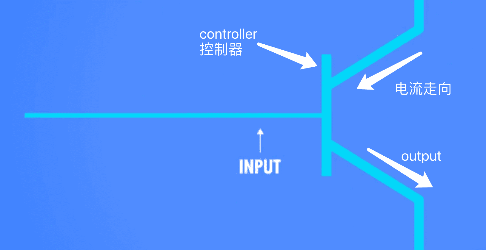

正常电路正常输出模式

| input     | output    |
| --------- | --------- |
| 0 (false) | 0 (false) |
| 1 (true)  | 1 (true)  |

## 1.1 与门

> 与门 _and gate_

 

> 很好理解，按照上面的电流图可知，我们可以设置一个**串联**电路，只有当其中两个支路均通畅时，才可保证电路正常运行，output 为 true，当其中任意一个电路为 false，电流断路，输入也为 false，即可实现与门的逻辑

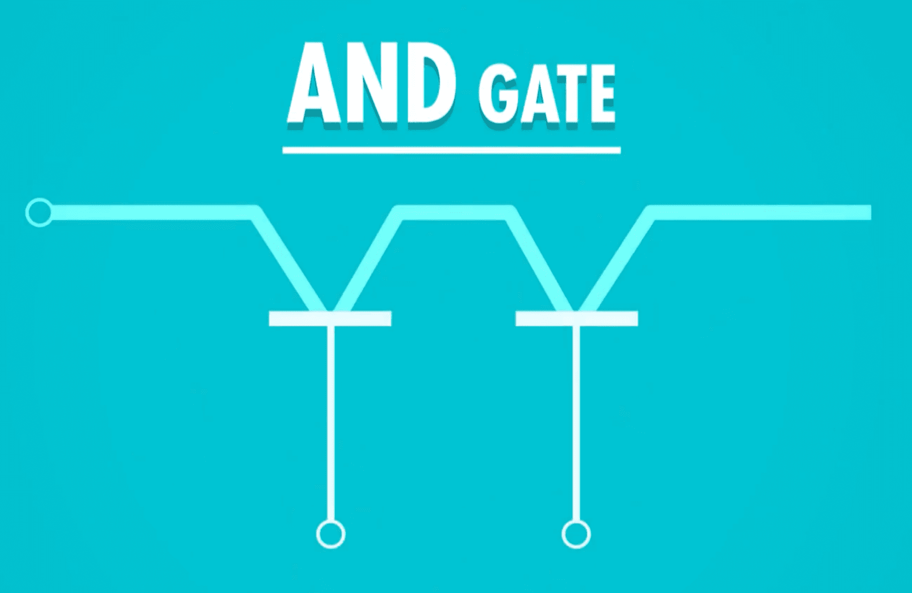

| inputA | inputB | output |
| ------ | ------ | ------ |
| 0      | 0      | 0      |
| 0      | 1      | 0      |
| 1      | 0      | 0      |
| 1      | 1      | 1      |

## 1.2 或门

> 或门 _or gate_

> 或门逻辑类似与门，与门是两者同时满足才可，或门是满足一边即可，所以第一个想到的肯定就是并联电路

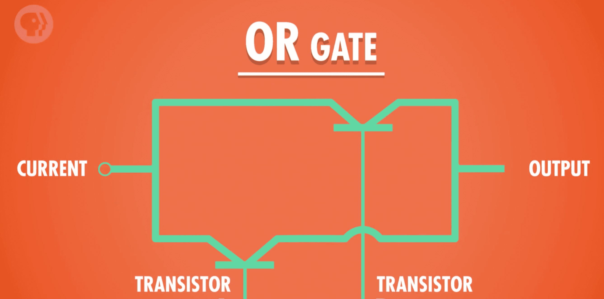

| inputA | inputB | output |
| ------ | ------ | ------ |
| 0      | 0      | 0      |
| 0      | 1      | 1      |
| 1      | 0      | 1      |
| 1      | 1      | 1      |

## 1.3 非门

> 非门 _not gate_

> 非门的电流流向如下图所示，当 input 端输入为 false，a 支路断路堵死，电流会往 b 端流走，output 为 true
>
> 当 input 端输入为 true，电流直接通过 a 支路流向接地端，output 端无电流，为 false

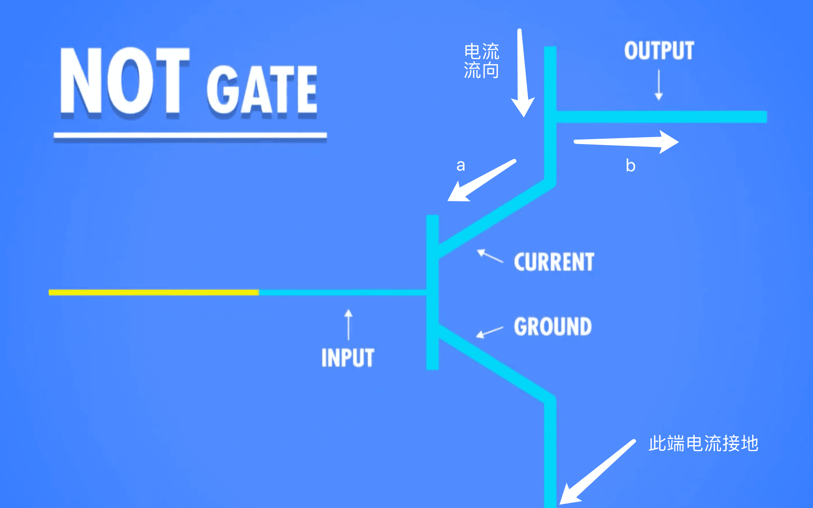

| input     | output    |
| --------- | --------- |
| 1 (true)  | 0 (false) |
| 0 (false) | 1 (true)  |

## 1.4 异或门

> 异或门 _exclusive or gate / Xor gate_

> 异或门的逻辑和或门的逻辑有点类似，但是，异或门在输出端两端均为 true 的时候，输出端不是 true，而是 false
>
> 要实现如上逻辑，首先我们采用一个或门，实现其他的基本逻辑，再想办法解决两个 true 为 false 的问题，此时，令 ab 两个 input 端均为 true，两个 true 要输出一个 false，直接使用一个 and 串上一个 not 即可，实现了该功能后，最后将 or 门并上，并经过一个 and 门，即可实现

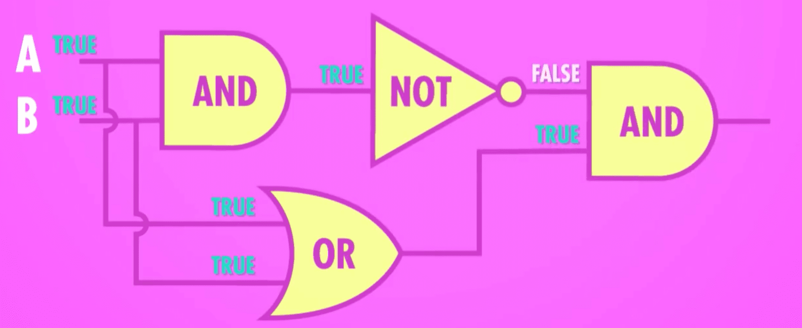

| inputA | inputB | output |
| ------ | ------ | ------ |
| 0      | 0      | 0      |
| 0      | 1      | 1      |
| 1      | 0      | 1      |
| 1      | 1      | 0      |

# 2 算术逻辑单元 ALU

> 算术逻辑单元 _Arithmetic and Logic Unit / ALU_

## 2.1 算术单元

> 算术单元 _Arithmetic unit_

当我们拥有了逻辑门之后，如果要实现计算，那么，就需要用到计算机之中的算术逻辑单元进行辅助

### 2.1.1 半加器

> 半加器 _half adder_

思绪回归到小学时候学习两个数相加，我们会列出一个相加算式，按进位的方式帮助我们辅助计算，由此思路推及到二进制当中，就得出了半加器的概念

在正式介绍半加器之前，首先引出一个只有一 bite 的二进制加法，一位的二进制加法共有四种可能性，分别为

- 0+0=0
- 0+1=1
- 1+0=1
- 1+1=10

按照上面的描述，如果将其两个相加元素表示为输入端 ab，得到的求和结果表示为总和的输出端 sum 和进位 carry，那么将会得到如下逻辑表

| inputA | inputB | carry(进位) | sum（总和） |
| ------ | ------ | ----------- | ----------- |
| 0      | 0      | 0           | 0           |
| 0      | 1      | 0           | 1           |
| 1      | 0      | 0           | 1           |
| 1      | 1      | 1           | 0           |

> 其中，sum 位代表的是输入端的相加之后的二进制和，carry 位代表的是相加之后是否有进位的存在

当我们忽略掉 carry 进位时，会发现，inputA，inputB 和 sum 组合而成的逻辑表实际上就是一个**XOR 门**，而忽略掉 sum 求和时，会发现，inputA，inputB 和 carry 组合而成的逻辑表是一个**and 门**，所以很好理解了，只要使用一个异或门，一个与门，输入两个值的时候就可以得到两个输出值，分别对应进位和总和，这就是一个**半加器**

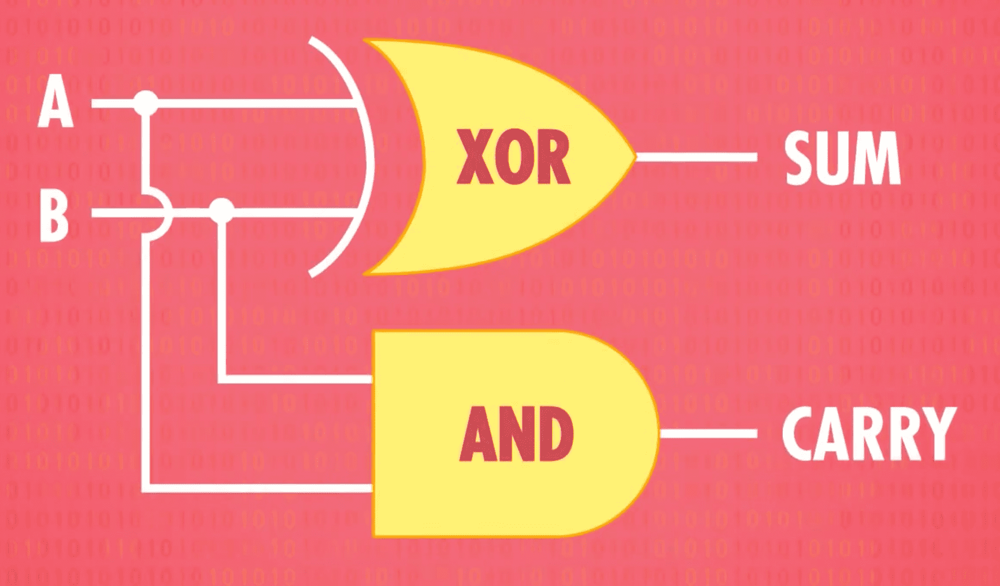

半加器可以抽象表示为如下图所示的内容，两个输入端，两个输出端

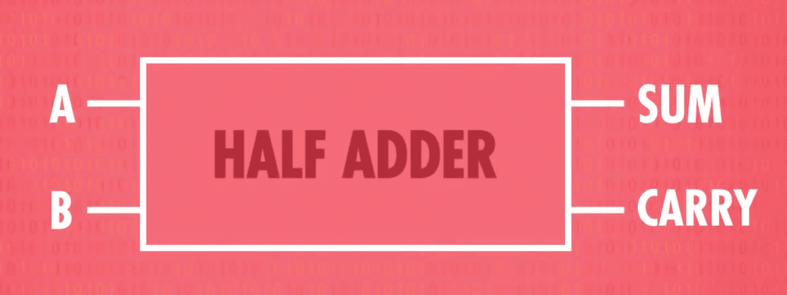

### 2.1.2 全加器

> 全加器 _Full adder_

有了上面的半加器，会发现一个问题，那就是实际上我们在计算二进制的时候，我们的输入端不止两个数，而是三位数！

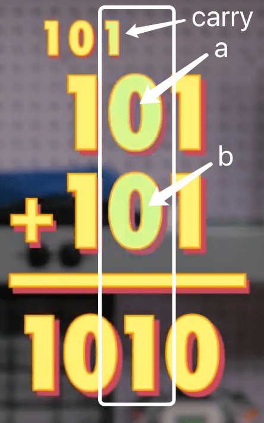

如上图所示，当计算二进制加法的时候，**除了最后一位**（即类似十进制加法中的个位加法中）我们不需要考虑进位之外，其他每一列都需要考虑输入端的两位数 ab 和进位 carry 的存在，于是，可以得到如下逻辑表，左边三格为当前位数上的三个值，右边两格的第一格 carry 是需要传递给左边的进位的进位值，sum 是两个 input 的相加值

| inputA | inputB | carry(从上一位继承的进位值) | carry（传递给下一位的进位值） | sum |
| ------ | ------ | --------------------------- | ----------------------------- | --- |
| 0      | 0      | 0                           | 0                             | 0   |
| 0      | 0      | 1                           | 0                             | 1   |
| 0      | 1      | 0                           | 0                             | 1   |
| 1      | 0      | 0                           | 0                             | 1   |
| 0      | 1      | 1                           |                               | 0   |
| 1      | 0      | 1                           | 1                             | 0   |
| 1      | 1      | 0                           | 1                             | 0   |
| 1      | 1      | 1                           | 1                             | 1   |

利用两个半加器，就可以实现上述的逻辑表格

使用第一个半加器，输入 inputA, inputB 我们可以得到一个 sum 求和值和一个 carry 进位值（传递给下一位），然后，取出从上一位继承而来的 carry 值，和 sum 值进行二次半加器运算，得出来的 sum 值就是最终的 sum 值，即最后一位（类似三个数相加的算式，前两个分别是 inputA 和 inputB，第三个数是进位，三个数加一起的 sum 就是最后一位），然后只要其中 inputA+inputB 有进位，或者 sum 和继承的 carry 有进位，那么进位就为 1，得出全加器的图，如下

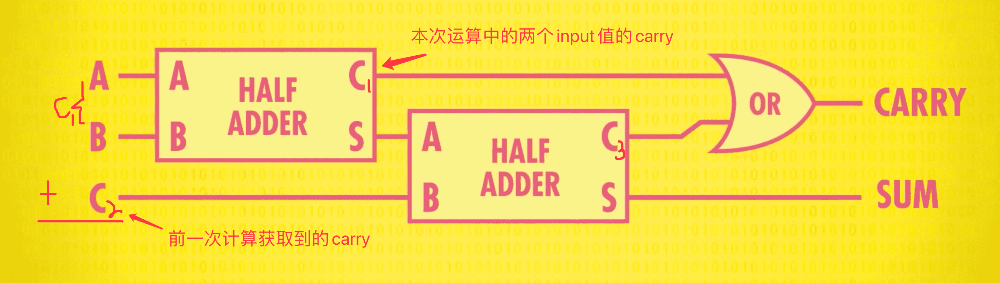

如此，便得出了一个全加器，拥有三个输入，即当前位的两个值 inputA 和 inputB，已经从上一次运算中获取到的 carry 值，输出一个当前位置上的 sum 值以及传递给下一位用于计算的 carry 值

### 2.1.3 8 位加法器

> 8 位加法器 _8-bit adder_ / 脉动进位加法器

8 位加法器，即计算两个八位二进制数的加法的工具，按照 2.1.1 和 2.1.2 中的两个加法器，可以推出：

> 最后一位的加法可以用半加器实现，其余各位的加法均需考虑上一位产生的进位，故需要用到全加器，所以一个半加器组合七个全加器便可以得到 8 位加法器的实现图

如此，便得到了 8 位加法器。

**注意！**最后一位可能会产生一个进位，但是已经没有新的全加器用于接收，此时造成的结果就是**溢出（overflow）**

## 2.2 逻辑单元

## 2.3 ALU

经过上面所述的 8 位加法器，我们可以获得到 ALU 的一层抽象概念

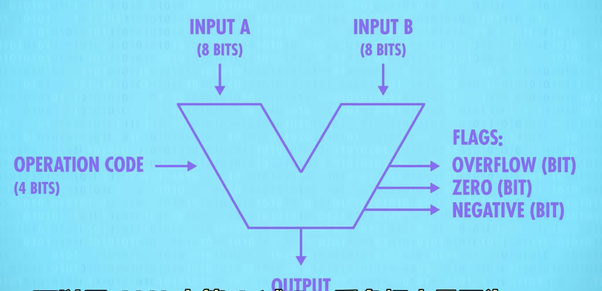

上图中，拥有两个输入，inputA 和 inputB，其中，左侧的四位 operation code 代表操作码，告诉 ALU 是要进行加减乘除中的哪一个，最后输出一个结果，同时，输出一些值为 0 或 1 的 flag，用于检测是否溢出，是否为 0 以及是否为负

# 3 寄存器&内存

## 3.1 存储 1 和 0 的状态

### 3.1.1 存储 1

要令计算机记住一个数，只需要将 or 门的输出端，接入到输入端的一端，此时，只要 A 端流入电流变成 1，那么 b 端会因为回流的关系也变成 1，而此时，无论当 a 端怎么改，b 端始终为 1，不变了，形成永久性存储，这便记住了 1

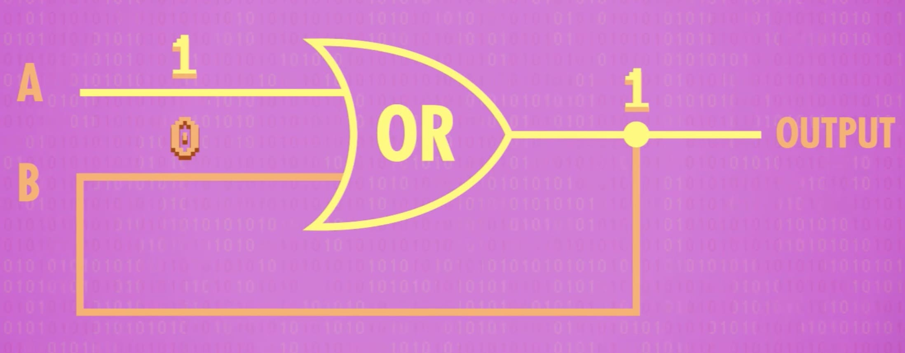

### 3.1.2 存储 0

与存储 1 的方式类似，只需要将逻辑 or 门改成逻辑 and 门，当 A 端流入 1，B 端也因回流变成 1，当 a 端流入 0 时，因为 and 门特性，b 端变成 0，而且，无论 a 端如何变化，此时的输出都将会是 0，这便记住了 0

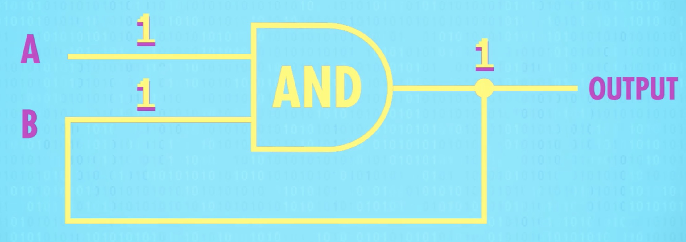

## 3.2 锁存器

根据存 1 和存 0 的电路，可以得出锁存器的原理图，锁存器有两个输入端，set 位和 reset 位

reset=0，即不启用重置功能，此时所存的循环便是 set 的输入

reset=1，启用重置功能，无论 set 是何值，循环都将初始化为 0

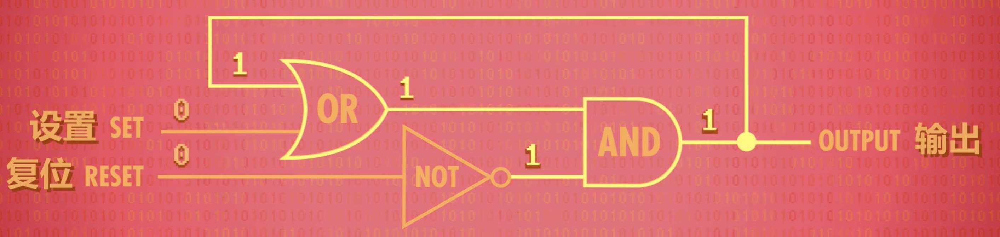

## 3.3 门锁

> 门锁 _gated latch_

因为锁存器需要两个位置比较复杂，故而加入更多逻辑门，形成两条线，一条是数据写入线，输入 1 或 0 用于存储，一条允许写入线，用于是否允许该输入的数据进行存储

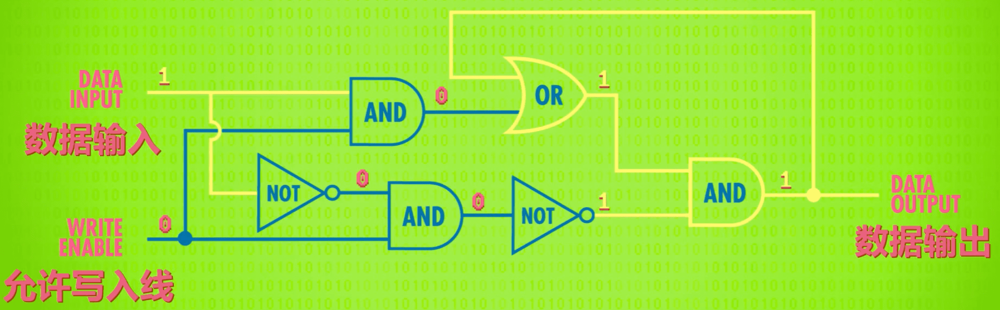
