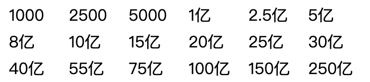

## 伪类，伪元素

英：pseudo-element [ˈsudoʊ ˈelɪmənt] , p 不发音

> 参考资料：https://www.w3school.com.cn/css/css_pseudo_elements.asp

简而言之，CSS 伪元素用于设置元素指定部分的样式，也可用于在元素之前或者之后插入一些内容

### before&after

before 和 after 用于在元素的前面/后面插入一些指定的内容，html 本身不存在可插入的内容，


## 渐变


## 对齐


### 居中对齐

给父盒子直接 flex 布局，然后 justify 和 align-item 到 center 即可实现最简单水平居中对齐

```css
.father_box {
  width: 100%;
  height: 100%;
  display: flex;
  align-items: center;	// 主轴居中
  justify-content: center;	// 交叉轴居中
}
```


## Position

### fix

相对于当前窗口进行固定布局，适合用来做全局弹框


## flex 布局

> flex 布局 _flex layout_

> flex 相关练习题：https://bbs.huaweicloud.com/blogs/detail/279930


## grid 布局

> 参考资料：https://www.ruanyifeng.com/blog/2019/03/grid-layout-tutorial.html

grid 布局即网状布局，横向为 row，竖直为 column

**主要布局属性**

- grid-template-rows 用于定义有多少行，或者说，每一列有多少个元素
- grid-template-columns 用于定义有多少列，或者说，每一行有多少个元素

举个栗子，如果要生成一个 3 行 6 列的网格，如下效果：



那么就应该定义

```css
display: grid;
grid-template-rows: 100px 100px 100px;
grid-template-columns: 100px 100px 100px 100px 100px 100px;
```

以上代码可以利用**repeat()**简写为

```css
display: grid;
grid-template-rows: repeat(3, 100px);
grid-template-columns: repeat(6, 100px);
```

同时，如果**不想固定死长度**，那么也可以采用**fr**相对长度，类似于 flex 中的比例

```css
display: grid;
grid-template-rows: repeat(3, 1fr);
grid-template-columns: repeat(6, 1fr);
```

如果**长度比例不固定**，可以分开写，类似如下，同样也能保持 3 行 6 列

```css
display: grid;
grid-template-rows: 1fr repeat(2, 1fr);
grid-template-columns: 2fr repeat(4, 1fr) 2fr;
```

如果不确定长度，可以使用**auto-fill**

```css
display: grid;
grid-template-rows: 1fr auto-fill 1fr;
grid-template-columns: 2fr repeat(4, 1fr) 2fr;
```

如果对长度的最大值和最小值有限制，可以使用**minmax()**

```css
display: grid;
grid-template-rows: 1fr 1fr minmax(100px, 1fr);
grid-template-columns: 2fr repeat(4, 1fr) 2fr;
```

要设置每个元素之间的间隔，可以使用**gap**

```css
display: grid;
grid-template-rows: repeat(3, 100px);
grid-template-columns: repeat(6, 100px);
gap: 10px;
```

gap 还可以扩展为行间距**grid-row-gap**和列间距**grid-column-gap**

```css
display: grid;
grid-template-rows: repeat(3, 100px);
grid-template-columns: repeat(6, 100px);
grid-row-gap: 20px;
grid-column-gap: 10px;
```


## 移动端适配

1. 使用flex, grid进行弹性布局
2. 使用视口单位**vw视口宽度百分比**, **vh视口高度百分比**，定义元素相对于视口的大小
3. 使用rem


## Rem单位

一般，在html标签中直接设置的字体大小单位即为rem的默认单位

例如

```css
html {
	font-size: 10px;
}
```

则可以设置默认字体大小为10px为1rem，对应的，2rem就是20px


## css 预处理

预处理工具有 Less 和 sass 等

此外还有 umi 提供 extraPostCSSPlugins，也可以使用 CSS Module


## Sass

**嵌套规则**

```scss
#main {
  color: red;
  a {
    color:blue;
  }
}
```

**&代表父级**

```scss
#main {
  &acolor
}
```

**变量定义**

```scss
$width = 5em;

#main {
  width: $width
}
```

**插值语句**

```scss
$name = foo;
$attr = border

p.#{$name} {
  #{$attr}-color:blue;
}
```

**@at-root**

直接置于顶层，不会到添加到父类中

```scss
#main {
  color: red;
  @at-root a {
    color:blue;
  }
}
```

**@mixin混入**

```scss
// 简单定义
@mixin large-text {
  font {
    family: Arial;
    size: 20px;
    weight: bold;
  }
}
// 简单使用
.page-title{
  @include large-text;
}
```

```scss
// 带参数定义
@mixin sexy-border($color, $width){
  border{
    color: $color;
    width: $width;
    style: dashed;
	}
}
// 带参数使用
p {
  @include sexy-border(blue, 5px)
}
```


## BEM架构

BEM（Block, Element, Modifier）是一种命名约定，用于在编写 CSS 和 HTML 类名时创建可维护和可重用的样式。BEM 是一种常用的 CSS 命名规范，它的目的是减少样式之间的耦合，增加样式的可读性，并提高样式的复用性。


### BEM架构下的全局Sass文件

定义的时候

```scss
$namespace: 'leo' !default
$block-sel: "-" !defalut
$elem-sel: "__" !default
$mod-sel: "--" !default
  
@mixin b($block){
  $B:#{$namespace + $block-sel + $block};
  .#{$B}{
    @content
  }
}

@minin e($el){
  // 获取父级类名
  $selector: &;
  // 跳出嵌套（没理解）
  @at-root{
    #{$selector + $elem-sel + $el}{
    	@content
  	}
  }
}

@mixin m($m){
// 获取父级类名
  $selector: &;
  // 跳出嵌套（没理解）
  @at-root{
    #{$selector + $mod-sel + $m}{
    	@content
  	}
  }
}
```

使用的时候


## 实战中遇见的一些效果实现

### 毛玻璃效果

> 苹果毛玻璃效果：https://www.zhangxinxu.com/wordpress/2019/11/css-backdrop-filter/

简而言之，就是在有 background-color 或者 background 的元素中（**该元素必须为半透明，毕竟是玻璃啊**），套一个 backdrop-filter: blur 的 css 属性即可

```css
dialog {
  backdrop-filter: blur(5px);
}
```

- **backdrop-filter 和 filter 区别**

  `backdrop-filter`是让当前元素所在区域**后面的内容**模糊灰度或高亮之类，要想看到效果，需要元素本身半透明或者完全透明；而`filter`是让当前元素**自身**模糊灰度或高亮之类。

### 遮罩层的实现

遮罩层，即一层黑色/白色的全屏 100%宽高的整个色块，上面用于展示一些弹框

```css
div {
  width: 100vh; // vh单位是相对于当前页面的单位
  height: 100vh;
  position: fixed; // 注意，此处必须要用fixed，不能用absolute，不然整个页面还是可以滑动
  top: 0; // 不加top:0会失效
}
```

### 图片水平垂直居中于盒子

1. **图片大小明确小于盒子的情况**

   通过 table-cell 定位，可以让图片处于盒子正中间，必须图片小于盒子，不然会把盒子撑大！

   ```html
   <!-- html部分 -->
   <div class="box">
     
   </div>

   <!-- css部分 -->
   .box{ width: 400px; height: 400px; background-color: pink; display:
   table-cell; vertical-align: middle; text-align: center; }
   ```

   或者，可以通过设置图片大小，主动令图片小于盒子，也可以实现

   ```html
   <!-- html部分 -->
   <div class="box">
     
   </div>

   <!-- css部分 -->
   img{ width: 200px; height: 200px; } .box{ width: 400px; height: 400px;
   background-color: pink; display: table-cell; vertical-align: middle;
   text-align: center; }
   ```

2. **图片大小未知，可能大于盒子导致把盒子撑大的情况**

   该种情况下，如果不改变图片大小，那就可以选择将图片当做背景，通过背景的设置令图片保持居中，且展示中间部分

   ```html
   <!-- html部分 -->
   <div class="box">
     
   </div>
   
   <!-- css部分 -->
   .box{ width:300px; height:300px; background:url(./demo.png) no-repeat center
   center }
   ```
