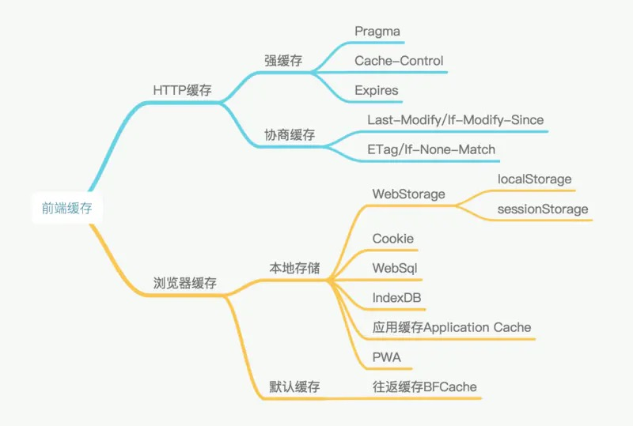
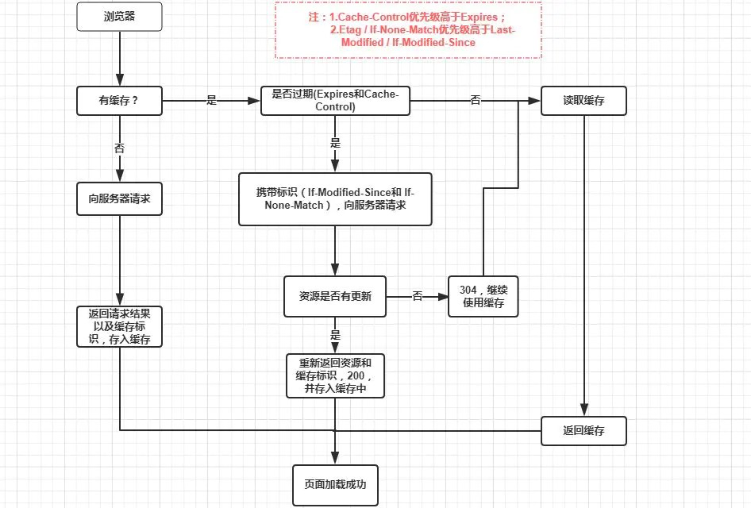
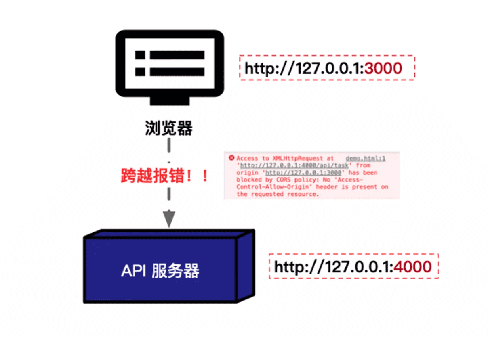
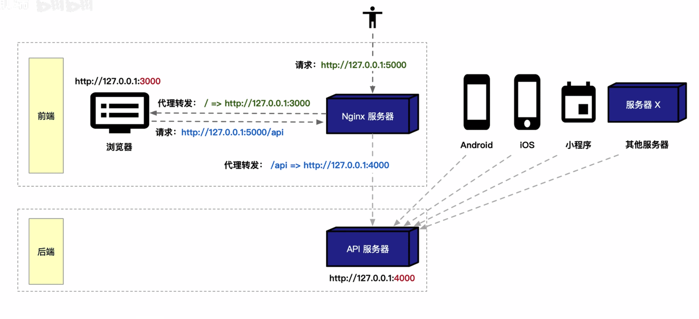

## 数据结构

### 栈stacks

- 栈结构具有 **先进后出LIFO** (last in, first out) 的特点，用 js 代码实现栈如下

  ```typescript
  class Stack = {
    private items: number[] = []
  	equeue(element: number){	 //入栈操作
      this.items.push(element);
    }
  	dequeue(element: number){		//出栈操作
      return this.items.pop(elemnt);		//pop函数删除并返回最后一个元素
    }
  }
  ```
  
- 入栈push，出栈pop


### 队列queue

- 队列结构具有 **先进先出FIFO**(first in, first out) 的特点，用 js 代码实现队列如下

* ```typescript
  class Queue = {
    private items: number[] = []
  	equeue(element: number){	 //入队enqueue操作
      this.items.push(element);
    }
  	dequeue(element: number){		//出队dequeue操作
      return this.items.shift(elemnt);		//shift函数删除并返回第一个元素
    }
  }
  ```
  
* 入队enqueue，出栈dequeue


### 链表

- 链表

  - 链表和数组一样，可以储存一系列的元素

  - 链表中的元素在内存中不必是连续的空间
  - 链表查找效率较低，每次查找，都需要从第一个元素开始依次查找，但是很方便增加和删除元素

- 单向链表
  - 单向链表只能**从头遍历到尾**或者从**尾遍历到头**
  - 单向链表的过程是**单向**的
  - 单向链表每个元素中都有**一个节点对象，指向下一个元素**，类似火车结构
  - 单向链表可以很轻松到达下一个节点，但是要到回到上一个节点却很难
- 双向链表
  - 双向链表可以**从头到尾**，也可以**从尾到头**
  - 双向链表每个元素中都有**两个节点对象，一个指向上一个节点，一个指向下一个节点**


### 哈希表

> https://juejin.cn/post/7058087556222550052 上篇
>
> https://juejin.cn/post/7059029220424417293 下篇

哈希表的原理就是：

1. **根据一项已知的下标值索引，如“name”，进行值的哈希化**
2. **哈希化后的数字，当做数组中的下标值直接进行存储**
3. **如果遇到哈希化后数字相同，则直接以数组形式存入当前位置索引，之后要查找的话，要找的内容也不多**
4. **如果遇到太满(>=75%)或太空(<=25%)，则要考虑哈希表的扩容/收缩**

- 哈希表是基于**数组**实现的，可以进行快速的**插入，查找，删除**操作
- 哈希表的速度比树要快，几乎可以瞬间查找


### 树

- 树即树型结构
- 相关术语
  1. 节点的度：即某一节点中子树的个数
  2. 树的度：树的所有节点中最大的度
  3. 叶节点：度为 0 的节点
  4. 父节点：有子树的节点，子树们的根即是父节点
  5. 子节点：略
  6. 兄弟节点：同一父节点的各个节点
  7. 路径和路径长度：从某一节点 n1 到另一节点 nk 路径上的节点序列，n1,n2,n3....,nk 为路径，其中所经过的节点的个数成为路径长度
  8. 节点的层次/层数，规定根节点层数为 1，其他节点的层数为父节点层数+1
  9. 树的深度：所有节点中的最大层次即为树的深度


### 二叉树

- 所有的树形结构，都可以用二叉树的形式表示

  > 例如，根节点 1 对应 2，3，4 三个子节点，那么，根据二叉树原理，根节点 1 会对应 2 和一个指针，该指针指向同级别的下一个节点

- 完美二叉树

  没有任何空间浪费，除了最后一层子节点之外，所有节点都有两个子节点，而且每个分支的度都一致

- 完全二叉树

  不同于完美二叉树，完全二叉树不需要每个分支的度都一样，只需要除了最底下之外的其他节点都有两个子节点即可

- 二叉搜索树

  - 满足以下条件的树结构叫做二叉搜索树

    1. 二叉搜索树可以为空
    2. 非空左子树的所有键值小于其根节点的键值
    3. 非空右子树的所有键值大于其根节点的键值
    4. 左、右子树本身也满足二叉搜索树的条件

  - 二叉搜索树的优点：

    可以快速地找到给定关键字的数据项，并且可以快速地**插入和删除**数据项

  - 二叉搜索树的缺陷

    如果插入的数据为有序的数据，会造成树的**不平衡**

    > 例如，根节点为 9，左子树键值为 8，右子树键值为 10，依次次插入 7，6，5，4，3，2，1，这些数据会依次全部插入在左子树的


### 红黑树

待补充


## 编译原理

> 详细原理可见笔记中配套的电子书《JavaScript 核心技术开发解密》

**2022.4.17 备注：目前执行上下文到激活对象的笔记做得有点晦涩难懂，暂时没时间去优化了，建议直接看上面的书籍，好懂很多，页码参考 p21-p42，重点理解一下 p36 的 demo2 案例**

### 执行上下文

- 说明：

  1. 执行上下文（Execution Context）仅会存在于 (**函数**) 当中
  2. 每次函数执行的时候，会自动生成一个执行上下文，执行上下文是一个 {**对象**} ，里面存放着当前函数内的变量，可以理解为当前代码的运行环境
  3. 基本数据类型保存在执行上下文的变量对象里，引用数据类型要单独在堆中开辟一块空间储存，执行上下文的变量对象中储存着引用类型的指针

- 函数和全局上下文中，我们都**无法访问和获取变量对象 VO**，是为了**保护里面的变量不能被随意修改**

- 执行上下文中保存着函数执行所需要的重要信息，其中包含**变量对象(variable object)**，**作用域链(scope chain)**，**this 指针(this value)**，它们影响着**变量的解析**，**变量作用域**和**函数 this**的指向

  > - 变量对象会保存变量声明（var,let），函数参数（arguments），函数定义（function）
  >
  >   ```javascript
  >   function one() {}
  >   // one的执行上下文可表述为下
  >   let oneExcutionContext = {
  >     VO: {}, //变量对象，影响变量解析，VO的属性见下
  >     this: window, //this的指向
  >     scopeChain: [oneVO, globalExcutionContext.VO], //变量的作用域
  >   };
  >   ```
  >
  > - 作用域链由自身 VO 和自身声明时的[[scopes]]属性拼接而成

- 执行上下文的生命周期有两个阶段，一个是**创建阶段**，一个是**执行阶段**

  > 创建阶段会进行我们所谓的“变量提升”
  >
  > > **变量提升**：
  > >
  > > 先将函数中的所有的函数声明，并将函数名提前存入 VO 并赋值为一个变量，其中存放着函数参数，函数定义和函数的父级作用域链，方便执行该函数时将其添加到函数的作用域链上去
  > >
  > > ```javascript
  > > VO: { ...arguments,     //函数参数，VO最先获取
  > >
  > > 			funcDesc: `()=>{}`, 		//函数声明，VO其次获取，若有相同值则自动忽略，不改变已经赋的值
  > >
  > > 			[[scopes]] = [ 父级作用域链 ] 		//父级作用域链
  > > }
  > > ```
  > >
  > > 再将所有变量声明提前存入 VO，变量赋值为**undefined**（用 var 声明的情况），创建阶段下，**执行上下文不会把 let 声明的变量存到 VO 中！**
  > >
  > > ```javascript
  > > VO: {
  > >   variable: undefined;
  > > } //变量声明，VO最后获取，（用var声明的情况），let不会获取
  > > ```
  >
  > 创建阶段的任务
  >
  > - 创建变量对象（VO）
  > - 确定作用域链
  > - 确定 this 的指向
  >
  > 执行阶段的任务
  >
  > - 变量赋值
  > - 函数赋值
  > - 代码执行

### 执行上下文栈

- 执行上下文栈（Execution Context Stack）分类

  JS 的运行环境主要分为了**全局执行上下文环境**和**函数执行上下文环境**

  1. 全局上下文栈由浏览器启动时产生，全局上下文栈中的 VO（变量对象）就是**window**，其中存放着熟知的各个函数，如 setTimeout, Math, String 等，同时，它又被称为**GO（Global Object）全局对象**
  2. 全局对象上的属性可以在任何地方被访问到

- 全局执行上下文在浏览器运行的时候会被**压入栈底**，此后，每执行一个函数，就把让该函数的执行上下文**入栈**，函数执行完毕之后，执行**出栈**。

### 作用域

- 作用域（scope）

- 作用域其实就是**函数执行上下文中的 VO**

### 作用域链

- 作用域链（scope chain）

- 说明：

  作用域链其实是在**创建函数的时候确定的，是函数的执行上下文中的属性之一**，可以理解为是一个栈

- 详见 2.1.3 第 3 条，scope chain**并不是在函数执行的时候创建的**，而是在该函数在父级 VO 中声明的时候就已经产生了一个父级作用域链的属性，当真正执行改函数的时候，再将父级作用域链属性拼接上自己的 VO 生成自己的作用域链

### 激活对象

- 说明：

  在函数调用栈中，如果当前执行上下文处于栈顶，那么意味着当前上下文处于激活状态，此时变量对象 VO 被称为**活动对象 AO**（Activation Object）

### 闭包

- 说明：

  解释一（不知道啥时候的笔记，现在看有点看不懂了）：闭包由两部分组成，一个是**当前的执行上下文 A**，一个是**在该执行上下文中创建的函数 B**，当**函数 B 执行的时候引用了执行上下文 A 中的变量，就产生了闭包**

  解释二（2021.7.26）：因为定义函数的时候，函数会申请一块单独的作用域，如果函数**定义时的作用域**和**执行时的作用域**，不是同一个，那么，就产生了闭包

- 垃圾回收机制

  当一个值失去引用的时候就会被标记，从而被垃圾回收机制回收

- 闭包的本质

  **在函数外部保持内部变量的引用，从而阻止垃圾回收机制的回收**

- **闭包新解释(2021.12.27)**

  简而言之，闭包，是一个**函数**，是一个能够读到别的函数内部变量的函数。

  js 中，函数拥有着自己的作用域，函数作用域之外是无法读取函数内部定义的变量的，如果要实现这一操作，则需要将该变量作为返回值 return 出来，

> 闭包练习题：
>
> ```javascript
> function demo() {
>   let n = 1;
>   return function sum() {
>     console.log(n++);
>   };
> }
> demo()();
> demo()();
> let a = demo();
> a();
> a();
> let b = demo();
> b();
> b();
> ```
>
> **解析**：输出结果为 1,1,1,2,1,2
>
>  首先，因为 demo 函数的返回值是一个引用类型而非值类型，所以，返回的是一串内存地址，demo 函数每次被调用，都会开辟一块新的内存空间，而且，一旦产生闭包，那么产生闭包的作用域内的全部变量均不会被垃圾回收机制回收，即 demo 内部的所有函数和对象和值，全部会存在着，所以 n 不会被回收。
>
>  然后，每次调用 demo 函数都会开辟新的内存空间，那么返回值是一个引用类型，返回的就是该内存所在的内存地址。拿例题来看，第一次 demo()，返回值假设为一串叫"AAAA1"的内存指针，那么自调用 demo()()，调用的是将"AAAA1"中的 n 输出，并自加 1。继而，第二次 demo()，又新开辟了一块空间，假设返回的指针为"AAAA2"，此时自调用，调用的是将"AAAA2"中的 n 输出，并自加 1，所以，输出还是 1。
>
>  第三次，重新调用 demo()，此时继续开辟新空间，假设指针为"AAAA3"，此时的不同点是，将改指针赋值给了变量 a，所以 a 储存的是"AAAA3"这个内存指针，第一次 a()，"AAAA3"中的 n 进行了输入，而且自+1，第二次 a()，仍旧还是"AAAA3"中的 n，此时 n 为 2，所以输出就变成了 2，然后自+1 变成 3
>
>  最后，重新调用 demo()并赋值给 b，按上面同理，开辟"AAAA4"，而且进行后续操作也都是新的一块内存空间了，互不影响。所以输出也为 1 和 2


### var, let, const

- 作用域说明：

  js 有全局作用域，函数作用域，ES6 中引入了块级作用域

- 块级作用域：

  1. 允许块级作用域任意嵌套
  2. 外层作用域无法获取内层作用域的变量
  3. 内层作用域可以定义外层作用域的同名变量

- ES6 中对 let 和 const 的处理：

  ES6 中，对 VO 和 GO 进行了分离，let 和 const 声明的变量会存在与 VO 中，**但是不会存在于 GO 中，没有变量提升**，所以，在 window 上是拿不到 let 和 const 声明的变量的


### this

1. 在方法中，this 表示该方法所属的对象。

2. 如果单独使用，this 表示全局对象。

   ```js
   // 其中1和2点的案例如下
   var a = 20;
   function foo() {
     var a = 10;
     var obj = {
       b: a + 10,
     };
     return obj.b;
   }
   foo(); // 20

   var a = 20;
   function foo() {
     var a = 10;
     var obj = {
       b: this.a + 10,
     };
     return obj.b;
   }
   foo(); // 30
   ```

3. 在函数中，this 表示全局对象。

4. 在函数中，在严格模式下，this 是未定义的(undefined)。

   ```js
   // 案例参考上述第二条
   // foo()相当于window.foo()，故而this指向window。严格模式下，此处报错，因为严格模式下this指向undefined，而undefined没有foo方法
   ```

5. 在事件中，this 表示接收事件的元素。

6. 类似 call() 和 apply() 方法可以将 this 引用到任何对象。

```js
// 易混淆习题1
var a = 20;
var foo = {
  a: 10,
  getA: function () {
    return this.a;
  },
};

var test = foo.getA;
console.log(foo.getA());
console.log(test());

//  --------------------------------------------------
// 答案揭秘：
// 10
// 20
```

```js
// 易混淆习题2
function foo() {
  console.log(this.a);
}

function active(fn) {
  fn();
}

var a = 20;
var obj = {
  a: 10,
  getA: foo,
  active: active,
};

active(obj.getA);
obj.active(obj.getA);

//  --------------------------------------------------
// 答案揭秘：
// 20
// 20
// 解析： 重点在第二个obj.active(obj.getA)，obj.active本质上调用的是active函数，会改变active中的This，但不会改变active中的函数的this
```

```js
// 易混淆习题3
var n = "window";
var object = {
  n: "object",
  getN: function () {
    return function () {
      return this.n;
    };
  },
};

console.log(object.getN()());

//  --------------------------------------------------
// 答案揭秘：
// window
// 解析： 和习题2类似，不过多赘述
```


### call, apply, bind

- 问题导入

  ```javascript
  function getName() {
    let name = "张三";
    console.log(this.name);
  }
  let obj = { name: "王五" };
  ```

  在这段代码中，我们需要 obj 调用 getName 方法，但是 obj 对象并没有 getName 方法，为了保证 obj 不被无关代码污染，所以一般的操作为：

  ```javascript
  obj.getName = getName; //先将getName方法添加到obj中
  obj.getName; //obj进行调用
  delete obj.getName; //再删除该方法
  ```

  为了解决如此复杂的操作，引入了 call 和 apply，可将上面三行代码简化为

  ```javascript
  getName.call(obj) / getName.apply(obj);
  ```

- 三者共同特点

  1. 改变所调用函数的 this 指针
  2. 第一个入参都是 this 要指向的对象
  3. 都可以利用后续参数传参

- 三者间的差异

  1. 返回值方面：call 和 apply 都属于直接调用，bind 会**返回一个函数**
  2. 参数方面：call 传参需要一个个传（eg: call(obj, a1, a2, a3...) ），apply 传参以数组形式传（eg: apply(obj, arg[]) ）


### ES6 中的 JS 执行原理

- 回顾：

  首先回顾一下 ES5 中的函数执行上下文，包含着**变量对象 VO，this 指针以及作用域链**三大块，在 ES6 的语法中，this 指针不变，变量对象 VO 被变量环境 VE 和词法环境 LE 替代，作用域链被外部执行上下文环境 outer 所替代，故：

- ES6 中的执行上下文包含：

  **this 指针，变量环境 VE（variable enviroment），词法环境 LE（lexical enviroment），和外部执行上下文环境 outer**

- 区别：

  - this 指针方面，无区别

  - VO 方面，在编译阶段，将 var 声明的函数和变量进行变量提升并存于变量环境 VE 中（无论 var 是否是在子作用域代码块内部），同时，忽略掉所有子作用域代码块，只将该作用域下的 let 声明的方法和属性存放于词法环境 LE 中，只有当执行的时候，才会采用相同的原理去处理内部代码块中的 let 声明的变量

    ```javascript
    var a = 1;
    var b = function () {};
    let c = 2;
    {
      let d = 3;
      var e = 4;
    }
    // 在该例中，编译阶段会将b, a, e存入VE中，将c存入LE中，不管d的存在，当执行时，才会将d置于LE中
    ```

  - 作用域链与外部执行上下文，取消掉原始的作用域链的继承方式，外部执行上下文有点类似原型的继承，外部执行上下文指向自身的上一级的 LE 和 VE

### 


## 面向对象

### 面向对象基础

- 区别于 C 语言的面向过程，讲究万物皆对象
- 对象的定义：**无序属性的集合**
- 对象都有自己的属性和方法

### 原型及原型链

> 经典原型链图
>
> https://img2018.cnblogs.com/blog/1604637/201903/1604637-20190312222906187-1431215081.png


- 原型链自我表达

  1. 首先引入一个概念：**原型即 prototype**，用于区分函数或对象的私有属性，是存放公共属性和方法的地方

  2. 其次，引入**Function, Object, Foo, fooson** 四个内容，Function 为顶级函数，Object 为顶级对象，Foo 为函数构造出来的一个函数(let Foo = function(){})，fooson 为 Foo 实例化出来的一个对象 object

  3. 每一个函数里面都含有一个**prototype 原型**，一个**\_\_proto\_\_**和自身的私有属性

     **prototype：用于定义公有属性，即分享给自己的继承者们的属性**

     **\_\_proto\_\_：而继承出去的这些属性，则存储在继承者的\_\_proto\_\_属性中，继承者们通过.\_\_proto\_\_.属性名的方式进行调用，但是因为 js 内置了语法糖，所以可以省略掉.\_\_proto\_\_，直接通过.属性名来调用**

     简而言之，`父亲的prototype和儿子的__proto__是同一个东西，父亲写在prototype里，儿子就能在__proto__拿到`

     > 举个栗子
     >
     > Function 的 prototype 原型上定义了 apply,bind,call 等方法
     >
     > 我们定义一个 fun 函数： let fun = funtion(){}
     >
     > fun 函数可以直接使用 fun.apply(); fun.bind(); fun.call(); 等方法，而这些方法，都存储在 fun 函数的\_\_proto\_\_中，本质上调用的，其实是 fun.\_\_proto\_\_.apply(); fun.\_\_proto\_\_.bind(); fun.\_\_proto\_\_.call();

     ```javascript
     Function{
       private property, // Function的私有属性
       prototype,	// Function的原型，用于定义公共的属性和方法，Function的原型是一个函数，除了Function的prototype是个函数之外，其他prototype均为对象
       __proto__,	// Function的proto指向自己的原型，因为Function是顶级函数，类似女娲，是最大的祖宗
     }
     Object {
       private property, // Object的私有属性
       prototype,	// Object的原型，里面定义了许多对象的方法，给自己的孩子使用
       __proto__,	// Object是一个函数，所以父亲是Function，那么Object的__proto__就是Function的prototype
     }
     foo {	// Function的实例化函数，即function foo(){}
       private property, // foo的私有属性
       prototype,	// foo的prototype, 用于给自己的儿子写公共的属性和方法
       __proto__,	// foo的__proto__继承自父亲的protptype，因为父亲是Function，所以值就是Function的prototype
     }
     obj {	// Object的实例化对象
       private property, // Object的私有属性
       __proto__,	// 实例化对象不一定含有prototype原型，实例化出来的对象的__proto__就是继承自object的prototype
     }
     ```

  4. 每一个原型都包含一个**constructor**和一个**\_\_proto\_\_**，constructor 指向生成该原型的构造函数，即函数本身；**\_\_proto\_\_**指向 Object 的原型，因为本质上，原型 prototype 自己就是一个 object，所以算是 Object 实例出来的，算是 Object 的儿子，**需要注意的一点，Object 的原型的\_\_proto\_\_为 null**，因为它本身就已经是所有 object 的祖宗了，所以它没有爸爸

     ```javascript
     Function{
       private property,
       prototype: {
         constructor: Function,
         __proto__: Object.prototype,
       },
       __proto__,
     }
     ==================================================
     Object {
       private property,
       prototype: {
         constructor: Object,
         __proto__: null,	// 需要注意的一点，Object的原型的__proto__为null
       },
       __proto__,
     }
     ==================================================
     foo {
       private property,
       prototype: {
         constructor: foo,
         __proto__: Object.prototype,
       },
       __proto__,
     }
     ```

  5. 每一个函数的**\_\_proto\_\_**指向实例化自己的那个构造函数的原型，**因为 Function 是自己 new 出来的自己，所以 Function 的\_\_proto\_\_指向自身的原型**

     ```javascript
     Function{
       private property,
       prototype: {
         constructor: Function,
         __proto__: Object.prototype,
       },
       __proto__: Function.prototype,	// 需要注意的一点，Function的__proto__指向自身的原型
     }
     ==================================================
     Object {
       private property,
       prototype: {
         constructor: Object,
         __proto__: Object.prototype,
       },
       __proto__: Function.prototype,  // Object的__proto__是Function，因为Object是Function实例化出来的 let Object = new Function(){}
     }
     ==================================================
     foo {
       private property,
       prototype: {
         constructor: foo,
         __proto__: Object.prototype,
       },
       __proto__: Function.prototype,
     }
     ==================================================
     foo {
       private property,
       __proto__: Object.prototype,	// 实例化对象的__proto__就是Object的原型
     }
     ```

  6. 故得出原型链结论，每个函数的公共属性写在原型中，实例出来的对象可以通过\_\_proto\_\_链接实例化对象和原函数的原型，从而实现继承

  7. **注意点：只有函数有 prototype 和\_\_proto\_\_，对象只有\_\_proto\_\_**

     ```javascript
     let fun(){};
     let obj= {};
     // 其中，fun有prototype和__proto__，而obj只有__proto__属性
     ```

     **在 ES6 的 class 中，class 类属于函数的一种**，所以两个属性都有

- instanceof

  1. 概述：

     instanceof 运算符用来判断一个构造函数的 prototype 属性所指向的对象是否存在另外一个要检测对象的原型链上，返回值为布尔值

  2. 语法：

     ```javascript
     function Person() {}
     let p1 = new Person();
     console.log(p1 instanceof Person); // true
     console.log(p1 instanceof Object); // true
     console.log(p1 instanceof Function); // false
     ```

  3. 原理：

     instanceof 的原理就是顺着\_\_proto\_\_向上找，能找到后面那个参数的原型就返回 true，否则返回 false。

     例如，上面的例子中，p1 的\_\_proto\_\_指向 Person 的原型，所以第一个为 true，找到 Person 的原型后，再顺着 Person 原型中的\_\_proto\_\_向上找，找到了 Object 的原型，所以第二个为 true，此时已经找到顶了，没有找到 Function 的原型，所以第三个为 false，即

     ```javascript
     p1.__proto__ ==> Person.prototype ==> Person.prototype.__proto__ ==> Object.prototype ==> Object.prototype.__proto__ ==> null
     ```

     所以，p1 不在函数的原型链上，自然也就无法使用函数的相关方法，例如 bind, call, apply


### 继承

**继承的种类**

待补充

**公私继承**

- 公有属性的继承

  待补充

- 私有属性的继承

  待补充

- 公私属性一并继承

  待补充

**函数实现继承**

> 参考视频：
>
> https://www.bilibili.com/video/BV1944y1q7N4/?spm_id_from=333.788.recommend_more_video.-1

函数实现继承可以使用 call 方法


## HTTP

> https://juejin.cn/post/6844904100035821575

### 状态码

网络请求状态码（HTTP状态码）是由服务器返回给客户端的，用于表示网页服务器HTTP响应状态的3位数字代码。它们分为五个类别，每个类别有不同的状态码表示不同的含义。下面是一些常见的HTTP状态码及其含义：

**1xx - 信息响应**

1. **100 Continue**：客户端应继续其请求
2. **101 Switching Protocols**：服务器根据客户端的请求切换协议

**2xx - 成功**

1. **200 OK**：请求成功。一般用于GET与POST请求
2. **201 Created**：已创建。成功请求并创建了新的资源
3. **202 Accepted**：已接受。已经接受请求，但未处理完成
4. **204 No Content**：无内容。服务器成功处理，但未返回内容，**一般用于跨域预检请求的返回**

**3xx - 重定向**

1. **301 Moved Permanently**：永久移动。请求的网页已永久移动到新位置
2. **302 Found**：临时移动。服务器目前从不同位置的网页响应请求，但请求者应继续使用原有位置来进行以后的请求
3. **304 Not Modified**：未修改。自从上次请求后，请求的网页未修改过

**4xx - 请求错误**

1. **400 Bad Request**：服务器不理解请求的语法
2. **401 Unauthorized**：请求要求身份验证。对于需要登录的网页，服务器可能返回此响应
3. **403 Forbidden**：服务器拒绝请求
4. **404 Not Found**：服务器找不到请求的网页
5. **408 Request Timeout**：请求超时。服务器等候请求时发生超时

**5xx - 服务器错误**

1. **500 Internal Server Error**：服务器遇到错误，无法完成请求
2. **501 Not Implemented**：服务器不具备完成请求的功能。例如，服务器无法识别请求方法时可能会返回此代码
3. **502 Bad Gateway**：服务器作为网关或代理，从上游服务器收到无效响应
4. **503 Service Unavailable**：服务器目前无法使用（由于超载或停机维护）。通常，这只是暂时状态
5. **504 Gateway Timeout**：服务器作为网关或代理，但是没有及时从上游服务器收到请求


### HTTP & HTTPS

1. **安全性**：这是HTTP和HTTPS之间最显著的区别。HTTPS通过使用SSL/TLS协议为数据传输提供了加密，从而保护了数据免受窃听和篡改。而HTTP传输的数据是未加密的，更容易受到中间人攻击。
2. **性能**：由于HTTPS需要额外的加密和解密过程，理论上它的性能可能稍低于HTTP。然而，随着现代计算能力的提升和协议优化（如HTTP/2），这种性能差异已经变得微不足道。
3. **端口**：如上所述，HTTP和HTTPS分别使用不同的默认端口，HTTP通常使用端口80，而HTTPS使用端口443。
4. **成本**：部署HTTPS需要获得SSL/TLS证书。虽然现在有许多组织（如Let's Encrypt）提供免费证书，但是对于某些高级证书或功能，可能会涉及额外的成本。
5. **搜索引擎优化（SEO）**：HTTPS被视为搜索引擎优化的一个正面因素。Google等搜索引擎倾向于对使用HTTPS的网站给予更高的排名。


### 请求方法

1. **GET**：请求指定的资源。GET请求应该只用于获取数据，并且应该是幂等的，这意味着多次发起同一个GET请求，其效果和一次请求应当相同。而且Get请求通常是可以被缓存的。
2. **POST**：用于提交数据给指定的资源，通常导致资源的状态变化或者资源的创建。POST请求不是幂等的，意味着多次执行同一请求可能会产生不同的结果。
3. **PUT**：替换指定资源的所有当前表示。PUT请求是幂等的，即多次执行同一个PUT请求应该与执行单次请求的效果相同。
4. **DELETE**：删除指定的资源。DELETE请求也是幂等的，多次调用对资源的影响和单次调用相同，即资源被删除。
5. **HEAD**：与GET方法相似，但服务器在响应中只返回头部信息而不返回实体的主体部分。这常用于检测资源的变化或获取资源的元数据。
6. **OPTIONS**：用于获取目标资源所支持的通信选项。客户端可以通过这种方式来检查服务器的性能或者查询与资源相关的选项和需求。
7. **PATCH**：用于对资源应用部分修改。与PUT不同，PATCH通常用于更新资源的一个小部分。PATCH不一定是幂等的，这取决于其实现。
8. **CONNECT**：建立一个到由目标资源标识的服务器的隧道。常用于HTTPS协议通过HTTP代理的情况。
9. **TRACE**：回显服务器收到的请求，主要用于测试或诊断。


**Q：既然POST也具有GET,PUT等请求的功能，为什么开发中不直接用一个POST解决所有请求？**

1. **语义清晰**：HTTP方法本身就带有明确的语义。例如，GET用于获取资源，POST用于创建资源，PUT用于更新资源，DELETE用于删除资源。这样的设计让API的行为更加直观易懂，有助于提高代码的可读性和维护性。
2. **符合标准和约定**：遵循HTTP协议和RESTful API设计规范有助于确保API的设计能够被广泛理解和接受。这不仅有利于团队内部的沟通，也有助于第三方开发者快速理解和使用API。
3. **利于缓存**：GET请求是可以被缓存的，这意味着通过适当的缓存策略，可以显著提高应用的性能和响应速度。而POST请求通常不会被缓存，因为它们通常用于产生或修改数据的操作。
4. **幂等性**：在HTTP协议中，某些方法（如GET、PUT、DELETE）被定义为幂等的，意味着多次执行相同的请求应该得到相同的结果，而不会改变资源的状态。这有助于提高API的可靠性。而POST方法不是幂等的，它每次调用都可能产生新的资源或产生不同的效果。
5. **安全性**：使用正确的HTTP方法还可以帮助提高应用的安全性。例如，通过限制对敏感资源的GET请求，可以防止敏感数据被不恰当地暴露。


## Blob

### Blob简介
Blob 是 Binary Large Object 的缩写，表示二进制大对象。在Web开发中，Blob对象是一个不可变的、原始数据的类文件对象。Blob 表示的不仅限于二进制类型的数据，还可以包含文本内容。Blob 对象通常用来处理文件操作的数据内容，比如你可以通过 Blob 来处理和操作二进制文件，如图片、音频、视频等。

Blob 对象含有以下几个关键的属性和方法：

1. **size**：Blob 对象的大小，以字节为单位。
2. **type**：Blob 对象的 MIME 类型，如果类型未知，则该值为空字符串。

Blob 对象通常与 `File` 接口一起使用，`File` 接口继承自 `Blob`，增加了一些文件相关的属性，如 `name`（文件名）和 `lastModified`（文件的最后修改时间）。

创建 Blob 对象的常用方法：

```javascript
const blob = new Blob(array, options);
```

1. `array` 是一个由 `ArrayBuffer`、`ArrayBufferView`、`Blob`、`String` 等对象构成的 `Array`，或者是以上类型的混合。它们将会被串联在一起，最终构成 Blob 的数据内容。
2. `options` 是一个可选对象，包含了额外的配置选项，如 `type`，可以设置 Blob 的 MIME 类型。

例如，创建一个包含文本内容的 Blob 对象：

```javascript
const text = 'Hello, World!';
const blob = new Blob([text], { type: 'text/plain' });
```

在前端Web应用中，Blob 对象通常用于以下场景：

1. 通过 AJAX 上传或下载二进制数据。
2. 使用 `URL.createObjectURL()` 将 Blob 对象转换为一个 URL，这个 URL 可以用于 `<a>` 标签的 `href` 属性，实现无需上传服务器即可下载文件的功能。
3. 在客户端创建和操作大型二进制数据，比如图片或视频编辑。
4. 使用 `FileReader` 对象读取 Blob 对象的内容。

Blob 对象因其能够处理大型的二进制数据而变得非常有用，特别是在需要在前端处理文件上传下载时。


### Blob下载文件
如果后端通过API以文本或二进制格式返回CSV内容，你可以使用JavaScript创建一个Blob对象，并生成一个URL，然后通过创建一个临时的`<a>`标签来模拟点击进行下载。

```javascript
// 假设csvData是后端返回的CSV文本数据
const csvData = 'id,name,age\n1,John Doe,30\n2,Jane Smith,25';

// 创建一个Blob对象
const blob = new Blob([csvData], { type: 'text/csv;charset=utf-8;' });

// 创建一个指向Blob的URL
const url = URL.createObjectURL(blob);

// 创建一个临时的a标签用于下载
const link = document.createElement('a');
link.href = url;
link.setAttribute('download', 'filename.csv'); // 设置下载文件名
document.body.appendChild(link); // 添加到DOM中
link.click(); // 模拟点击
document.body.removeChild(link); // 移除临时标签
```


## 缓存

`缓存 chache`

> https://www.jianshu.com/p/256d0873c398



### HTTP 缓存

http 缓存分为 **强缓存** 和 **协商缓存** 两种



#### 强缓存的工作流程

1. **首次请求资源**：浏览器首次请求一个资源时，服务器会在响应头中包含`Cache-Control`和/或`Expires`字段，指示浏览器如何缓存该资源。
2. **再次请求资源**：当浏览器需要再次请求相同的资源时，它会首先检查本地缓存中的资源是否有效（根据`Cache-Control`和`Expires`字段）。
3. **缓存有效**：如果缓存有效，浏览器将直接从本地缓存加载资源，而不是从服务器请求。
4. **缓存失效**：如果缓存失效（例如，超过了`max-age`指定的时间或达到了`Expires`指定的日期），浏览器将向服务器发送请求，获取新的资源。

#### **强缓存**

> 强缓存与协商缓存
>
> https://www.jianshu.com/p/1a1536ab01f1

强缓存中，就是向浏览器缓存查找该请求结果，并根据该结果的缓存规则来决定是否使用该缓存结果的过程。

强制缓存的情况主要有三种

1. **不存在该缓存结果和缓存标识，强制缓存失效，则直接向服务器发起请求（跟第一次发起请求一致）**
2. **存在该缓存结果和缓存标识，但该结果已失效，强制缓存失效，则使用协商缓存**
3. **存在该缓存结果和缓存标识，且该结果尚未失效，强制缓存生效，直接返回该结果**

当浏览器向服务器发起请求时，服务器会将缓存规则放入 HTTP 响应报文的 HTTP 头中和请求结果一起返回给浏览器

主要字段如下（位于响应头内）：

```http
// 测试案例如下，详细字段解释，可见上提供的链接
Expires: '' // 目前已被cache-control完全取代
Cache-Control: max-age=0, private, must-revalidate
// 如果资源请求时间在max-age内，则命中强缓存，直接取缓存内容
```

缓存位置又分为两种

1. from memory cache 读取内存缓存
2. from disk cache 读取硬盘缓存

刷新页面，会导致内存缓存丢失，只能去读取硬盘缓存，硬盘缓存相对于内存缓存来说速度要慢，因为进行了 I/O 操作并重新进行了解析，相对复杂许多


#### 协商缓存的流程

1. 浏览器第一次请求资源时，服务器返回资源，并在响应头中包含`Last-Modified`和/或`ETag`值。

2. 浏览器存储资源及其头部信息，并将资源显示给用户。

3. 当浏览器再次请求相同的资源时，请求中会包括`If-Modified-Since`和/或`If-None-Match`头，其值分别对应之前响应中的`Last-Modified`和`ETag`。

4. 服务器接收到请求后，根据`If-Modified-Since`

   和`If-None-Match`头中的信息，判断资源是否被修改过：

   1. 如果资源未修改，服务器返回304 Not Modified状态码，无需返回资源内容。浏览器随后从本地缓存加载资源。
   2. 如果资源已修改，服务器返回200 OK状态码和新的资源内容。同时，响应头中会包含新的`Last-Modified`和`ETag`值。

#### 协商缓存

协商缓存，就是当缓存已过期之后，浏览器会携带缓存标识向服务器请求资源，如下

```http
// 位于请求头内，将缓存标识传过去
If-None-Match: W/"e39f603a5ebcff23859d200f9c9dc20f"
```

服务端会根据 If-None-Match 的字段值与该资源在服务器的标识做对比，若标识一致，则返回 304，客户端直接使用缓存，否则，返回，状态码置为 200，重新返回数据和缓存信息，其中包含 ETag，就是本次的缓存标识

```http
// 位于响应头内，由服务器传给客户端，可以看到与客户端请求头标识一致，故返回304，令客户端直接读取本地缓存
ETag: W/"e39f603a5ebcff23859d200f9c9dc20f"
```


### 浏览器缓存

**本地小容量的存储**

- cookie

  cookies 数据不能超过 4k 同时因为每次 http 请求都会携带 cookie 所有 cookie 只适合保存很小的数据 如会话标识

- sessionStorage

  sessionStorage：当页面关闭后被清理与其他相比不能同源窗口共享 是会话级别的存储方式

- localStorage

  localStorage:以键值对的方式存储 储存时间没有限制 永不失效 除非自己删除记录

- cookie,sessionStorage,localStorage 三者异同

  > https://www.cnblogs.com/zr123/p/8086525.html

  共同点：都是保存在浏览器端、且同源的

  区别：

  1. cookie 数据始终在同源的 http 请求中携带（即使不需要），即 cookie 在浏览器和服务器间来回传递，而 sessionStorage 和 localStorage 不会自动把数据发送给服务器，仅在本地保存。cookie 数据还有路径（path）的概念，可以限制 cookie 只属于某个路径下
  2. 存储大小限制也不同，cookie 数据不能超过 4K，同时因为每次 http 请求都会携带 cookie、所以 cookie 只适合保存很小的数据，如会话标识。sessionStorage 和 localStorage 虽然也有存储大小的限制，但比 cookie 大得多，可以达到 5M 或更大
  3. 数据有效期不同
     - sessionStorage：仅在当前浏览器窗口关闭之前有效；
     - localStorage：始终有效，窗口或浏览器关闭也一直保存，因此用作持久数据；
     - cookie：只在设置的 cookie 过期时间之前有效，即使窗口关闭或浏览器关闭
  4. 作用域不同
     - sessionStorage 不在不同的浏览器窗口中共享，即使是同一个页面；
     - localstorage 在所有同源窗口中都是共享的；
     - cookie 也是在所有同源窗口中都是共享的；
  5. web Storage 支持事件通知机制，可以将数据更新的通知发送给监听者
  6. web Storage 的 api 接口使用更方便

**本地大容量的存储**

可使用 IndexDB，笔记后续补充


## 网络通信

### 完整网络请求流程

1、解析 URL：首先会对 URL 进行解析，分析所需要使用的传输协议和请求的资源的路径。如果输入的 URL 中的协议或者主机名不合法，将会把地址栏中输入的内容传递给搜索引擎。如果没有问题，浏览器会检查 URL 中是否出现了非法字符，如果存在非法字符，则对非法字符进行转义后再进行下一过程。

2、缓存判断：浏览器会判断所请求的资源是否在缓存里，如果请求的资源在缓存里并且没有失效，那么就直接使用，否则向服务器发起新的请求。

3、DNS 解析： 下一步首先需要获取的是输入的 URL 中的域名的 IP 地址，首先会判断本地是否有该域名的 IP 地址的缓存，如果有则使用，如果没有则向本地 DNS 服务器发起请求。本地 DNS 服务器也会先检查是否存在缓存，如果没有就会先向根域名服务器发起请求，获得负责的顶级域名服务器的地址后，再向顶级域名服务器请求，然后获得负责的权威域名服务器的地址后，再向权威域名服务器发起请求，最终获得域名的 IP 地址后，本地 DNS 服务器再将这个 IP 地址返回给请求的用户。用户向本地 DNS 服务器发起请求属于递归请求，本地 DNS 服务器向各级域名服务器发起请求属于迭代请求。

4、获取 MAC 地址： 当浏览器得到 IP 地址后，数据传输还需要知道目的主机 MAC 地址，因为应用层下发数据给传输层，TCP 协议会指定源端口号和目的端口号，然后下发给网络层。网络层会将本机地址作为源地址，获取的 IP 地址作为目的地址。然后将下发给数据链路层，数据链路层的发送需要加入通信双方的 MAC 地址，本机的 MAC 地址作为源 MAC 地址，目的 MAC 地址需要分情况处理。通过将 IP 地址与本机的子网掩码相与，可以判断是否与请求主机在同一个子网里，如果在同一个子网里，可以使用 APR 协议获取到目的主机的 MAC 地址，如果不在一个子网里，那么请求应该转发给网关，由它代为转发，此时同样可以通过 ARP 协议来获取网关的 MAC 地址，此时目的主机的 MAC 地址应该为网关的地址。

5、TCP 三次握手： 下面是 TCP 建立连接的三次握手的过程，首先客户端向服务器发送一个 SYN 连接请求报文段和一个随机序号，服务端接收到请求后向客户端发送一个 SYN ACK 报文段，确认连接请求，并且也向客户端发送一个随机序号。客户端接收服务器的确认应答后，进入连接建立的状态，同时向服务器也发送一个 ACK 确认报文段，服务器端接收到确认后，也进入连接建立状态，此时双方的连接就建立起来了。

6、HTTPS 握手： 如果使用的是 HTTPS 协议，在通信前还存在 TLS 的一个四次握手的过程。首先由客户端向服务器端发送使用的协议的版本号、一个随机数和可以使用的加密方法。服务器端收到后，确认加密的方法，也向客户端发送一个随机数和自己的数字证书。客户端收到后，首先检查数字证书是否有效，如果有效，则再生成一个随机数，并使用证书中的公钥对随机数加密，然后发送给服务器端，并且还会提供一个前面所有内容的 hash 值供服务器端检验。服务器端接收后，使用自己的私钥对数据解密，同时向客户端发送一个前面所有内容的 hash 值供客户端检验。这个时候双方都有了三个随机数，按照之前所约定的加密方法，使用这三个随机数生成一把秘钥，以后双方通信前，就使用这个秘钥对数据进行加密后再传输。

7、返回数据： 当页面请求发送到服务器端后，服务器端会返回一个 html 文件作为响应，浏览器接收到响应后，开始对 html 文件进行解析，开始页面的渲染过程。

8、页面渲染： 浏览器首先会根据 html 文件构建 DOM 树，根据解析到的 css 文件构建 CSSOM 树，如果遇到 script 标签，则判端是否含有 defer 或者 async 属性，要不然 script 的加载和执行会造成页面的渲染的阻塞。当 DOM 树和 CSSOM 树建立好后，根据它们来构建渲染树。渲染树构建好后，会根据渲染树来进行布局。布局完成后，最后使用浏览器的 UI 接口对页面进行绘制。这个时候整个页面就显示出来了。

9、TCP 四次挥手： 最后一步是 TCP 断开连接的四次挥手过程。若客户端认为数据发送完成，则它需要向服务端发送连接释放请求。服务端收到连接释放请求后，会告诉应用层要释放 TCP 链接。然后会发送 ACK 包，并进入 CLOSE_WAIT 状态，此时表明客户端到服务端的连接已经释放，不再接收客户端发的数据了。但是因为 TCP 连接是双向的，所以服务端仍旧可以发送数据给客户端。服务端如果此时还有没发完的数据会继续发送，完毕后会向客户端发送连接释放请求，然后服务端便进入 LAST-ACK 状态。客户端收到释放请求后，向服务端发送确认应答，此时客户端进入 TIME-WAIT 状态。该状态会持续 2MSL（最大段生存期，指报文段在网络中生存的时间，超时会被抛弃） 时间，若该时间段内没有服务端的重发请求的话，就进入 CLOSED 状态。当服务端收到确认应答后，也便进入 CLOSED 状态。


### Ajax

> 暂时可以先参考一下这个
>
> https://blog.csdn.net/weixin_44750790/article/details/105253207?utm_medium=distribute.pc_relevant.none-task-blog-2~default~baidujs_baidulandingword~default-0-105253207-blog-72725500.pc_relevant_default&spm=1001.2101.3001.4242.1&utm_relevant_index=2

**定义**

AJAX 的全称是 Asynchronous JavaScript and XML，它允许网页在不重新加载整个页面的情况下，通过后台与服务器交换数据并更新部分网页内容。AJAX 不是一项新技术，而是利用了一组现有的技术标准和方法。

**重要性**

AJAX的出现极大地改善了用户体验。在AJAX出现之前，每次用户请求新数据时，整个页面都需要刷新。AJAX允许网页只更新必要的部分，使得操作更加流畅，减少了等待时间和网络资源的消耗。

**工作原理**

1. **用户在界面上进行操作**，如点击一个按钮，触发一个事件。
2. **JavaScript 创建 XMLHttpRequest 对象**，并通过这个对象向服务器发送一个异步请求。
3. **服务器处理请求**，并将结果发送回客户端。
4. **XMLHttpRequest 对象接收服务器响应**，并将数据传递给一个JavaScript回调函数。
5. **JavaScript回调函数处理数据**，可能会更新DOM，从而在不重新加载整个页面的情况下更新网页的某部分内容。

**关键组成**

1. **JavaScript**：编写逻辑来处理用户的交互，发送请求，以及处理响应数据。
2. **XMLHttpRequest 对象**：提供了在JavaScript中发起HTTP请求的能力。虽然名称中包含XML，但它也可以处理其他格式的数据，如JSON、HTML或纯文本。
3. **HTML/CSS**：构建用户界面，并在接收到数据后更新界面。
4. **DOM（文档对象模型）**：通过JavaScript更新页面内容。


### XMLHttpRequest

完整的请求流程（以GET为例）

```js
// 定义一个XMLHttp请求
const xhr = XMLHttpRequest()

// 通过open，开启事件
xhr.open('GET', 'http://test.com?name=Leo&age=18')
xhr.open('GET', 'http://test.com')

// 通过send，发送事件，才能得到服务器响应
xhr.send()

// 通过onreadystatechange来监听状态改变，包括open,send,done等
xhr.onreadystatechange = () => {
  // 监听当请求完成，且状态码为200成功的时候，打印响应数据
	if(xhr.readyState === XMLHttpRequest.DONE && xhr.status === 200){
    console.log(JSON.parse(xhr.responseText))
  }
}
```

对于**post请求**来说，还需要额外设定请求头
```js
xhr.open('POST', url)
xhr.setRequestHeader('Content-Type', 'application/x-www-form-urlencoded')
xhr.send('name=Leo&age=18')
```


### Axios

#### 基本使用

```js
// GET
const res1 = axios.get('http://test.com', {
  params: {
    name: 'Leo',
    age: 18
  }
})
console.log(res1.data)

// POST
const res2 = axios.post('http://test.com', {
    name: 'Leo',
    age: 18
})
console.log(res2.data)
```

#### 拦截器

在axios中，可以使用请求拦截器或者响应拦截器，对请求发送前/响应接收前进行一波统一的拦截操作

⚠️**在请求拦截器中，注意需要return config，不然请求不会发送！**

```js
const ins = axios.create()

// 请求拦截器
ins.interceptors.request.use(config => {
  console.log('request is going to sending')
  return config  // 注意要返回！
})

// 响应拦截器
ins.interceptors.response.use(res => {
  console.log('result is going to be returned')
  return res  // 注意要返回！
})
```

#### 取消请求

TODO


### Fetch

GET

```js
fetch('http://test.com/get?name=Leo&age=18')
	.then(res => {
  	if(res.ok){
      return res.json()
    }
})
```

POST

```js
fetch('http://test.com/post', {
  method: 'POST',
  headers: {
    'Content-Type': 'application/json'
  }
  body: JSON.stringify({
  	name: 'Leo',
  	age: 18
	})
})
	.then(res => {
  	if(res.ok){
      return res.json()
    }
})
```


## 跨域

`跨域问题 cross-domain issues`

> 参考资料：https://segmentfault.com/a/1190000002647143?utm_source=Weibo&utm_medium=shareLink&utm_campaign=socialShare

### 跨域介绍

**跨域场景**

协议名、子域名、主域名、端口号任意一个有一个不同，就会产生跨域问题

例如： https://github.com/ 协议:https 主域名:github 子域名:www 端口号:443(默认)

注意，域名和该域名对应的 ip，也是不允许的

例如： http://www.a.com/a.js 和 http://70.32.92.74/b.js

图示：



**解决方式**

1. jsonp

   即使用 script 标签（可以理解为，设置`script`的`src`属性可以访问 cdn 服务器中静态文件，引入依赖之类的）

2. 服务端代理

   具体可参考资料

3. 服务端设置 Access-Control-Allow-Origin

   这种方式只要服务端把 response 的 header 头中设置`Access-Control-Allow-Origin`为制定可请求当前域名下数据的域名即可


### jsonp

举个例子，服务端和客户端约定要传一个名为 callback 的参数来使用 JSONP 功能。比如请求的参数如下:

```js
http://www.example.net/sample.aspx?callback=mycallback
```

如果没有后面的 callback 参数，即不使用 JSONP 的模式，该服务的返回结果可能是一个单纯的 json 字符串，比如：`{ foo : 'bar' }`。但是如果使用 JSONP 模式，那么返回的是一个函数调用: `mycallback({ foo : 'bar' })`，这样我们在代码之中，定义一个名为 mycallback 的回调函数，就可以解决跨域问题了。

**缺点：只能是get请求**


### Nginx代理

**重点：Access-Control-Allow-Origin**

原理图示：



**步骤**

1. **客户端请求**：客户端（例如一个运行在`127.0.0.1:3000`的前端应用）向Nginx服务器发起请求，请求的地址是Nginx服务器的地址，比如`127.0.0.1:5000`。
2. **Nginx作为反向代理**：Nginx服务器配置为监听`5000`端口的请求，并根据配置将这些请求转发到后端的API服务器（假设实际运行在`127.0.0.1:4000`）。
3. **处理请求**：API服务器（`127.0.0.1:4000`）接收到请求，处理这个请求，然后将响应返回给Nginx服务器。
4. **Nginx转发响应**：Nginx服务器收到来自API服务器的响应后，将这个响应转发回最初的请求者，也就是`127.0.0.1:3000`的客户端。

⚠️**注意！**在这个步骤中，客户端的3000端口请求5000端口的nginx服务器，**同样会触发浏览器的同源策略**，因此，需要在Nginx服务器上配置好响应头，允许3000端口传来的所有跨域请求，如下：

```nginx
server {
    listen 5000;

    location / {
        # 将请求转发到后端服务
        proxy_pass http://127.0.0.1:4000;

        # 添加CORS响应头
        add_header 'Access-Control-Allow-Origin' 'http://127.0.0.1:3000' always;
    		...
    }
}
```

下面是一个Nginx配置的常用代理，可以进行参考：

其中`if ($request_method = 'OPTIONS')`用于检测是否为预检请求

`OPTIONS`预检请求是**由浏览器自动发起的**，而不是由前端代码直接发起。这是浏览器实现CORS（跨来源资源共享）策略的一部分。

预检请求的目的是在实际发送跨域请求之前，先检查目标服务器是否允许该跨域请求的发生。

```nginx
server {
    listen 80;
    server_name example.com;

    location / {
        if ($request_method = 'OPTIONS') {
            add_header 'Access-Control-Allow-Origin' '*';
            #
            # 其他CORS相关的头部字段，如：
            add_header 'Access-Control-Allow-Methods' 'GET, POST, OPTIONS';
            #
            # 允许携带凭证
            add_header 'Access-Control-Allow-Credentials' 'true';
            add_header 'Access-Control-Allow-Headers' 'Origin,Content-Type,Accept';
            #
            # 缓存预检请求的结果（秒）
            add_header 'Access-Control-Max-Age' 1728000;
            #
            # 返回204状态码，而不是常规的200
            add_header 'Content-Type' 'text/plain; charset=utf-8';
            add_header 'Content-Length' 0;
            return 204;
        }
        if ($request_method = 'POST') {
            add_header 'Access-Control-Allow-Origin' '*';
            add_header 'Access-Control-Allow-Credentials' 'true';
            add_header 'Access-Control-Allow-Headers' 'Origin,Content-Type,Accept';
        }
        if ($request_method = 'GET') {
            add_header 'Access-Control-Allow-Origin' '*';
            add_header 'Access-Control-Allow-Credentials' 'true';
            add_header 'Access-Control-Allow-Headers' 'Origin,Content-Type,Accept';
        }
    }
}
```


## 深浅拷贝

### 浅拷贝

- 展开运算符（...）

  特点：会改变原来数组对象中对象的值

  示例：

  ```javascript
  let obja = { a: 1, b: [1, 2] };
  let objb = { ...obja };
  objb.a = 2; // 不改变obja的值
  objb.b = [3, 4]; // 不改变objb的值
  
  let obja = [{ a: 1 }, { b: 2 }];
  let objb = [...obja];
  objb[0].a = 2; // 会改变obja内的a的值
  ```

### 深拷贝

- JSON.parse(JSON.stringify(obj))

  特点：不会改变一些常见的属性的值

  缺点：不能复制时间对象，正则对象，Error 对象，函数会丢失，undefined 会丢失，NaN、Infinity 和-Infinity 会变成 null

  示例：

  ```javascript
  let obja = [{ a: 1 }, { b: 2 }];
  let objb = JSON.parse(JSON.stringify(obja));
  objb[0].a = 2; // 不会改变obja内的a的值
  ```


## 进制

### 二进制

`binary 二进制`

定义二进制，只需在数字前添加**0b**即可

```javascript
let a = 0b110; // 6
let b = 0b101; // 5
```

### 十进制

`decimal`

### 十六进制

`hexadecimal`

定义二进制，只需在数字前添加**0x**即可

```javascript
let a = 0x110; // 272
let b = 0x101; // 257
```


## 位运算

`bit operation 位运算`

> https://www.w3school.com.cn/js/js_bitwise.asp

---

js 中同样存在位运算方法，如下

### 位运算符

| 位运算符        | 名称         | 描述                                                     |
| --------------- | ------------ | -------------------------------------------------------- |
| & (区别于&&)    | AND          | 如果两位都是 1 则设置每位为 1                            |
| \| (区别于\|\|) | OR           | 如果两位之一为 1 则设置每位为 1                          |
| ^               | XOR          | 如果两位只有一位为 1 则设置每位为 1                      |
| ~               | NOT          | 反转所有位                                               |
| <<              | 零填充左位移 | 通过从右推入零向左位移，并使最左边的位脱落。             |
| >>              | 有符号右位移 | 通过从左推入最左位的拷贝来向右位移，并使最右边的位脱落。 |

| 操作    | 结果 | 等同于       | 结果 |
| :------ | :--- | :----------- | :--- |
| 5 & 1   | 1    | 0101 & 0001  | 0001 |
| 5 \| 1  | 5    | 0101 \| 0001 | 0101 |
| 5 ^ 1   | 4    | 0101 ^ 0001  | 0100 |
| ~ 5     | 10   | ~0101        | 1010 |
| 5 << 1  | 10   | 0101 << 1    | 1010 |
| 5 >> 1  | 2    | 0101 >> 1    | 0010 |
| 5 >>> 1 | 2    | 0101 >>> 1   | 0010 |

```javascript
let a = 0b0110;
let b = 0b0101;
a & b; // 0100  --> 4
a | b; // 0111  --> 7
```

### 位运算特殊用法

- 用于 math.random 取整

  ```javascript
  (Math.random() * 5) << 0; // 可取到0~4的随机数
  ```


## 高阶函数

### 高阶函数概念

高阶函数有两种形式

1. 传入的参数是一个函数，即 fn( `fn(){}` ){ }
2. 函数的返回值是一个函数，即 fn(){ `return fn(){}` }

### 高阶函数复杂案例

### 函数柯里化

> 参考视频： node 部分 1.高阶函数及函数柯里化

函数柯里化往往与闭包，与递归有关

首先，函数要进行柯里化需要满足几个条件，必须是**已知个数的参数！**


## 正则表达式

> https://juejin.cn/post/6844904119463837704

一些常见的要记的元字符

### 量词元字符

| 元字符 | 含义     | 元字符  | 含义      |
| ------ | -------- | ------- | --------- |
| \*     | 零到多次 | +       | 一到多次  |
| ?      | 零或一次 | \{n,m\} | n 到 m 次 |

### 特殊元字符

| 元字符   | 含义                           | 元字符 | 含义                          |
| -------- | ------------------------------ | ------ | ----------------------------- |
| ^        | 以...开头                      | $      | 以...结尾                     |
| \d ( \D) | 匹配数字（匹配非数字）         | \s     | 匹配空白符，空格或者 tab 缩进 |
| [a-z]    | 匹配 a-z 中的一个              | [^a-z] | 匹配非 a-z                    |
| \w       | 匹配数字，字母，下划线中任一个 |        |                               |


## 事件循环

> 事件循环 _event loop_

### 浏览器环境

> 参考文档：
>
> [1]阮一峰.什么是 Event Loop. http://www.ruanyifeng.com/blog/2013/10/event_loop.html
>
> [2]阮一峰.再谈 event Loop. https://www.ruanyifeng.com/blog/2014/10/event-loop.html
>
> [3]liuxuan.带你彻底弄懂 event loop. https://segmentfault.com/a/1190000016278115
>
> [4]Mr.z.事件循环. https://zhuanlan.zhihu.com/p/55511602
>
> [5]Philip Roberts. what the heck is the event loop anyway. https://www.youtube.com/watch?v=8aGhZQkoFbQ&ab_channel=JSConf
>
> [6]Jack Archibald. Tasks, microtasks, queues and schedules. https://jakearchibald.com/2015/tasks-microtasks-queues-and-schedules/

一张图解释 event loop


### node环境


## MVC&MVVM

> 参考资料：
>
> https://blog.csdn.net/qq_42068550/article/details/89480350?utm_medium=distribute.pc_relevant.none-task-blog-baidujs_baidulandingword-0&spm=1001.2101.3001.4242

参考资料已经写得非常详细了，直接看即可，此处仅介绍下两个模型

文章大意的两者区别是：MVC 时代，因为用户和界面数据交互较为简单，所以用 controller 便可完美解决所有的数据处理的逻辑，但是随着 app 功能增多，数据处理变得复杂，便需要一个专门的地方用来进行数据的解析，于是 viewModal 便应运而生，比 controller 多了一个数据处理的功能

### MVC

> MVC _Model-view-controller_

### MVVM

> MVVM _Model-view-viewModal_


## 设计模式

### 单例模式

`单例模式 Singleton pattern`

> 参考资料：https://segmentfault.com/a/1190000040146574

- 概述

  **单例模式只涉及一个类，确保在系统中一个类只有一个实例，并提供一个全局访问入口**

- 实现方式

  1. **私有化构造方法，避免外部类通过 new 创建对象**
  2. **定义一个私有的静态变量持有自己的类型**
  3. **对外提供一个静态的公共方法来获取实例**
  4. **如果实现了序列化接口需要保证反序列化不会重新创建对象**

- 代码实现

  ```typescript
  // 一般在很多语言中用instance字段表示单例实例
  class Singleton {
    private static instance: Singleton; // 此处Singleton表示类型而不是赋值
    private constructor() {
      // ..
    }
  
    public static getInstance() {
      if (!Singleton.instance) {
        Singleton.instance = new Singleton();
      }
  
      return Singleton.instance;
    }
  
    someMethod() {}
  }
  let someThing = new Singleton(); // Error: constructor of 'singleton' is private
  
  let instacne1 = Singleton.getInstance(); // do some thing with the instance
  let instacne2 = Singleton.getInstance(); // 无论创建多少次，都是指向的同一个实例对象 instacne1 === instacne2
  let instacne3 = Singleton.getInstance(); // 无论创建多少次，都是指向的同一个实例对象 instacne1 === instacne2 === instacne3
  ```


### 代理模式

`代理模式 Proxy pattern`

> 参考资料：https://www.bilibili.com/video/BV14i4y1o7YF?p=21&spm_id_from=pageDriver&vd_source=6adac1d9bbd16466fad0c4ec156dc9b7

- 概述

  **为其他对象提供一种代理以控制对这个对象的访问**

- 简单描述

  简而言之，给一个对象的某个方法设置一个代理，不同的代理对象调用该方法可以获得不同的值。例如，`class Person`， Person 类有一个 eat 吃饭方法需要找代理，相当于点外卖，可以由`class 好好香锅`代理该方法，也可以由`class 湘西姑娘`来代理该方法，而由`class 好好香锅`代理的结果就是“香锅”，`class 湘西姑娘`代理的结果就是“凉菜”

- 代码实现，用计算来举例

  ```typescript
  // 首先定义一个代理对象都必须要支持的方法，用接口实现
  interface ICalc {
    calc(num1: number, num2: number): number;
  }
  
  // 代理对象A实现该方法
  class Add implements ICalc {
    constructor() {}
    calc(num1: number, num2: number) {
      return num1 + num2;
    }
  }
  
  // 代理对象B实现该方法
  class Minus implements ICalc {
    constructor() {}
    calc(num1: number, num2: number) {
      return num1 - num2;
    }
  }
  
  // 源对象
  class Num {
    constructor() {}
    delegate: ICalc; // 源对象中，先设置好需要代理的方法
    public getCalc(num1: number, num2: number) {
      // 该方法中，设置好对应的代理对象的调用
      return this.delegate.calc(num1, num2);
    }
  }
  
  let num = new Num();
  // num.delegate = new Add();	// 利用源对象中的delegate实现代理
  num.delegate = new Minus(); // 不同的代理对象可以有不同的实现
  console.log(num.getCalc(2, 1));
  ```


### 发布订阅模式

`发布订阅模式 Publish–subscribe pattern `

- 概述

  发布订阅模式可以理解成有一个**发布者**，一个**订阅者**和一个类似于发布订阅平台的**事件中心**

  发布者通过调用事件中心的emit方法，即可通知所有订阅者最新发布的内容

  订阅者本质为`回调函数`，发布者发布新内容的时候，会触发订阅者本身的函数体内容

  订阅者通过eventBus的on方法，实现对发布者的订阅

- 基本代码实现

  ```typescript
  // 此处引入node中的fs文件操作方法来进行模拟异步请求操作
  const fs = require("fs");
  // 事件中心，用于管理所有事件
  let events = {
    funcList: [], // 所有订阅方法的集合
    on(func) {
      this.funcList.push(func); // 每当有一个新的订阅方法，就push到所有方法集合中
    },
    emit(name, data) {
      this.funcList.forEach((fn) => fn(name, data)); // 每当发布者发布新内容的时候，自动调用所有订阅了该发布者的订阅方法
    },
  };
  
  events.on((name, data) => {
    // 此处有一个方法，他订阅了别的方法，每当有emit的方法执行后，该方法就会自动执行
    console.log(name + "方法执行了，结果是" + data);
  });
  
  fs.readFile("./a.txt", "UTF8", (err, data) => {
    // 模拟异步事件1
    let name = "A";
    events.emit(name, data);
  });
  
  fs.readFile("./b.txt", "UTF8", (err, data) => {
    // 模拟异步事件2
    let name = "B";
    events.emit(name, data);
  });
  ```


### 观察者模式

`观察者模式 Observer pattern`

- 代码实现

  ```typescript
  interface IObserver {
    namechanged(name: string): void;
  }
  
  class Person {
    constructor() {}
  
    private _name: string = "";
  
    obeservers: Array<IObserver> = new Array<IObserver>();
  
    set name(newname: string) {
      this._name = newname;
      for (let items of this.obeservers) {
        items.namechanged(newname);
      }
    }
    get name() {
      return this._name;
    }
  }
  
  class OverSee implements IObserver {
    constructor() {}
  
    namechanged(name: string) {
      console.log("name has changed", name);
    }
  }
  
  let person = new Person();
  let oversee = new OverSee();
  
  person.obeservers.push(oversee);
  person.name = "I am groot!";
  
  //  "name has changed",  "I am groot!"
  ```


## 意面式代码

`意大利面式代码 Spaghetti code  `

> https://www.eet-china.com/mp/a78716.html
