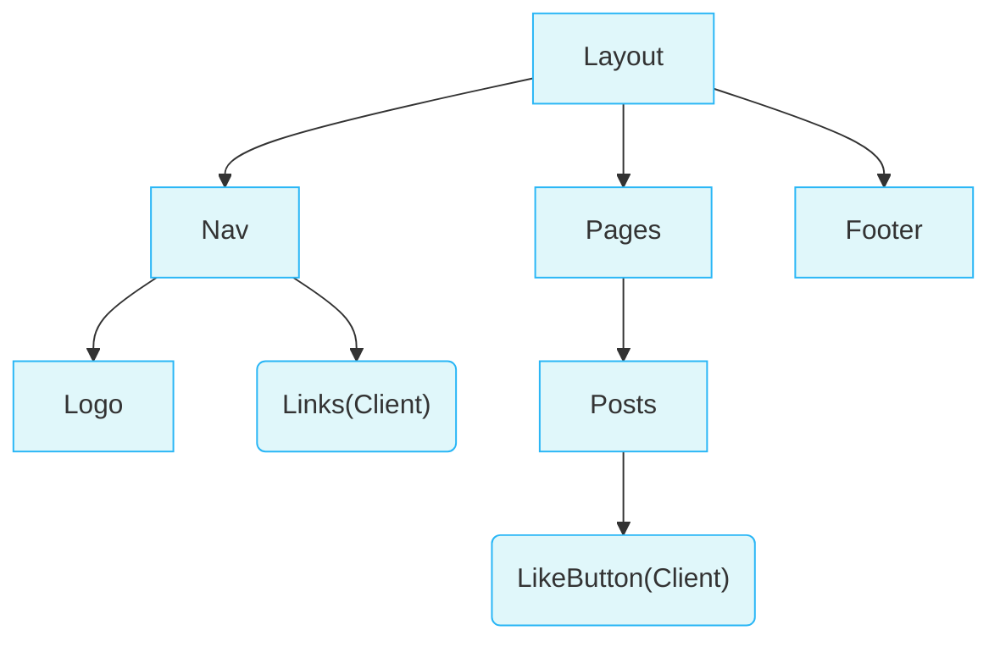

## React & Next.js

### Build Web

**Building blocks of a web application**

There are a few things you need to consider when building modern applications. Such as:

- **User Interface** - how users will consume and interact with your application.
- **Routing** - how users navigate between different parts of your application.
- **Data Fetching** - where your data lives and how to get it.
- **Rendering** - when and where you render static or dynamic content.
- **Integrations** - what third-party services you use (for CMS, auth, payments, etc.) and how you connect to them.
- **Infrastructure** - where you deploy, store, and run your application code (serverless, CDN, edge, etc.).
- **Performance** - how to optimize your application for end-users.
- **Scalability** - how your application adapts as your team, data, and traffic grow.
- **Developer Experience** - your team's experience building and maintaining your application.

For each part of your application, you will need to decide whether you will build a solution yourself or use other tools, such as packages, libraries, and frameworks.


**React** is a JavaScript **library** for building **interactive user interfaces**.


### Next.js


You can use React to build your UI, then incrementally adopt Next.js features to solve common application requirements such as routing, data fetching, and caching - all while improving the developer and end-user experience.


### Client & Server

The **client** refers to the browser on a user’s device that sends a request to a server for your application code. It then turns the response it receives from the server into an interface the user can interact with.

The **server** refers to the computer in a data center that stores your application code, receives requests from a client, does some computation, and sends back an appropriate response.


## Network Boundary

The **Network Boundary** is a conceptual line that separates the different environments.

网络边界，用于区分不同的环境，区分使用服务端组件(Server Components)还是客户端组件(Client Components)



例如在上述图中，我们可以将`Links`组件和`LikeButton`组件在客户端进行渲染，其他组件采用服务端渲染


### 服务端和客户端结合

当服务端组件(Server Components)被在服务端渲染完成后，一种特殊格式的数据会传到客户端来，这种数据被称为**RSC (React Server Component Payload)**

RSC包括

- 服务端组件渲染后的结果
- client components的placeholder/holes

通过RSC数据，React可以将服务端组件内容和客户端组件内容进行结合，并进行DOM挂载


## 客户端组件

> Client Components

与服务端组件不同，客户端组件即我们通常理解的React组件，直接在客户端进行渲染+挂载，不会在服务端进行渲染

### 基本使用

客户端组件，使用的时候在顶部添加`'use client'`关键字

```jsx
'use client';
 
import { useState } from 'react';
 
export default function LikeButton() {
  const [likes, setLikes] = useState(0);
 
  function handleClick() {
    setLikes(likes + 1);
  }
 
  return <button onClick={handleClick}>Like ({likes})</button>;
}
```


## Next项目基本结构

**`/app`**: Contains all the routes, components, and logic for your application, this is where you'll be mostly working from.

**`/app/lib`**: Contains functions used in your application, such as reusable utility functions and data fetching functions.

**`/app/ui`**: Contains all the UI components for your application, such as cards, tables, and forms. To save time, we've pre-styled these components for you.

**`/public`**: Contains all the static assets for your application, such as images.

**`/scripts`**: Contains a seeding script that you'll use to populate your database in a later chapter.

**Config Files**: You'll also notice config files such as `next.config.js` at the root of your application. Most of these files are created and pre-configured when you start a new project using `create-next-app`. You will not need to modify them in this course.


## 集成Ant Design

