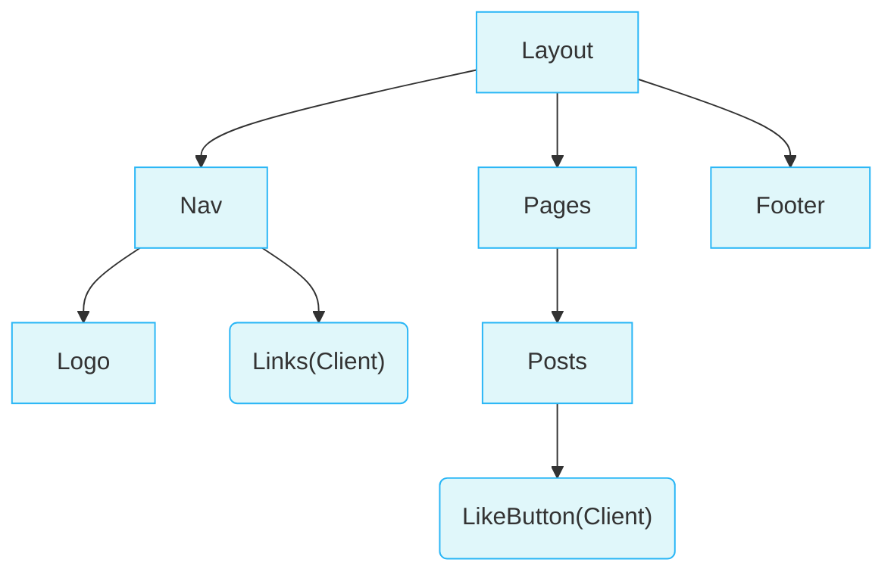

## React & Next.js

### Build Web

**Building blocks of a web application**

There are a few things you need to consider when building modern applications. Such as:

- **User Interface** - how users will consume and interact with your application.
- **Routing** - how users navigate between different parts of your application.
- **Data Fetching** - where your data lives and how to get it.
- **Rendering** - when and where you render static or dynamic content.
- **Integrations** - what third-party services you use (for CMS, auth, payments, etc.) and how you connect to them.
- **Infrastructure** - where you deploy, store, and run your application code (serverless, CDN, edge, etc.).
- **Performance** - how to optimize your application for end-users.
- **Scalability** - how your application adapts as your team, data, and traffic grow.
- **Developer Experience** - your team's experience building and maintaining your application.

For each part of your application, you will need to decide whether you will build a solution yourself or use other tools, such as packages, libraries, and frameworks.


**React** is a JavaScript **library** for building **interactive user interfaces**.


### Next.js


You can use React to build your UI, then incrementally adopt Next.js features to solve common application requirements such as routing, data fetching, and caching - all while improving the developer and end-user experience.


### Client & Server

The **client** refers to the browser on a user’s device that sends a request to a server for your application code. It then turns the response it receives from the server into an interface the user can interact with.

The **server** refers to the computer in a data center that stores your application code, receives requests from a client, does some computation, and sends back an appropriate response.


## Network Boundary

The **Network Boundary** is a conceptual line that separates the different environments.

网络边界，用于区分不同的环境，区分使用服务端组件(Server Components)还是客户端组件(Client Components)



例如在上述图中，我们可以将`Links`组件和`LikeButton`组件在客户端进行渲染，其他组件采用服务端渲染


### 服务端和客户端结合

当服务端组件(Server Components)被在服务端渲染完成后，一种特殊格式的数据会传到客户端来，这种数据被称为**RSC (React Server Component Payload)**

RSC包括

- 服务端组件渲染后的结果
- client components的placeholder/holes

通过RSC数据，React可以将服务端组件内容和客户端组件内容进行结合，并进行DOM挂载


## 客户端组件

> Client Components

与服务端组件不同，客户端组件即我们通常理解的React组件，直接在客户端进行渲染+挂载，不会在服务端进行渲染

### 基本使用

客户端组件，使用的时候在顶部添加`'use client'`关键字

```jsx
'use client';
 
import { useState } from 'react';
 
export default function LikeButton() {
  const [likes, setLikes] = useState(0);
 
  function handleClick() {
    setLikes(likes + 1);
  }
 
  return <button onClick={handleClick}>Like ({likes})</button>;
}
```


## Next项目基本结构

**`/app`**: Contains all the routes, components, and logic for your application, this is where you'll be mostly working from.包括路由，组件，应用逻辑

**`/app/lib`**: Contains functions used in your application, such as reusable utility functions and data fetching functions.包括客服用的公共方法，API请求函数

**`/app/ui`**: Contains all the UI components for your application, such as cards, tables, and forms.包含所有的可复用的UI组件，例如表格或者表单

**`/public`**: Contains all the static assets for your application, such as images.包含所有静态资源

**`/scripts`**: Contains a seeding script that you'll use to populate your database. 包括服务端与数据库交互的代码文件

**Config Files**: You'll also notice config files such as `next.config.js` at the root of your application. 配置文件


## 内置组件

### Image

传统html中的图片组件大致为

```html

```

为了优化这个组件，我们需要

1. Ensure your image is responsive on different screen sizes.
2. Specify image sizes for different devices.
3. Prevent layout shift as the images load.
4. Lazy load images that are outside the user's viewport.

Next内置的Image组件可以帮助处理上面所提到的内容

```jsx
import Image from 'next/image';

...

<Image
  src="/hero-desktop.png"
  width={1000}
  height={760}
  className="hidden md:block"
  alt="Screenshots of the dashboard project showing desktop version"
/>
<Image
  src="/hero-mobile.png"
  width={560}
  height={620}
  className="block md:hidden"
  alt="Screenshot of the dashboard project showing mobile version"
/>
```

其中，通过tailwind css提供的样式，`md:hidden`和`md:block`来控制在不同显示器上的展示与否

主要是通过屏幕宽度来定制，相关断点的默认值如下

1. `sm:` 适用于最小屏幕宽度为640px的设备。
2. `md:` 适用于最小屏幕宽度为768px的设备。
3. `lg:` 适用于最小屏幕宽度为1024px的设备。
4. `xl:` 适用于最小屏幕宽度为1280px的设备。
5. `2xl:` 适用于最小屏幕宽度为1536px的设备。


## Routing

### 路由规则

Next中的路由，是跟随文件夹进行动态生成的，例如

`/app` 称为**根项目(root segment)**，对应**根路由(/)**

`/app/dashboard` 文件夹称为为 **项目(segment)**， 对应**项目路由(/dashboard)**

`/app/dashboard/invoices` 文件夹称为 **子项目(leaf segment)**, 对应**子路由(/dashboard/invoice)**


### Page

page.tsx是一类特殊的next文件，相当于**关键字**，根据上述路由规则新建的文件夹内，**有page.tsx文件才会被认定为是有效路由**，从而实现直接通过路由进行访问

例如：`/app/dashboard/page.tsx ` 对应的路由是 `/dashboard`


### Layout

与page.tsx类似的还有layout.jsx，layout也可以当做是一个关键字

它的作用是将当前文件夹以及当前文件夹内所有子文件夹内的page或layout自动挂载上当前的layout，一般用来做侧边栏，顶栏，面包屑等等，可以保持这些组件不会反复渲染

例如：dashboard内有个page.tsx和layout.tsx，layout引入了侧边栏SideNav，那么，所有dashboard内的子路由（包括/dashboard本身），都会自动挂载上SideNav组件，而且切换到其他/dashboard下的路由的时候，也不需要重新渲染SideNav

下面是一个标准的Layout结构

```jsx
import SideNav from '@/app/ui/dashboard/sidenav';
 
export default function Layout({ children }: { children: React.ReactNode }) {
  return (
    <div className="flex h-screen flex-col md:flex-row md:overflow-hidden">
      <div className="w-full flex-none md:w-64">
        <SideNav />
      </div>
      <div className="flex-grow p-6 md:overflow-y-auto md:p-12">{children}</div>
    </div>
  );
}
```


### Link

在Next中，要实现路由跳转，可以通过Next自带的Link组件实现

通过**href**实现路由跳转

```jsx
import Link from 'next/link';

const links = [
  {
    name: 'Invoices',
    href: '/dashboard/invoices',
    icon: DocumentDuplicateIcon,
  },
  ...
];

return (
  <Link
    key={link.name}
    href={link.href}
  >
    <LinkIcon className="w-6" />
    <p className="hidden md:block">{link.name}</p>
  </Link>
)
```

在**视口(viewport)**中如果出现了`<Link />`，那么next会在后台**预取(prefetch)**出其中的代码，以便用户点击的时候可以实现立即响应(near-instant)


### Related Hooks

**usePathname**

usePathname可以获取当前的路由path

```jsx
import { usePathname } from 'next/navigation';
...
const pathname = usePathname() // /dashboard/invoices
```


## Database

数据库模块直接参考教程进行配置，不赘述了


## Fetching Data

**API layer**

API层(Api layer)是**业务代码(application code)**和数据库进行交互的**中间层(intermediary)**

**Database queries**

当需要进行数据库查询时，一般是在进行如下场景：

- 创建API接口(API endpoint)时，需要与database进行交互，提供数据给前端
- 使用服务端组件(Server Components)时，在服务端与database进行交互，无需编写API接口


## 服务端组件

`Server Components`


