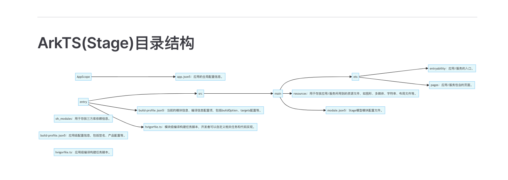

## vite-press + typora

主要讲一下 vite-press 和 typora 结合，搭建自己的笔记库

## favicon 和 logo 的的配置

在 config.mts 文件中

### favicon

head 用于设置网页的 favicon


需要注意的是,href 的根路径对应的是项目的/docs 路径！

```typescript
head: [
    [
      "link",
      { rel: "icon", type: "image/x-icon", href: "/public/assets/boat.png" },
    ],
],
```

### logo

logo 即左上角的这个位置


此处可以通过设置 themeconfig 实现

```typescript
 themeConfig: {
    logo: "/public/assets/boat.png",
    ...
 }
```

## Mermaid 支持

> 参考文档：
>
> https://emersonbottero.github.io/vitepress-plugin-mermaid/guide/getting-started.html

安装插件即可

```bash
npm i vitepress-plugin-mermaid mermaid -D
```

然后，在 vitepress/config.mts 中，将原本利用 defineConfig 进行的导出，改成 withMermaid

```javascript
// import { defineConfig } from "vitepress";
import { withMermaid } from "vitepress-plugin-mermaid";

// export default defineConfig({
export default withMermaid({
  // config here
});
```

最后，添加 mermaid 配置

```javascript
export default withMermaid({
  // your existing vitepress config...
  // optionally, you can pass MermaidConfig
  mermaid: {
    // refer https://mermaid.js.org/config/setup/modules/mermaidAPI.html#mermaidapi-configuration-defaults for options
  },
  // optionally set additional config for plugin itself with MermaidPluginConfig
  mermaidPlugin: {
    class: "mermaid my-class", // set additional css classes for parent container
  },
});
```

最终在github pages效果如下：


