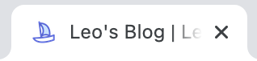
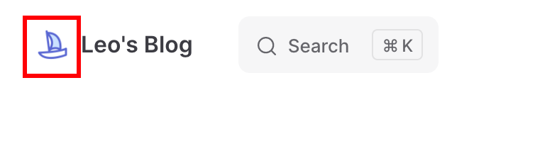

# vue-press & vite-press

## vite-press + typora

主要讲一下vite-press和typora结合，搭建自己的笔记库


## favicon和logo的的配置

在config.mts文件中

### favicon

head用于设置网页的favicon



需要注意的是,href的根路径对应的是项目的/docs路径！

```typescript
head: [
    [
      "link",
      { rel: "icon", type: "image/x-icon", href: "/public/assets/boat.png" },
    ],
],
```


### logo

logo即左上角的这个位置



此处可以通过设置themeconfig实现

```typescript
 themeConfig: {
    logo: "/public/assets/boat.png",
    ...
 }
```

