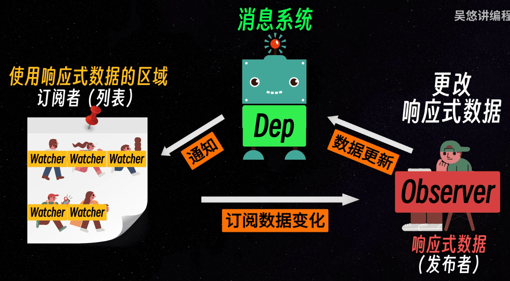

# Vue2

## Vue2基本指令

### v-once

v-once包裹的内容，只会渲染一次，后续值的更新不会触发组件渲染

### v-html

可用于解析html内容

### v-on/v-if/v-else-if...

经常用到，不多赘述


## 修饰符

### 事件修饰符

事件修饰符使得事件处理更简单，无需在方法内部手动调用函数如`event.preventDefault()`或`event.stopPropagation()`。

**.stop **调用`event.stopPropagation()`，停止事件冒泡

```html
<button v-on:click.stop="doThis">点击我</button>
```

**.prevent** \- 调用`event.preventDefault()`，阻止默认事件行为

以submit按钮提交为例，当不添加prevent事件时候，点击会直接触发原生方法，包括a标签也是，会直接跳转，通过prevent，可以阻止原生方法的执行

```html
<form v-on:submit.prevent="onSubmit">提交</form>
<a href="xxx" @click.prevent="handleClick">跳转</a>
```

**.capture** - 添加事件侦听器时使用事件捕获模式。

```html
<div v-on:click.capture="doThis">点击我</div>
```

**.self** - 只当在 event.target 是当前元素自身时触发处理函数。

```html
<div v-on:click.self="doThat">点击我</div>
```

**.once** \- 事件只触发一次。

```html
<button v-on:click.once="doThis">点击我</button>
```

**.passive** \- 以 `{ passive: true }`模式添加侦听器，常用于提高滚动性能。

```html
<div v-on:scroll.passive="onScroll">滚动我</div>
```

**.native** \- 已在vue3中移除，`.native`修饰符用于监听组件根元素的原生事件。

假设你有一个按钮组件`<my-button>`，这个组件内部渲染了一个`<button>`标签。如果你想在使用`<my-button>`时监听这个按钮的点击事件（一个原生的`click`事件），你需要使用`.native`修饰符。

```html
<div v-on:scroll.passive="onScroll">滚动我</div>
```


### 按键修饰符

用于键盘事件，使得只有在特定按键被按下时才触发事件。

```html
<!-- 只有在按下 Enter 键时才调用 vm.submit() -->
<input v-on:keyup.enter="submit">
```


### 鼠标按钮修饰符

Vue 2.2.0+ 新增，用于指定鼠标按钮。

```html
<!-- 只有在使用鼠标左键点击时才会触发 -->
<button v-on:click.left="doThis">点击我</button>
```


# Vue3

## Vue2的缺点

- 对typescript不友好
- mixin混入缺陷
- 响应式缺陷，利用defineProperty劫持对象，无法监听新增和删除属性，性能也比较低下
- 逻辑零散


## Vue3的变化

- monorepo源码管理，mono单个，repository仓库，将许多项目的代码存储在同一个仓库中（方便阅读理解源码）
- 采用typescript
- 改为proxy劫持对象
- 编译阶段，生成block tree，优化diff算法
- composition API


## 命令式编程&声明式编程

**命令式编程**：命令浏览器去干某件事情，例如，原生js控制浏览器监听按钮点击事件，改变变量的值，然后将改变的值重新通过innerHTML的方式渲染回页面

**声明式编程**：先通过定义/声明变量和方法完成相应功能，再将其邦洞到模板上


## MVVM架构

vue并没有完全按照MVVM的架构进行设计，但是参考了MVVM的思想

MVVM，即**View, View-Modal, Modal**

- View，视图层，在vue中的体现就是template，定义模板页面
- Model, 模型层，在vue中的体现是data和methods等，属于数据层面
- view-modal，即vue中的Vue.createApp，进行将数据与视图双向绑定，将model层的数据绑定给view，将view的dom事件绑定回model


## Key和diff算法

v-for进行遍历的时候，推荐给每个元素带上key，因为diff算法是根据key进行判断的，所以可以提高更新速度，减少不必要的DOM操作


## SFC开发模式

SFC即single-file components，单文件组件，即推荐使用.vue文件后缀，将template, js, css写在同一个文件内


## CSS

### CSS scoped

scoped表示改css仅在该文件内有效

### CSS中的v-bind

````js
<script setup>
const color1 = 'red'
</script>

<style>
  .red{
    color: v-bind(color1)
  }
</style>
````

 


## vue动态绑定

在vue中，通过`v-bind`，或者`:` 可以动态绑定值，例如

````vue
<div :name='leo'></div>
````

在此代码示例中，会将变量leo的值绑到属性name上

但有时候，我们可以直接将变量当做属性本身的名字！

````vue
<div :[name]='leo'></div>
````

这种情况下，name和leo都是变量！


## 自定义指令

自定义指令`Custom Directives`

除了vue自带的内置指令，例如v-if, v-show，我们还能自定义一些自己的指令
以下是使用自定义指令实现鉴权的操作，真实场景下可以封装成一个hooks应该会更好

```vue
<template>
	<div v-my-directive:aaa.leo={background: red}></div>
</template>

<script setup>
  import { DirectiveBinding } from 'vue'
  const vMyDirective = (el: HTMLElement, binding: DirectiveBinding) => {
    el.firstElement.style.background = binding.value.background
  }
</script>
```


### 原生拖拽(Directives)
通过自定义指令，可以绑定原生拖拽事件，从而实现绑定事件使得元素可被拖拽

该案例中需要用到原生事件监听函数**addEventListener**和**removeEventListener**

监听的事件为**mousemove**鼠标移动事件和**mouseup**鼠标抬起事件

⚠️注意点：本案例中，绑定的div盒子必须要是**非static的定位**，可以是*relative, absolute, fixed, sticky*


```vue
<template>
	<div class='draw-box' v-my-draw>draw box</div>
</template>

<script setup>
  import { DirectiveBinding } from 'vue'
  const vMyDraw = (el: HTMLElement, binding: DirectiveBinding) => {
    const onMouseMove = (e: MouseEvent) => {
      let x = e.clientX - el.offsetLeft
      let y = e.clientY - el.offsetTop
      el.style.left = e.clientX - x + 'px'
      el.style.top = e.clientY - y + 'px'
    }
    document.addEventListener('mousemove', onMouseMove)
    document.addEventListener('mouseup', ()=>{
      document.removeEventListener('mousemove', onMouseMove)
    })
  }
</script>

<style>
  .draw-box{
    position: absolute;
  }
</style>
```


### 图片懒加载(Directives)

代码和解析如下：

```vue
<template>
	lazy load</img>
</template>
```

1. 这里定义了一个Vue模板，使用`v-for`指令循环遍历数组`arr`中的每个项。
2. 自定义指令`v-my-lazy-load`用于实现图片的懒加载功能，它接受一个绑定值`item`，这个值是图片的URL

```vue
<script setup>
  import { DirectiveBinding } from 'vue'
  import imageList: Record<string, {default: string}> = import.meta.glob('./assets/images/*.*', {eager:true})
  
  let arr = Object.value(imageList).map(v=> v.default)
  const vMyLazyLoad = (el: HTMLElement, binding: DirectiveBinding) => {
    const def = await import ('./assets/ver.svg')
    el.src = def.default
    const observer = new IntersectionOvserver((entry)=>{
      if(entry[0].intersectionRatio > 0){
        el.src = binding.value
        observer.unobserver(el)
      }
    })
  }
</script>
```

1. `DirectiveBinding`从Vue库中导入，它是自定义指令的类型。
2. 使用`import.meta.glob`加载`./assets/images/`目录下的所有图片文件，返回一个对象，其中包含了所有匹配文件的模块，这是vite提供的一个批量引入的方式
3. `imageList`对象的每个属性都是一个模块，这些模块具有一个`default`属性，该属性是图片的URL。
4. `arr`是一个包含所有默认导出图片URL的数组。
6. `await import('./assets/ver.svg')`动态导入一个默认的占位图，并将它设置为元素的`src`属性。
7. `IntersectionObserver`用来观察元素何时进入视口。一旦观察到元素进入视口（`intersectionRatio > 0`），将图片的`src`设置为绑定值（即实际图片的URL），并停止观察元素。


## Composition API

### ref,reactive

ref定义简单数据类型和获取DOM，reactive定于引用数据类型

```vue
<template>
	<div ref='simDom'></div>
</template>
<script>
  import { ref, reactive } from 'vue'
  const name = ref<string>('Leo')	// 定义简单类型
  const simDom = ref<HTMLElement>()	// 获取DOM
</script>
```


### isProxy, isReactive, isReadonly, isRef

用于判断某个对象是否为响应式对象/属性

**注意：ref创建的是RefImpl对象，因此不可以用isProxy来判断**


### toRaw

用于将响应式对象变回普通对象


### shallowReactive, shallowReadonly

创建浅层的代理响应式/只读对象，只有对象的**根级别**的属性具有对应特性


### toRef

可用于拆分响应式对象，令其中的每个属性都具有响应式

````js
<template>
	<button>{{age}}</button>
</template>

// 错误示范
<script setup>
  const reactiveObj = reactive({name: 'Leo', age: 10})
	const { name, age } = reactiveObj
  const addAge = () => {
    age ++ 	// 此时对age进行操作，页面上无响应
  }
</script>

// 正确示范
<script setup>
  const reactiveObj = reactive({name: 'Leo', age: 10})
	const { name, age } = toRef(reactiveObj) // 使用toRef包裹住
  const addAge = () => {
    age ++ 	// 此时对age进行操作，页面上有
  }
</script>
````


### unref

该函数接收一个参数，如果参数是个ref属性，则返回其value，如果不是，则返回参数本身

本质上是如下的一个语法糖

````js
result = unref(val)
result = isRef(val) ? val.value : val
````


### computed

computed和vue2中的用法差别不大

````js
const computedValue = computed(()=> val1 + val2)
````

不过computed函数支持传入set和get

````js
const computedValue = computed({
  get: ()=> val1 + val2,
  set(newVal){
  	first = val1;
    second = val2
	}
})
````


### watch, watchEffect

watch的用法和vue2中差不多，如下

```typescript
const name = ref('Leo')
const obj = reactive({
  age: 18
  height: 180
})

watch(name, ()=> console.log(name))
watch(obj, 
      ()=> console.log(obj), 
      {
  			deep: true,	// 	deep属性对于reactive包裹的对象来说是默认开启的，关闭的话，监听不到对象里面值的变化
  			immediate: false,	// immediate默认关闭，用于决定是否需要函数一进来就调用一次watch函数
			}
)
```

**watchEffect和react中的useEffect效果一样**

**与watch不同的是，watch需要传入监听的值，但是watchEffect不需要，它会自动监听watchEffect里面所有值的变化，任何一个值发生变化，都会触发watchEffect的刷新**

watchEffect在运行时会立即触发一次，最后会监听写在传入其中的函数体内响应式数据，当其中的响应式数据再度发生变化的时候，会自动触发watchEffect的执行

除此之外，watchEffect函数本身的返回值是一个stop函数，当需要停止监听的时候，直接调用即可

````js
const age = ref(18)
const age2 = ref(20)
const stop = watchEffect(()=>{
  console.log('age: ', age) // 每次age发生变化，都会触发该watch
})
const stopWatch = watchEffect(()=>{
  console.log('age2', age2)
  oninvalidate(()=>{
    console.log('before')  // oninvalidate会在watch执行前触发，可用于加一些防抖逻辑
  })
})
const changeAge = () => {
	if(age > 65){
    stop()	// 调用watchEffect本身返回的函数，即可停止监听
  }else{
    age ++
  }
}

````


## Vue3组件

### Teleport

内置组件，可以直接使用，将组件挂载到某一特定DOM节点下，而不是挂载到当前组件中

```typescript
<template>
  // 此处会将SomCom挂载到body上，而不是挂载到当前的父组件上
	<Teleport to="body" disable="">
  	<SonCom></SonCom>
  </Teleport>
</template>
```


### Keep-alive

用于缓存用户数据，例如表单提交中，如果切换到了别的组件，再切回来可以保证数据不丢失，有点类似v-show，但是v-show不能跨路由，但是keep-alive可以

```typescript
<template>
  // AForm组件切换的时候会丢失表单数据
	<AFrom></AFrom>
	<keep-alive>
  	// BForm组件切换的时候不会丢失表单数据，下次进来会继续保持
  	<BFrom></BFrom>
  </keep-alive>
</template>
```

Keep-alive会让组件多两个生命周期

```typescript
onActivated(){
  // 每次keep-alive包裹的组件切换出来进行渲染的时候会执行
}
onDeactivated(){
  // 每次keep-alive包裹的组件切换隐藏的时候会执行
}
onUnmounted(){
  // keep-alive包裹的组件，不会走onMounted进行卸载
}
```


### transition

动画组件

// TODO


### provide & inject

在不使用状态管理库的时候，用于多级组件之间传递数据

```typescript
// grandparent comp ----------------------------
<script>
import { ref, provide } from 'vue'
const colorVal = ref('red')
provide('color', colorVal)
</script>


// grandson comp ----------------------------
<temaplate>
 	<div class='box'></div>
</template>

<script setup>
import { inject } from 'vue'
const color = inject<Ref<string>>('color')
// 子组件还可以改provide传入的值，如果不希望子组件修改传入的值，可以在provide的时候设置为readonly(colorVal)
color.value = 'yellow'
</script>

<style scoped>
.box{
  background: v-bind(color)
}
</style>
```


## Vue3组件生命周期

**vue2中的beforeCreated和created在setup模式下是不存在的**，使用setup直接替换掉了。

也就是说，使用了**\<script setup>\</script>**这种写法的话，组件创建的时候就直接进入到了script里面，不需要再created了

Vue3 composition API中的组件

```vue
<script setup>
  // onBeforeMount阶段获取不到DOM
  onBeforeMounted(()=>{})
  
	onMounted(()=>{})
  
	onBeforeUpdate(()=>{})
  
	onBeforeUnmounted(()=>{})
  
	onUnmounted(()=>{})
</script>
```


## 组件传参

### 父组件 to 子组件

```typescript
// 父组件传递
<Son title="leo" :arr="parentArr"></Son>

// 子组件接收
// 1.js方式
const props = defineProps({
	title: {
    type: string
    default: ''
  },
  arr: {
    type: Array,
    default: [],
	}
})
// 2.ts方式
const props = defineProps<{
  title: string,
  arr: number[],
}>
      
// 子组件使用
// 模板中，直接使用
<template>{{title}} {{arr}}</template>
// script中，[props.]的方式使用
const result = `Hello ${props.title}`
```


### 子组件 to 父组件

**js方式**

```typescript
// 父组件
<Son @on-click='func'></Son>
const func = (name) => `Hello ${name}`

// son
const emit = defineEmits(['on-click', ...])
const send = () => {
  emit('on-click', 'Leo')
}
```

**ts方式**

```typescript
// son
const emit = defineEmits<{
  (e: "on-click", name:string):void,
  (e: "on-touch", name:string):void,
  ...
}>
```


### defineExpose

与vue2不同，vue2中，父组件可以通过$ref的方式拿到子组件实例，并获取子组件的方法和属性，如下

```vue
<s-form-item
  ref="bankName"
  ...
>
  <s-input ...></s-input>
</s-form-item>
<script>
  ...
this.$refs.bankName.resetField()
</script>
```

但在vue3中，子组件需要通过**defineExpose**暴露属性，父组件通过ref才能拿到

```typescript
// 子组件定义好需要暴露给父组件的属性或方法
<script setup>
import { ref } from "vue";
const innerValue = ref("innerValue");
const exportsValue = ref("exportsValue");
const sayHi = () => 'Hello world'
defineExpose({
  exportsValue,
  sayHi
});
</script>

// 父组件
// template中，给子组件加上ref
<Son ref='sonCom'></Son>

// script中，正常引入子组件
import sonComponent from './Son'

// 利用ts和vue3的特性，类似vue2中的$refs，ref()可以拿到同名的ref组件的vue实例
const sonCom = ref<InstanceType<typeof sonComponent>>()

// 通过[.value]的方式可以拿到暴露出来的值            
// ⚠️注意！获取子组件的value需要写在onMounted里面，不然拿到的会是null！
onMounted(() => {
  console.log("test", sonCom.value); // 可以拿到exportsValue和sayHi，拿不到innerValue
});
```


### 兄弟组件传参

#### 父组件当桥梁

通过父组件当作桥梁进行传参，不做演示了

#### eventBus (for vue2)

利用全局事件总线。

在vue2中，在$vue上面，通过全局注册一个发布订阅的bus, 使用emit和on进行组件间的通信

```typescript
// 给vue的根节点挂载eventBus
class Bus {
  ...
  emit(eventName, params){ ... }
  on(eventName, callback){ ... }
}
                          
// 组件A
import Bus from './Bus'
Bus.emit('passParam', 'Hello')
                          
// 组件B
import Bus from './Bus'
Bus.on('passParam', (params)=>{console.log(params)})
```

#### mitt (for vue3)

用法和vue2的eventBus差不多，不过mitt封装得更完备一点

首先，在main.ts中，将mitt挂载到$vue上

```typescript
// TODO
```

然后，在子组件中通过拿到组件实例进行使用

```typescript
// 组件A
<script setup>
import { getCurrentInstance } from 'vue'
const instance = getCurrentInstance()
instance.proxy.$Bus.emit('eventName', params)
</script>

// 组件B
<script setup>
import { getCurrentInstance } from 'vue'
const instance = getCurrentInstance()
// 可以监听某个事件
instance.proxy.$Bus.on('eventName', (...)=> {
  callback()
})
// 也可以选择监听所有事件，然后根据不同的事件再做不同决定
instance.proxy.$Bus.on('*', (EventType, ...)=> {
  callback()
})
</script>
```


## 组件

### 局部组件

不同于vue2需要注册组件

```typescript
components: {
  ACom,
  BCom,
  CCom,
}
```

vue3组件引入即可直接使用

```typescript
<template>
  <SonComp ref="sonCom"></SonComp>
</template>

<script setup>
import SonComp from "./components/SonCom.vue";
```


### 全局组件

**app.component**

在main.ts里面，通过**app.component**进行全局注册，之后在任何vue文件中都可以直接使用

```typescript
// main.ts
import myComponent from './components/myComponent.vue'

app.component('myComp', myComponent)

// 其他组件中，不需要再import，可以在Template中直接使用
<MyComp></MyComp>
```


### 递归组件

#### Tree

```typescript
<template>
  <div v-for="item in data">
    <input v-model="item.checked" type='checkbox' @click='select'><span>{{item.name}}</span>
		// 方式一：直接使用文件名，比如当前文件名是Tree.vue，就可以直接使用<Tree>
		<Tree v-if="item.children?.length" :data="item?.children"></Tree>
		// 方式二：使用namespace，需要额外写一个script，见下
		<Leo v-if="item.children?.length" :data="item?.children"></Leo>
  </div>
</template>

// 方式二的namespace定义
<script lang='ts'>
export default {
	name: 'Leo'
}
</script>

<script setup>
interface Tree {
  name:string
  checked: false
  children?: Tree[]
}

const data = reactive<Tree[]>([
  {
    name: '1',
    checked: false,
    children: [
      {
        name: '1-1'
        checked: false,
        children: [
          {
						name: '1-1-1'
        		checked: false,
          }
        ]
      }
    ]
  },
  {
    name: '2',
    checked: false,
  }
])
</script>
```

#### 递归组件冒泡

在上述事例中，我们点击1-1-1所对应的那个checkbox的时候，会同时触发1-1-1, 1-1, 1三个checkbox的事件，这个时候，我们需要将click后面添加**.stop**来阻止事件冒泡

```typescript
<input v-model="item.checked" type='checkbox' @click.stop='select'><span>{{item.name}}</span>
```


### 动态组件

使用component的方式，可以

```typescript
<template>
  <component :is='comId'></component>
</template>

<script setup>
import ACom from './ACom.vue'
const comId = shallowRef(ACom)
</scipt>
```


### 异步组件

#### 异步组件和懒加载


## 插槽

### 匿名插槽

```typescript
// 父组件
<template v-slot>
  content
</template>

// 子组件
<slot></slot>
```


### 具名插槽

```typescript
// 父组件
<template v-slot:header>
  content
</template>
//或者简写成
<template #header>
  content
</template>

// 子组件
<slot name="header"></slot>
```


### 动态插槽

```typescript
// 父组件
<template #[slotName]>
  content
</template>

<script setup>
const slotName = ref('header')
</scipt>
```


### 插槽传值

TODO


## 源码分析

### 整理框架设计思路

整体的框架思路就是一个进阶版的发布订阅系统从而实现的双向绑定系统




### 响应式原理

**基本使用**

根据手写代码的逻辑，根据使用，来反推写法，vue2的基本使用如下

```html
...
<div id="app">
  <h1>Title: {{ title }}</h1>
  <p>Content: {{ content }}</p>
</div>
...

<script src='vue cdn address'></script>
<script>
	const vm = new Vue({
    el: '#app',
    data(){
      return {
        title: 'title',
        content: 'content',
      }
		}
  })
</script>
```

可以看到，new了一个Vue实例，传入了一个配置对象`options`，其中包含了要挂在的位置`el`，还包含了`data`，即vue实例中的状态

**实现Vue class**

```js
class Vue{
  constructor(options){
    this.$options = options
    this.$data = options.data
    const el = options.el
    this.$el = typeof el = string ? document.querySelector(el) : el // 这里默认el要么是string，要么是HTMLElement
	}
}
```

上面就是一个基本的Vue的结构了，我们需要再往里面补充逻辑

1. **将属性注入到vue实例**
2. **创建observer对data的属性变化进行监听**
3. **视图的解析**

**功能实现**

下面来分别进行讲解

第一步，将属性注入到Vue的实例中，为的是直接this.name就可以拿到上面vm实例中，$data里面的值，相当于是为了实现直接通过`this.name`可以拿到`this.$data.name`的值，这一步，vue2采用的是defineProperty来实现

⚠️**注意！**这里，我们不能直接用`Object.assign(target, source)`的方式进行处理，因为这样**对于值类型来说是深拷贝**。这么做，并不是通过this.name拿到this.$data.name，而是直接复制一个值，当我们尝试更改this.name的时候，并不是更改的this.$data.name

```js
class Vue {
  constructor(){...}
  
  ...
  // 将属性注入到vue实例
  proxyVm(this, this.$data)
}
  
function proxyVm (target, source){
  // 先通过Object.keys拿到source里面的所有key，进行循环
  Object.keys(data).forEach(key => {
    // 将每个属性，都添加到vue实例上
    Object.defineProperty(target, key, {
      enumerable: true,
      configurable: true,
      get(){
        return source[key]
			}
      set(newValue){
      	source[key] = value
    	}
    })
  })
}
```

第二步，创建Observer实现对data里面属性的监听，这是通过创建一个Observer类来实现的

要实现这个Observer，我们需要将data传进去，并分别对里面的每个属性进行监听，如果属性的值本身是个对象，则需要递归进行监听

```js
class Vue {
  constructor(){...}
  
  ...
  // 创建一个新的Observer，来实现对data里面所有数据的响应式
  new Observer(data)
}

class Observer {
  constructor(data){
    this.data = data
    // 这个walk用来实现具体的监听逻辑
		this.walk(data)
  }
  
  // 将整个data,单个属性key以及值value，也就是data[key]传入
  walk(data){
    Object.keys(data).forEach(key => defineReactive(data, key, data[key]))
  }
}

// 该方法用于设置响应式
function defineReactive(data, key, value){
  // 如果data中的某个属性本身也是个对象，那么就需要进行递归创建响应式
  if (typeof value === 'object' && value !== null){
    return new Observer(value)
  }
  // 
  Object.defineProperty({
    enumerable: true,
    configurable: true,
    get(){
      // 逻辑待补充
    }	
    set(){
    	// 逻辑待补充
		}
	})
}
```

上面就创建了一个响应式监听的框架，但是具体响应式get和set的时候应该需要进行什么额外的逻辑呢

首先，我们的data里面的数据和页面模板template中的数据是需要双向绑定的，因此，创建响应式**实际上就是teplate里面用到的data数据，和data数据本身的一个双向绑定关系**，类似于一个双向的发布订阅模式，data变，template变，template变，data也要变

所以，我们需要记录一下template里面，哪些地方用到了data里面的数据，将其全部进行记录，进行存储管理，当data和template任意一个地方发生变化后，都需要通知另一方同样发生变化，而这个存储管理的地方，就类似于发布订阅中的eventBus的功能，在vue里面，这个地方就叫做`Dep`

故而，我们new一个Dep用于管理发布和订阅，**它里面会记录使用了当前的响应式数据的所有的template的区域，以及每个区域需要对应更新的方式（即eventbus中subscriber的回调函数）**

对应的，每个Observer都会需要new一个Dep，用于通知dep当前Observer发生了变化，需要通知其他地方，我们在Observer中添加

```js
class Observer {
  constructor(data){
    this.data = data
		this.walk(data)
    // 添加eventBus
    this.dep = new Dep()
  }
  
  walk(data){
    const dep = this.dep
    Object.keys(data).forEach(key => defineReactive(data, key, data[key], dep))
  }
}
```

然后，defineReactive中，这一块对于响应式逻辑的处理也可以添加逻辑了

```js
Object.defineProperty({
  enumerable: true,
  configurable: true,
  get(){
    // 当响应式数据被读取，我们要通过dep记录一下读取的位置，方便到时候响应式数据进行变更的时候可以通知这里进行更改
    dep.addSubscriber()
  }	
  set(newValue){
    // 通过dep，通知所有使用到了当前属性的地方，对这个值的变更进行更新
  	dep.notify()
  }
})
```

好，接下里，我们可以实现这个`Dep`了，和eventBus一样，定义一个`subscribers`，用于存储每个使用到该响应式数据的地方，然后实现一下上面提到的`addSubscriber`和`notify`，这就和发布订阅模式保持一致了

```js
class Dep{
  constructor(){
    this.subscribers = []
	}
  
  // 此时，我们还不确定这个subscriber的形态
  addSubscriber(...){
    this.subscribers.push(...)
	}
  
  notify(){
    // update就是 subscriber的更新回调
    this.subscribers.forEach(sub => sub.update())
  }
}
```

下一步，我们需要确认的就是这个subscribers里面应该存什么，怎么描述这个subscriber的位置？这样就引申到了第三部分，视图的解析

**第三步，视图解析compiler**

定义一个compiler类，用于解析template，看看哪些地方用到了响应式数据，并在对应的地方创建一个`watcher`，和响应式数据Observer相关联，这样就可以在Observer更新的时候，同时进行更新了


### 整体模块划分

整体模块划分为三大块，**compiler-module，renderer-module，reactivity-module**

+ 编译器模块compiler将视图模板编译成一个**渲染函数**
+ 数据响应式模块reactivity将模板中使用到的**数据对象变为为响应式对象**，就是上面提到的响应式原理
+ 渲染模块开始进入渲染阶段(render phase)，调用刚刚生成的**渲染函数**，观察响应式数据对象的变化，并返回一个**虚拟的DOM节点**
+ 然后在挂载阶段(mount phase)，调用`mount`函数，使用**虚拟DOM节点**来创建web页面
+ 当观察的响应式对象发生变化时，渲染模块会再次调用**渲染函数**创建一个新的虚拟DOM节点，然后发送到`patch`函数中，进行DOM diff，然后更新视图


### 响应式原理分析

针对reactivity-module响应式模块，其核心原理是：

**通过Proxy代理目标对象的存取器，拦截存取操作，在执行收集依赖track以及出发更新trigger的方法后，再完成原先的存取操作**


#### reactive

> http://www.zhufengpeixun.com/advance/guide/04.reactivity-2.html#reactivity%E6%A8%A1%E5%9D%97%E5%9F%BA%E6%9C%AC%E4%BD%BF%E7%94%A8
>
> 密码：2558@手机号后四位

reactive函数接收一个对象，返回一个proxy

reactive仅用于创建响应式对象，不用于监测，不涉及到

````typescript
export const reactive = <T extends object>(target: T) => {
  return new Proxy(target, {
    get(target, key, reciever){
      // return target[key]  
      // 此处本应该直接返回target[key]，但是出于保证this的指向始终是指向的调用对象，而不是代理对象本身
      // 详情可参考 https://juejin.cn/post/7101084596053213215
      let res = Reflect.get(target, key, reciever)
      return res
    },
    set(){
      let res = Reflect.set(target, key, reciever)
      return res
    },
    delete(){}
    ...
  })
}
````


#### effect

````typescript
let activeEffect;
export const effect = (fn: Function) => {
  const _effect = function(){ // 设置一个闭包
    activeEffect = _effect 	// 将当前的effect作为全局的当前活跃effect
    fn()	
  }
  _effect() // 传入的函数会调用一下
}
````


#### traker

目前能力有限，有点听不懂，之后再回顾一下

> https://www.bilibili.com/video/BV1dS4y1y7vd?p=10&vd_source=6adac1d9bbd16466fad0c4ec156dc9b7 p10

````typescript
const targetMap = new WeakMap()
export const track = (target, key) => {
  
}
````


#### computed

```typescript
// computed 基本使用
// 1. 传入函数 computed(()=>{})
// 2. 传入对象 computed({ get(){}, set(){} })
// 重点是进行脏值检测

// 此处引入effect
import { effect } from './effect'

export const computed = (getter: Function) => {
  // let getter;
  // let setter;
  // 1. 如果传入一个函数，则为该函数为getter，否则将会对象。
  let _value = effect(getter)
  let cacheValue
  let _dirty = true	// 脏值检测
  
  class ComputedRefImpl {
    get value(){
      if(_dirty){
        cacheValue = _value()
			}
      return cacheValue
    }
  }
  
  return new ComputedRefImpl()
}
```


#### watch

```typescript
// watch的基本使用
// watch(target, (newValue, oldValue)=>{})
// 对于reactive包裹的响应式对象来说，默认deep开启，对于ref包裹的响应式对象，默认deep为false
// watch([target1, target2 , (newValue, oldValue)=>{}, { deep: true, immediate: false })

// TODO:
```


### 虚拟DOM


### Diff算法

#### vue3 diff算法

vue3中比较子元素数组，使用到了diff算法，具体的流程如下：

统一使用案例

````javascript
c1: [a, b, c, d, e, f, g]			// 之前的子元素
c2: [a, b, e, c, d, h, f, g]		// 新的子元素
````

1. **先从头开始比**

   按上面的例子，那么可以排除掉ab不需要重新渲染

   ````javascript
   // 第一轮筛选过后
   [a, b, c, d, e, f, g]				// 之前的子元素
   [a, b, e, c, d, h, f, g]		// 新的子元素
   // 筛选结果，可以不需要重新渲染ab
   [a, b]  [c, d, e, f, g]  // 之前的子元素
   [a, b]  [e, c, d, h, f, g]		// 新的子元素
   ````

2. **再从尾部开始比**

   继续筛选，可以筛掉fg，根据下标，进行unmount

   ````javascript
   // 第二轮筛选过后
   [c, d, e, f, g] 			// 之前的子元素
   [e, c, d, h, f, g]		// 新的子元素
   // 筛选结果，可以不需要重新渲染fg
   [c, d, e]  [f, g]	  // 之前的子元素
   [e, c, d, h]  [f, g]		// 新的子元素
   ````

3. **然后判断是否为最简单的插入和删除操作**

   本情况，另起一个新例子，不看上面的，如下

   ````javascript
   // 案例1 --------------------------
   [a, b, c]
   [a, b, c, d]	
   // 第一二轮筛选完成后，发现老节点已经没了，剩下一个新节点d，直接进行插入d的操作即可
   
   // 案例2 --------------------------
   [a, b, c, d]
   [a, b, c]
   // 第一二轮筛选完成后，发现新节点已经没了，剩下一个老节点d，直接进行删除d的操作即可
   ````

   上面两案例中，经过第一轮，第二轮的筛选过后，会存在一个情况，那就是新或老元素节点其中一方已经空了，没了，那就不需要进行下面第四步的乱序比较了，直接进行插入和删除即可

4. **如果不是上述的简单情况，那么就需要进行复杂比对了**

   继续回到统一案例中，当经过一二轮筛选后，而且发现新老节点都还有剩下，那么就不会走第三步。接下来，就需要进行复杂的乱序比较了

   ````javascript
   // 经过第一二轮的筛选，剩下的为
   c1: [a,b] [c, d, e] [f, g]	  // 老节点
   c2: [a,b] [e, c, d, h] [f, g]	 // 新节点
   // 其中，c1代表老节点List, c2代表新节点list
   
   // 还有几个变量要注意，s1, e1, s2, e2，分别对应老节点的开始，老节点的结束，新节点的开始，新节点的结束对应的数组下标index
   				 	(s1)  (e1)
   c1: [a,b] [c, d, e] [f, g]	  // 老节点
   c2: [a,b] [e, c, d, h] [f, g]	 // 新节点
   					(s2)      (e2)
   // s1 = 2, e1 = 4
   // s2 = 2, e2 = 5
   ````

   - 4.1 第一步，先创建一个c2中新节点的map映射表

     ````javascript
     let keyToNewIndexMap = new Map()
     // 从s2到e2，创建映射表
     for(let i = s2; i<= e2; i++){	
       // 键为子元素的key，值为子元素的c2数组下标
       keyToNewIndexMap.set(c2[i].key, i)
     }
     // keyToNewIndexMap
     // [e:2, c:3, d:4, h:5]
     ````

   - 4.2 第二步，循环老元素c1，看新的里面有没有，如果有，比较差异并添加，如果没有，就删掉老元素

     ````javascript
      
     ````

     


#### 最长递增子序列


### 生命周期源码


