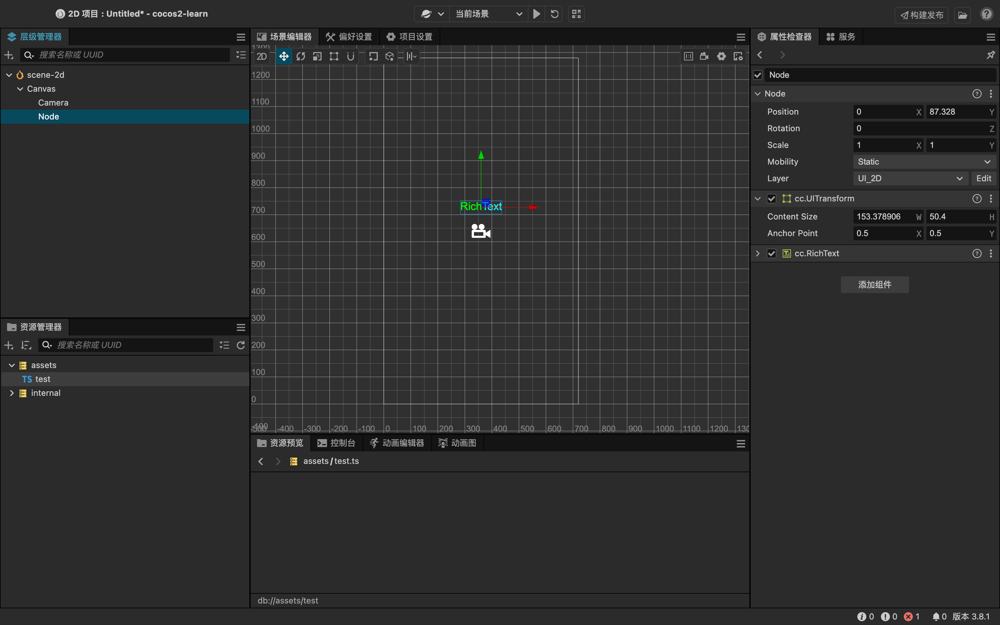
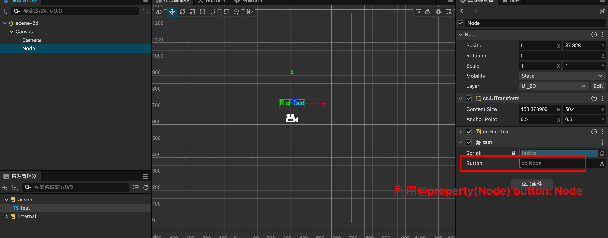
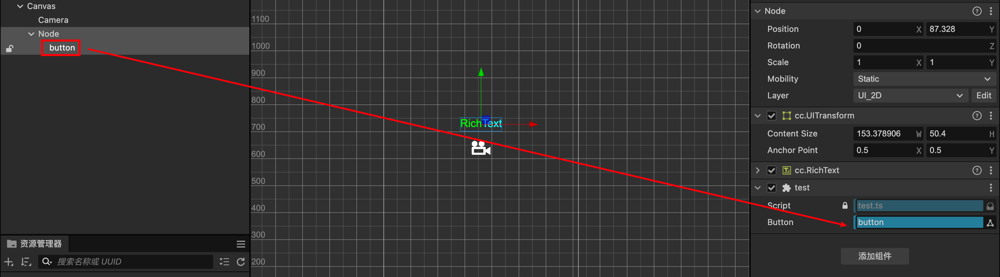

# Cocos

## Cocos面板

基础面板




## Node

cocos中，比较重要的概念就是节点


### Position

position用于描述节点的位置，可以通过覆盖position的方式对position进行修改，不然的话改变的只是引用值，不会触发cocos的内部渲染

```javascript
export class test extends Component {
  start() {
    // 非标准获取位置的方式
    console.log(this.node.position);
  }

  update(deltaTime: number) {
    const p = this.node.position;
    // position + 1是向右运动
    p.x += 1;
    this.node.position = p;
  }
}
```

获取position方式：**getPosition(Vec3?)**

设置position方式：**setPosition(Vec3)**

比较建议使用已有变量的重复使用的方式对position进行操作，不然会产生大量垃圾

```js
export class test extends Component {
  start() {
    
    // ❌ 错误方式：this.node.getPosition()在不传入Vec3三维向量对象的时候，会默认新建一个，如果放到update中，每秒会生成60个对象，十分消耗性能（虽然会被js垃圾回收机制回收掉）
    const currentP = this.node.getPosition()
    currentP.x += 300
    this.node.setPosition(currentP)
    
    // ✅ 正确方式：
    const currentP = new Vec3()
    this.node.getPosition(currentP)
    currentP.x += 300
    this.node.setPosition(currentP)
  }

  update(deltaTime: number) {}
}
```

此外，cocos提供了简便的创建Vec2和Vec3的方式，也推荐在类里面直接**创建V3对象**

```js
export class test extends Component {
  // 语法糖
  curPos = v3()
  
  start() {}

  update(deltaTime: number) {
    // 直接使用全局的V3对象，可以保证不会产生新的垃圾变量，优化性能
    this.node.getPosition(this.curPos)
    this.curPos.x += 1
    this.node.setPosition(this.curPos)
  }
}
```


### angle

angle和position不一样，angle可以直接通过+1的方式进行修改

```js
export class test extends Component {
  start() {
    console.log(this.node.angle);
  }

  update(deltaTime: number) {
    // 需要注意，360度和0度一样，最好做一个满360 - 360的处理
    this.node.angle += 1
  }
}
```

### rotation

一般3d游戏会需要用到

### scale


## 事件

可以给节点绑定上一系列事件

### 鼠标事件

鼠标事件挂载在**Node.EventType**下

```typescript
import { Node } from 'cc'
export class test extends Component {
  start() {
    this.node.on(Node.EventType.TOUCH_START, this.onTouchStart, this)
    this.node.on(Node.EventType.TOUCH_MOVE, this.onTouchMove, this)
    this.node.on(Node.EventType.TOUCH_END, this.onTouchEnd, this)
    this.node.on(Node.EventType.TOUCH_CANCEL, this.onTouchCancel, this)
  }
  // 鼠标点击
  onTouchStart(event: EventTouch){}
  // 鼠标移动
  onTouchMove(event: EventTouch){}
  // 鼠标松开
  onTouchEnd(event: EventTouch){}
  // 鼠标
  onTouchCancel(event: EventTouch){}

  update(deltaTime: number) {
  }
}
```


### 键盘事件

键盘事件挂载在**Input.EventType**下

```typescript
import { Node } from 'cc'
export class test extends Component {
  start() {
    this.node.on(Input.EventType.KEY_DOWN, this.onKeyDown, this)
  }
  // 键盘按下
  onKeyDown(event: EventTouch){
    event.key_word = KEY_W
  }

  update(deltaTime: number) {
  }
}
```


### 真实像素和UI像素

一般我们在对节点进行位置操作的时候，都需要操作UI的值，而不是本身相对于左下角的点的值，例如：

**event.getDeltaX()**

**event.getDeltaY()**

这两个方法，用于获取事件触发时，x,y相对于**设备像素**的像素变化！也就是说，当设备像素越高，x,y的变化越大，就会出现不跟手的情况！因为cocos的画布始终是720x1280，如果设备像素为1440 x 2560，那么每次移动事件触发，x,y的变化量其实相对画布来说都是翻倍的！

```typescript
export class test extends Component {
  start() {
    this.node.on(Node.EventType.TOUCH_MOVE, this.onTouchMove, this)
  }
  // 鼠标移动
  onTouchMove(event: EventTouch){
    // 获取相对于设备像素移动的x和y的值
    const dx = event.getDeltaX()
    const dy = event.getDeltaY()
    // 获取当前相对于画布(0,0)点的像素的值
    const x = this.node.position.x;
    const y = this.node.position.y;
    // 移动当前节点，使其跟随鼠标移动，会发现不跟手
    this.node.setPosition(x + dx, y + dy)
  }
  
  update(deltaTime: number) {}
}
```

在上述例子中，就会出现移动节点不跟手的情况，在这种情况下，我们需要使用UI像素进行操作

**event.getUIDelta()**

```typescript
export class test extends Component {
  start() {
    this.node.on(Node.EventType.TOUCH_MOVE, this.onTouchMove, this)
  }
  // 鼠标移动
  onTouchMove(event: EventTouch){
    // 获取相对于画布像素移动的x和y的值
    const delta = event.getUIDelta()
    // 获取当前相对于画布(0,0)点的像素的值
    const dx = delta.x;
    const y = delta.y;
    // 移动当前节点，使其跟随鼠标移动，此时相对画布来说就是正常的
    this.node.setPosition(x + dx, y + dy)
  }
  
  update(deltaTime: number) {}
}
```

所以对于Position来说，也是一样的

```typescript
export class test extends Component {
  start() {
    this.node.on(Node.EventType.TOUCH_START, this.onTouchStart, this)
  }
  // 鼠标点击
  onTouchStart(event: EventTouch){
    const loc = event.getLocation()  // 此处获取的是设备像素的位置值，大小不固定，跟随设备精度和大小而变化
    const uiLoc = event.getUILocation()	// 此处获取的是cocos canvas画布的位置值，固定720x1280
  }
  
  update(deltaTime: number) {}
}
```


## 脚本中操作其他节点

在cocos中，我们使用this.node操作的时候，只能操作该脚本挂载的节点，如果想要操作其他节点，那么我们需要使用props的方式进行传入

**@property(Node) [NodeName]: Node** 的格式，可以将其他节点挂载到当前脚本中进行操作，例如，我们想要挂载一个button节点到整个Node的节点脚本中，首先，在脚本中进行property定义

```typescript
export class test extends Component {
  // 将button传进来，可以对button进行操作
  @property(Node) button: Node;
  start() {}
}
```

定义成功后，在cocos的页面上的点击该脚本所挂载的组件，在其组件菜单栏中，会对应出现一个命名的组件（就是上述代码示例中所写的的button），此时可以将需要挂载的button节点拖拽到该位置上进行绑定





此时在脚本中，this.node获取到的将会是该脚本挂载的node节点本身，而this.button获取到的将会是挂载传进来的button节点


## 缓动系统

要介绍缓动系统，我们首先将cocos中的节点绑定到脚本上

按照脚本中操作其他节点的方式，我们将button挂载进来，并对touchEnd事件进行监听

```typescript
@ccclass("test")
export class test extends Component {
  @property(Node) button: Node;
  start() {
    this.button.on(Node.EventType.TOUCH_END, this.onTouchEnd, this);
  }
}
```

然后，编写onTouchEnd事件，设置缓动函数

```typescript
onTouchEnd(event: EventTouch) {
  this.button.setScale(0.9, 0.9);
  this.myAnimation();
}
```

编写缓动函数**tween**，有以下注意点

1. cocos的渲染原理，有点类似于vue等mvvm框架的原理，利用数据变化驱动视图更新，而不是直接更改视图，故而无论是位置，大小，旋转度，颜色等，都可以先对数据进行改变，然后再用改变后的数据驱动视图的update
2. 对于无限播放的动画，我们需要使用到**repeatForever()**函数，该函数可以直接传入tween进行循环播放，也可以在union了多个tween之后，设置.repeatForever，代码分别如下（1,1-1对应y轴变化驱动视图变化，采用repeatForever函数传入tween的方式。2,2-1对应颜色变化，采用多个tween.union再repeat的形式）：

```typescript
myAnimation() {
    // 注意，我们并不是直接操作tween去改变节点的位置，而是通过tween，改变数据，再由数据驱动节点的相关改变
    // 1. 例如，我们可以设置一个obj,里面包含了y轴的位置信息，那么我们就可以通过tween改变y的值，然后在onUpdate里面，由改动过的y值，利用setPosition方式驱动节点的重新渲染
    const obj = {
      y: 0,
    };
    // 2. 此外，我们还可以设置一个颜色vec3向量变量，里面包含了颜色的信息
    const color = v3(255, 255, 255);
    // 1 - 1: tween改变y值从而setPosition改变y轴
    tween(obj)
      .repeatForever(
        // 值得一提的是，repeatForever里面可以包含需要循环播放的tween实现循环播放（1-1），也可以通过多个tween进行.union的方式再.repeatForever(2-1)
        tween(obj)
          .to(
            3, // 此处的数字代表动画时间
            { y: 200 },
            {
              onUpdate: (target, ratio) => {
                this.button.setPosition(this.button.position.x, obj.y);
              },
              easing: "quadOut",
            }
          )
          .to(
            3,
            { y: 0 },
            {
              onUpdate: (target, ratio) => {
                this.button.setPosition(this.button.position.x, obj.y);
              },
              easing: "quadOut",
            }
          )
      )
      .start();
    // 2-1: 颜色的循环变化
    tween(color)
      .to(
        3,
        { x: 10, y: 20, z: 30 },
        {
          onUpdate(target, ratio) {
            this.button.color = new Color(color.x, color.y, color.z);
          },
        }
      )
      .to(
        3,
        { x: 120, y: 0, z: 100 },
        {
          onUpdate(target, ratio) {
            this.button.color = new Color(color.x, color.y, color.z);
          },
        }
      )
      .union() // 此处通过先将多个tween进行union，再repeat forever
      .repeatForever()
      .start();
  }
```

