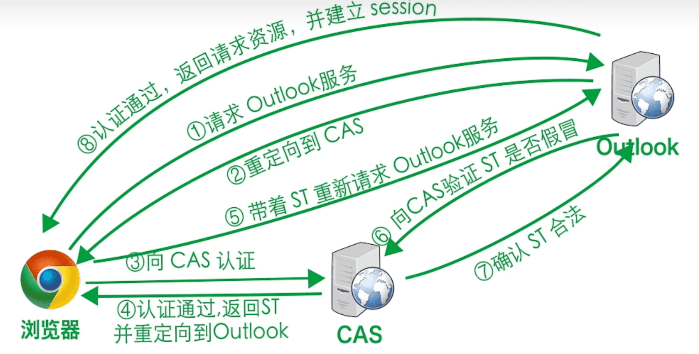

## SSO

> SSO Single Sign On 单点登录机制 
>
> CAS Central Authentication Service 中央认证服务

**背景**

在企业中，往往会存在大量系统，每个系统都搞一个账号密码登录显然过于繁琐，于是催生出了SSO

SSO的具体实现一般是通过CAS

**前置概念：**

**服务标识**： 每个系统或者应用都会从CAS获得一个唯一标识

**TGT Ticket**：成功通过CAS认证后通过cookie的形式发放给客户端的

**Service Ticket**：具体的项目认证

**具体认证流程**

