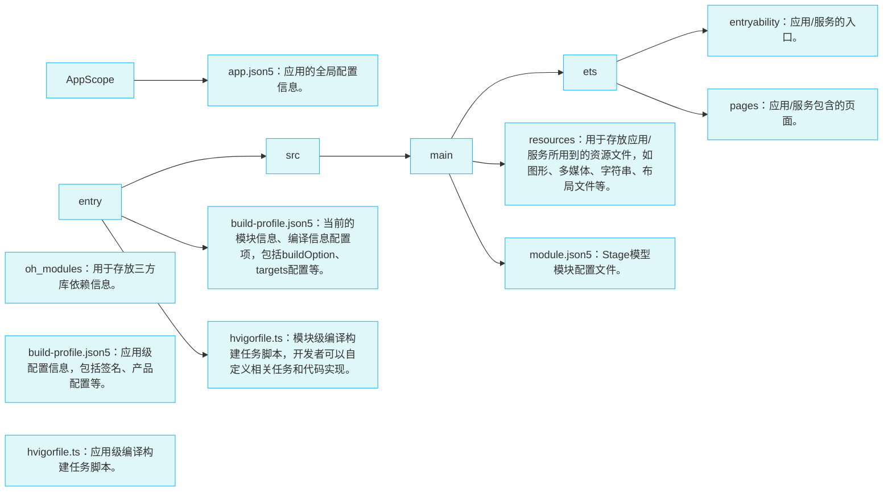

## HarmonyOS 应用开发基础

注册及安装步骤略

## ArkTS(Stage 模型)目录结构

## 应用程序包

### 概念

用户应用程序泛指运行在设备的操作系统之上，为用户提供特定服务的程序，简称“应用”。一个应用所对应的软件包文件，称为“应用程序包”。

### 结构

**一图流**

绿色部分为分类及解释说明，蓝色部分为包结构

**简要概述**

- 每个app中的基本单元为**Module**，每个module都包含了自己的source code, lib, configs等，都可以自行单独打包成ability或者library类型的包
- Module分ability类型和library类型，打包后分别叫HAP，HAR/HSP，其中，主要还是HAP。
- HAP又分为Entry和Feature两种，每个app中，只能有一个Entry类型的module
- 最终，多个module打包后，分别生成对应的.hap文件，多个.hap文件集合在一起称为bundle，bundle打包后，生成.app后缀的文件，为最终的app

**相关概念解释**

①Entry类型的HAP：是应用的主模块，在[module.json5配置文件](https://developer.huawei.com/consumer/cn/doc/development/harmonyos-guides-V2/module-configuration-file-0000001427744540-V2)中的type标签配置为“entry”类型。在同一个应用中，同一设备类型只支持一个Entry类型的HAP，通常用于实现应用的入口界面、入口图标、主特性功能等。

②Feature类型的HAP：是应用的动态特性模块，在[module.json5配置文件](https://developer.huawei.com/consumer/cn/doc/development/harmonyos-guides-V2/module-configuration-file-0000001427744540-V2)中的type标签配置为“feature”类型。一个应用程序包可以包含一个或多个Feature类型的HAP，也可以不包含；Feature类型的HAP通常用于实现应用的特性功能，可以配置成按需下载安装，也可以配置成随Entry类型的HAP一起下载安装（请参见[module对象内部结构](https://developer.huawei.com/consumer/cn/doc/development/harmonyos-guides-V2/module-configuration-file-0000001427744540-V2)中的“deliveryWithInstall”）。

③打包后的HAP包结构包括ets、libs、resources等文件夹和resources.index、module.json、pack.info等文件。

- ets目录用于存放应用代码编译后的字节码文件。
- libs目录用于存放库文件。库文件是HarmonyOS应用依赖的第三方代码（.so二进制文件）。
- resources目录用于存放应用的资源文件（字符串、图片等），便于开发者使用和维护，详见[资源分类与访问](https://developer.huawei.com/consumer/cn/doc/development/harmonyos-guides-V2/resource-categories-and-access-0000001544463977-V2)。
- resources.index是资源索引表，由IDE编译工程时生成。
- module.json是HAP的配置文件，内容由工程配置中的module.json5和app.json5组成，该文件是HAP中必不可少的文件。IDE会自动生成一部分默认配置，开发者按需修改其中的配置。详细字段请参见[应用配置文件](https://developer.huawei.com/consumer/cn/doc/development/harmonyos-guides-V2/application-configuration-file-overview-stage-0000001428061460-V2)。
- pack.info是Bundle中用于描述每个HAP属性的文件，例如app中的bundleName和versionCode信息、module中的name、type和abilities等信息，由IDE工具生成Bundle包时自动生成。

