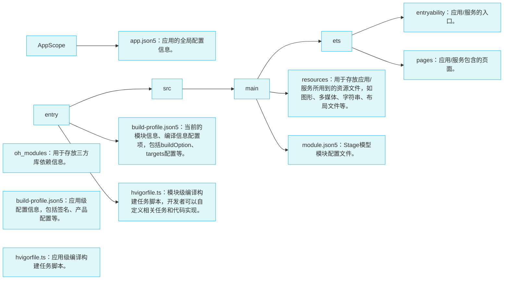
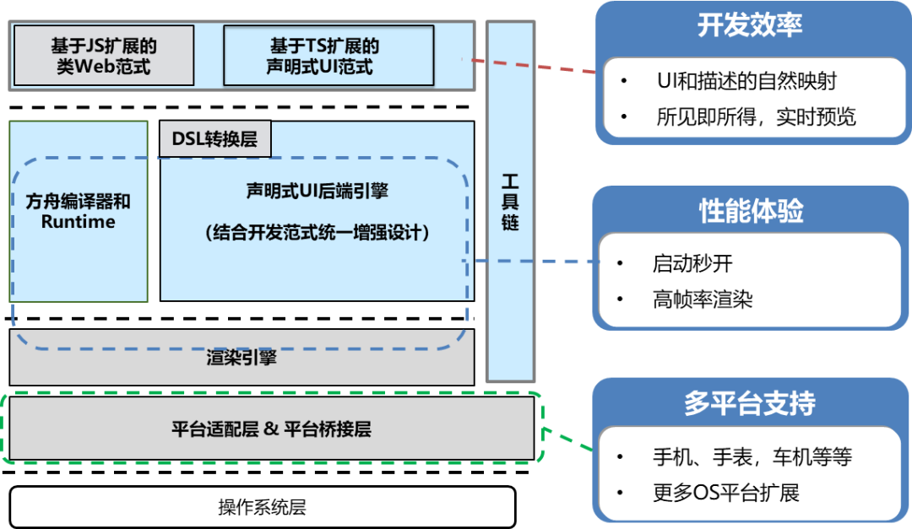

## HarmonyOS 应用开发基础

注册及安装步骤略


## ArkTS(Stage 模型)目录结构




## 应用程序包

### 概念

用户应用程序泛指运行在设备的操作系统之上，为用户提供特定服务的程序，简称“应用”。一个应用所对应的软件包文件，称为“应用程序包”。

### 结构

**一图流**

绿色部分为分类及解释说明，蓝色部分为包结构


**简要概述**

- 每个app中的基本单元为**Module**，每个module都包含了自己的source code, lib, configs等，都可以自行单独打包成ability或者library类型的包
- Module分ability类型和library类型，打包后分别叫HAP，HAR/HSP，其中，主要还是HAP。
- HAP又分为Entry和Feature两种，每个app中，只能有一个Entry类型的module
- 最终，多个module打包后，分别生成对应的.hap文件，多个.hap文件集合在一起称为bundle，bundle打包后，生成.app后缀的文件，为最终的app

**相关概念解释**

①Entry类型的HAP：是应用的主模块，在[module.json5配置文件](https://developer.huawei.com/consumer/cn/doc/development/harmonyos-guides-V2/module-configuration-file-0000001427744540-V2)中的type标签配置为“entry”类型。在同一个应用中，同一设备类型只支持一个Entry类型的HAP，通常用于实现应用的入口界面、入口图标、主特性功能等。

②Feature类型的HAP：是应用的动态特性模块，在[module.json5配置文件](https://developer.huawei.com/consumer/cn/doc/development/harmonyos-guides-V2/module-configuration-file-0000001427744540-V2)中的type标签配置为“feature”类型。一个应用程序包可以包含一个或多个Feature类型的HAP，也可以不包含；Feature类型的HAP通常用于实现应用的特性功能，可以配置成按需下载安装，也可以配置成随Entry类型的HAP一起下载安装（请参见[module对象内部结构](https://developer.huawei.com/consumer/cn/doc/development/harmonyos-guides-V2/module-configuration-file-0000001427744540-V2)中的“deliveryWithInstall”）。

③打包后的HAP包结构包括ets、libs、resources等文件夹和resources.index、module.json、pack.info等文件。

- ets目录用于存放应用代码编译后的字节码文件。
- libs目录用于存放库文件。库文件是HarmonyOS应用依赖的第三方代码（.so二进制文件）。
- resources目录用于存放应用的资源文件（字符串、图片等），便于开发者使用和维护，详见[资源分类与访问](https://developer.huawei.com/consumer/cn/doc/development/harmonyos-guides-V2/resource-categories-and-access-0000001544463977-V2)。
- resources.index是资源索引表，由IDE编译工程时生成。
- module.json是HAP的配置文件，内容由工程配置中的module.json5和app.json5组成，该文件是HAP中必不可少的文件。IDE会自动生成一部分默认配置，开发者按需修改其中的配置。详细字段请参见[应用配置文件](https://developer.huawei.com/consumer/cn/doc/development/harmonyos-guides-V2/application-configuration-file-overview-stage-0000001428061460-V2)。
- pack.info是Bundle中用于描述每个HAP属性的文件，例如app中的bundleName和versionCode信息、module中的name、type和abilities等信息，由IDE工具生成Bundle包时自动生成。


### 多HAP机制

多HAP构建视图


其他待补充

// TODO


## ArkTS

### JS & TS & ArkTS

TypeScript是JavaScript的超集，添加了静态类型的定义

而ArkTS是TypeScript的超级，扩展了**声明式UI，状态管理，并发任务**等能力


### ArkTS设计




### ArkTS声明式开发范式

```typescript
// ---part 1
@Entry
@Component
// ---

// ---part 2
struct Hello {
// ---
  @State myText: string = 'World'
  
  // ---part 3
  build(){
    column{
      Text('Hello')
      	.fontSize(50)
      Text(this.myText)
      	.fontSize(50)
      // ---part 4
      Divider()
      Button(){
      // ---
        Text('Click Me')
        	.fontSize(30)
			}
      // ---part 5
      .onClick(()=>{
        this.myText = 'ArkUI'
      })
      // ---
      // ---part 6
      .width(200)
      .height(50)
      // ---
    }
	}
  // ---
}
```

1. Part1: **装饰器**

   用来装饰类、结构体、方法以及变量，赋予其特殊的含义，如上述示例中 @Entry 、 @Component 、 @State 都是装饰器。具体而言， @Component 表示这是个自定义组件； @Entry 则表示这是个入口组件； @State 表示组件中的状态变量，此状态变化会引起 UI 变更。

2. Part2: **自定义组件**

   可复用的 UI 单元，可组合其它组件，如上述被 @Component 装饰的 struct Hello。

3. Part3: **UI 描述**

   声明式的方式来描述 UI 的结构，如上述 build() 方法内部的代码块。

4. Part4: **内置组件**

   框架中默认内置的基础和布局组件，可直接被开发者调用，比如示例中的 Column、Text、Divider、Button。

5. Part5: **事件方法**

   用于添加组件对事件的响应逻辑，统一通过事件方法进行设置，如跟随在Button后面的onClick()。

6. Part6: **属性方法**

   用于组件属性的配置，统一通过属性方法进行设置，如fontSize()、width()、height()、color() 等，可通过链式调用的方式设置多项属性。


### 自定义组件

#### @Entry/@Component

ArkTS通过struct声明组件名，并通过@Component和@Entry装饰器，来构成一个自定义组件。

使用@Entry和@Component装饰的自定义组件作为页面的入口，会在页面加载时首先进行渲染。

```typescript
@Entry
@Component
struct ToDoList {...}
```


#### 基本组件

build方法内可以容纳内置组件和其他自定义组件，如Column和Text都是内置组件，由ArkUI框架提供，ToDoItem为自定义组件，需要开发者使用ArkTS自行声明

```typescript
@Entry
@Component
struct ToDoList {
  ...
  build() {
    Column(...) {
      Text(...)
        ...
      ForEach(...{
        TodoItem(...)
      },...)
    }
  ...
  }
}
```


#### 组件拆分

```typescript
// 首先拆分出FoodImageDisplay组件
@Component
struct FoodImageDisplay {
  build() {
    	// ...
    }  
  }
}

// 然后拆分出ContentTable
@Component
struct ContentTable {
  // 利用builder，创建类似于jsx的带模板的组件
  @Builder IngredientItem(title:string, name: string, value: string) {
    Flex() {
      Text(title)
        .fontSize(17.4)
        .fontWeight(FontWeight.Bold)
        .layoutWeight(1)
      Flex() {
        Text(name)
          .fontSize(17.4)
          .flexGrow(1)
        Text(value)
          .fontSize(17.4)
      }
      .layoutWeight(2)
    }
  }

  build() {
    Flex({ direction: FlexDirection.Column, justifyContent: FlexAlign.SpaceBetween, alignItems: ItemAlign.Start }) {
      this.IngredientItem('Calories', 'Calories', '17kcal')
      this.IngredientItem('Nutrition', 'Protein', '0.9g')
      this.IngredientItem('', 'Fat', '0.2g')
      this.IngredientItem('', 'Carbohydrates', '3.9g')
      this.IngredientItem('', 'VitaminC', '17.8mg')
    }
    .height(280)
    .padding({ top: 30, right: 30, left: 30 })
  }
}

@Entry
@Component
struct FoodDetail {
    build() {
        Column() {
            FoodImageDisplay()
            ContentTable()
        }
        .alignItems(HorizontalAlign.Center)
    }
}
```


### 布局

#### **Row布局**


```typescript
Row() {
  Image($r('app.media.ic_default'))
    ...
  Text(this.content) 
    ...
}
...
```


#### **Column布局**


```typescript
Column() {
   Text($r('app.string.page_title'))
     ...

   ForEach(this.totalTasks,(item) => {
     TodoItem({content:item})
   },...)
 }
```


#### 间距设置

在Row，Column组件中，可以传入space属性，来设置间距

```typescript
Row({space: 20}){
  ...
}
```


#### 对齐设置

**主轴和交叉轴概念**

在布局容器中，默认存在两根轴，分别是主轴和交叉轴，这两个轴始终是相互垂直的。不同的容器中主轴的方向不一样的。

- **主轴**：在Column容器中的子组件是按照从上到下的垂直方向布局的，其主轴的方向是垂直方向；在Row容器中的组件是按照从左到右的水平方向布局的，其主轴的方向是水平方向。
- **交叉轴**：与主轴垂直相交的轴线，如果主轴是垂直方向，则交叉轴就是水平方向；如果主轴是水平方向，则交叉轴是垂直方向。


**主轴方向对齐 (justifyContent)**

```typescript
Row/Colum(){
  ...
}
.justifyContent(FlexAlign.Start) // 首端对齐
.justifyContent(FlexAlign.End)	 // 末端对齐
.justifyContent(FlexAlign.Center)	// 中心对齐
.justifyContent(FlexAlign.SpaceBetween)
```


**交叉轴方向对齐 (alignItems)**

Column水平对齐

```typescript
Column(){
  ...
}
.alignItems(HorizontalAlign.Start)	// 所有子组件左端对齐
.alignItems(HorizontalAlign.Center)	// 所有子组件中心对齐
.alignItems(HorizontalAlign.End)		// 所有子组件右端对齐
```

Row垂直对齐

```typescript
Row(){
  ...
}
.alignItems(VerticalAlign.Top)	// 所有子组件顶端对齐
.alignItems(VerticalAlign.Center)	// 所有子组件中心对齐
.alignItems(VerticalAlign.Buttom)		// 所有子组件底部对齐
```


#### Stack布局

Stack组件为堆叠组件，可以包含一个或多个子组件，其特点是后一个子组件覆盖前一个子组件

```typescript
@Entry
@Component
struct MyComponent {
  build() {
    Stack() {
        Image($rawfile('Tomato.png'))
        Text('Tomato')
            .fontSize(26)
            .fontWeight(500)
    }
  }
}
```


#### Flex布局

利用flex(){}可以实现flex布局，其中，`flexGrow`表示填充满剩余空间, `layoutWeight`用于设置flex比例值

```typescript
@Component
struct ContentTable {
  build() {
    Flex() {
      Text('Calories')
        .fontSize(17.4)
        .fontWeight(FontWeight.Bold)
        .layoutWeight(1)	// flex占一份
      Flex() {
        Text('Calories')
          .fontSize(17.4)
          .flexGrow(1)	// 改元素填满剩余空间
        Text('17kcal')
          .fontSize(17.4)
      }
      .layoutWeight(2)	// flex占两份
    }
    .height(280)
    .padding({ top: 30, right: 30, left: 30 })
  }
}
```


### 条件

ArkTS支持直接在声明式语法当中添加if条件判断语句，也支持通过三元表达式来进行条件判断，如下：

```typescript
build() {
  Column() {
    Text(this.isCountDown ? 'Count Down' : 'Stopwatch').fontSize(20).margin(20)
    if (this.isCountDown) {
      // 图片资源放在media目录下
      Image($r("app.media.countdown")).width(120).height(120)
      TimerComponent({ counter: 10, changePerSec: -1, showInColor: Color.Red })
    } else {
      // 图片资源放在media目录下
      Image($r("app.media.stopwatch")).width(120).height(120)
      TimerComponent({ counter: 0, changePerSec: +1, showInColor: Color.Black })
    }
    Button(this.isCountDown ? 'Switch to Stopwatch' : 'Switch to Count Down')
      .onClick(() => {
        this.isCountDown = !this.isCountDown
      })
  }.width('100%')
}
```


### 循环

利用自带方法ForEach进行循环

```typescript
@Entry
@Component
struct ToDoList {
   ...
   build() {
     Row() {
       Column() {
         Text(...)
           ...
         ForEach(this.totalTasks,(item) => {
           TodoItem({content:item})
         },...)
       }
       .width('100%')
     }
     .height('100%')
   }
 }
```


## UIAbility

### 页面创建

ets/pages下，直接右键新建pages


### 页面跳转

通过引入router，类似微信小程序的router.push和router.back


### 生命周期

 create -- onCreate

 null -- windowStageCreate,

foreground -- onForeground，UI 在前台展示前调用

background -- onBackground，UI切换到后台之后调用

null - windowStageDestroy

destroy


## 基础组件

### Image


### List

List一般搭配forEach和ListItem组件混合使用，如下：

```typescript
List(){
  ForEach(this.listData, (item: ItemData)=>{
    ListItem(){
      this.buildListItemFunc(item)	// 这里是个@builder，获取单个item的UI组件
    }
  })
}
.divider({...})	// divider用于设置分割线
```

**divider**

List中的divider分割线有一些属性，例如线宽，颜色，边距等，可以查看文档进行设置


### Grid

类比List，Grid也需要搭配GridItem进行混合使用，同时，使用rowsTmplate和columnsTemplate进行grid格式设置

```typescript
Grid(){
  ForEach(this,gridData, (item: ItemData)=>{
    GridItem(){...}
  })
}
.rowsTemplate('1fr 1fr')	// rowsTemplate用于设置行，此处意味着grid共有两行，共占两份宽度，每行都占1份
.columnsTemplate('1fr 1fr 1fr 1fr')	// rowsTemplate用于设置列，此处意味着grid共有四列，共占四份宽度，每列都占1份
.rowsGap(12)	// 此处设置行间距
.columnsGap(8)	// 此处设置列间距
```

此外，也可以不设置rowsTemplate，而是选择固定grid的高度

```typescript
Grid(){
  ForEach(this,gridData, (item: ItemData)=>{
    GridItem(){...}
  })
}
.columnsTemplate('1fr 1fr 1fr 1fr')	// 不设置row
.rowsGap(12)	
.columnsGap(8)	
.width(124) // 而是固定高度
```

在这种情况下，加入gridItem有十个，将会将已有的8个格子2x4填充满之后，另外两个换行，此时，可以通过拖动滚动条进行展示


### Tabs

**标准使用**

```typescript
Tabs({barPosition: BarPosition.End/ BarPosition.Left}){	// 此处用于设置tab页签的位置，底部or左侧
  ...
}
.vertical(false)	// 此处用于设置tab是否为垂直排列
.barWidth('100%')	// tab宽度
.barHeight(60)		// tab高度
```

**自定义Tabs**

用法类似于icon-tooltip，用`TabContent`来包裹Tab内的页面，然后挂一个`.tabBar(component)`，里面用于传入tab本身设计的自定义样式

```typescript
private tabsController: TabsController = new TabsController();

build(){
  Tabs({..., controller: this.tabsController}){
    TabContent(){	// 利用TabContent包裹要展示的Tab内的界面内容
      Home()	// 此处是home界面内容
    }
    .tabBar(this.TabBuilder(...))	// 挂一个.tabBar，里面是home界面对应的tab的样式
            
    TabContent(){
      Profile()	
    }
    .tabBar(this.TabBuilder(...))   
  }
}
.onchange((index: number)=> {
  this.currentIndex = index
})
...
```

