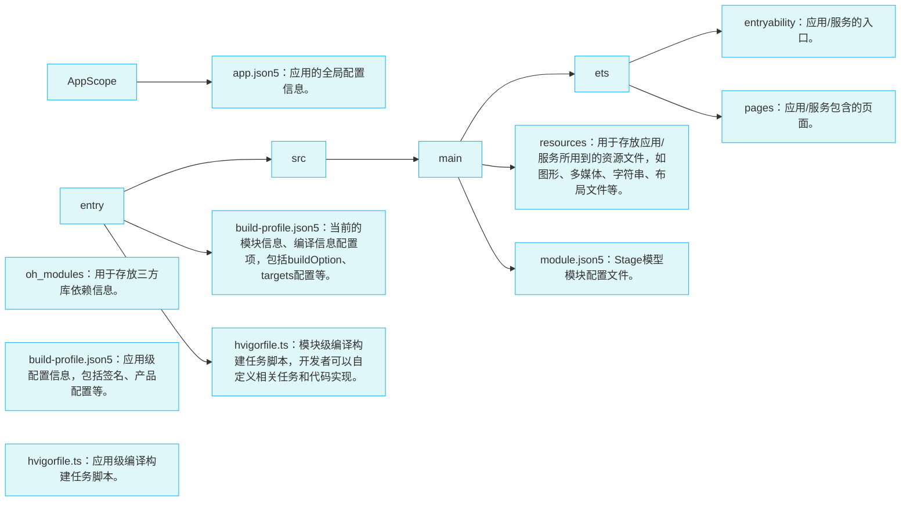
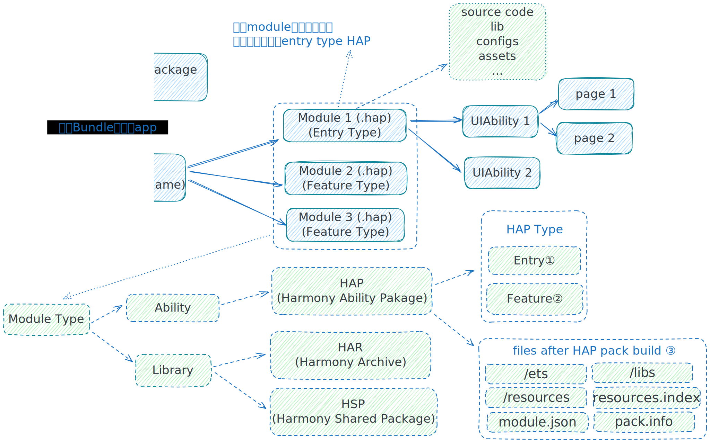

## HarmonyOS 应用开发基础

注册及安装步骤略

## ArkTS(Stage 模型)目录结构

```mermaid
graph LR
AppScope --> app_json5["app.json5：应用的全局配置信息。"]
entry --> src["src"]
entry --> build_profile["build-profile.json5：当前的模块信息、编译信息配置项，包括buildOption、targets配置等。"]
entry --> hvigorfile["hvigorfile.ts：模块级编译构建任务脚本，开发者可以自定义相关任务和代码实现。"]
src --> main["main"]
main --> ets["ets"]
main --> resources["resources：用于存放应用/服务所用到的资源文件，如图形、多媒体、字符串、布局文件等。"]
main --> module_json5["module.json5：Stage模型模块配置文件。"]
ets --> entryability["entryability：应用/服务的入口。"]
ets --> pages["pages：应用/服务包含的页面。"]
oh_modules["oh_modules：用于存放三方库依赖信息。"]
build_profile_app["build-profile.json5：应用级配置信息，包括签名、产品配置等。"]
hvigorfile_app["hvigorfile.ts：应用级编译构建任务脚本。"]

classDef default fill:#e0f7fa,stroke:#29b6f6,stroke-width:1px;
class app_json5,build_profile,hvigorfile,module_json5,resources,entryability,pages,oh_modules,build_profile_app,hvigorfile_app default;
```

## 应用程序包

### 概念

用户应用程序泛指运行在设备的操作系统之上，为用户提供特定服务的程序，简称“应用”。一个应用所对应的软件包文件，称为“应用程序包”。

### 结构

