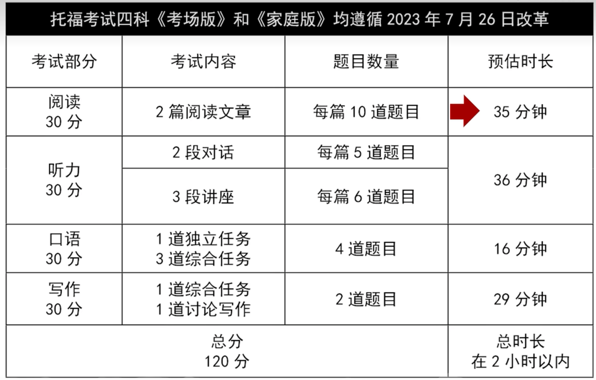

## 备考指南

### 通用

- 背单词
- **计时**刷题，不计时没有紧凑感
- 总结错因
- 看official guideline


### 阅读

3篇文章，每篇10题，一共54分钟，18分钟一篇

找错题，归纳出错因，总结tips，提示自己下次应该怎么做

eg: 

```tex
错因：
1. 单词不认识
2. 文本没读懂
tips:
1. 善用逻辑关联词，如：so之前的是原因
```


### 听力

#### 磨耳朵

第一步，先磨耳朵，养成英文习惯

可刷《摩登家庭》

可看英文vlog

#### 刷题

5篇听力，2篇对话，3篇lettures

- 培养自己的速记符号
- 分段听，形成框架意识


### 口语

先自己录音，然后看高分回答

逻辑框架


## 试题分布




## 阅读模块

### 时间控制

改革后，阅读只有两篇，每篇控制17-18分左右，第一篇不要超过20分钟


### 屏读问题

- 注意力不集中
- 无法在屏幕上勾画做笔记
- 记忆效率低


## 听力模块


## 口语模块


## 写作模块


