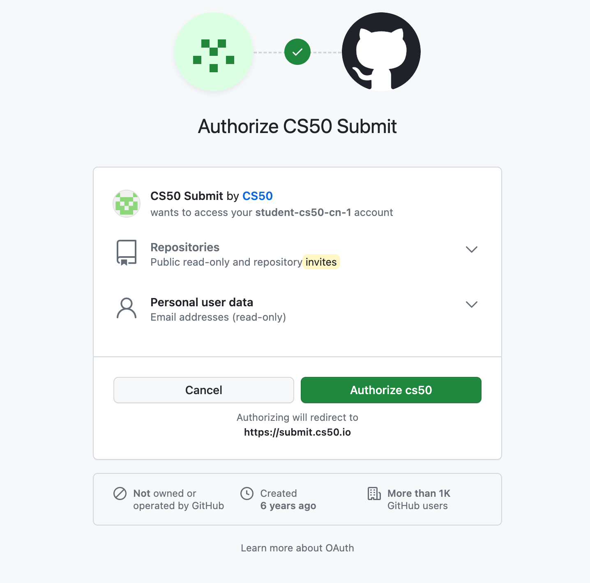
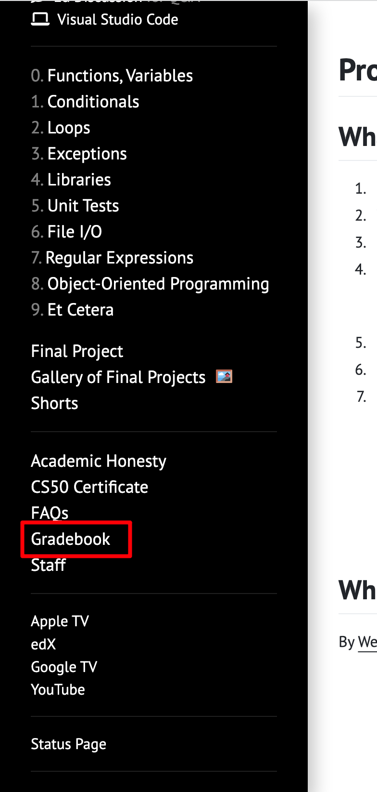
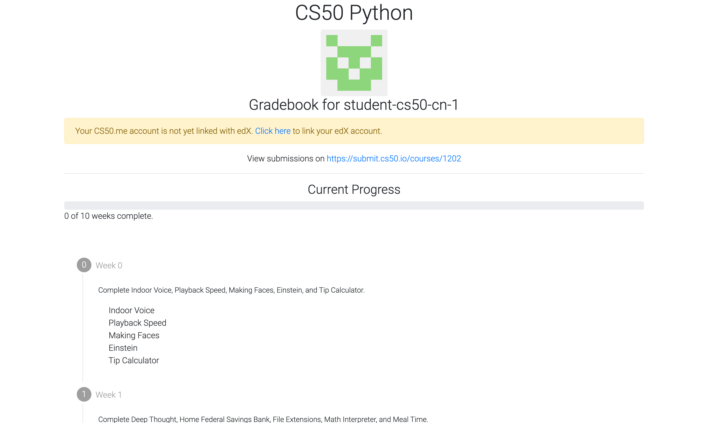

1. 首先，进官网

   https://cs50.harvard.edu/python/2022/

   

2. 然后，需要学习的课程都在左边

   

3. 进入课程0

   

4. 一个是视频，一个是作业，先说视频，直接选YOUTUBE链接即可

   

5. 英语好的建议直接空耳听，David教授的口音特别纯正特别好懂，对练听力以及养成英语编程习惯很有帮助，英语不太行的可以选择开启字幕，自动翻译

   

6. 来到作业部分，点击之前截图里的作业，problem set0

   

7. 根据步骤，首先提交一个表单

8. 

9. 

点击第四步里的链接

登录进入

授权

会自动加载编辑器

进来后，正常界面就是这样

成绩单

你每做完一个作业，前面就会标绿

